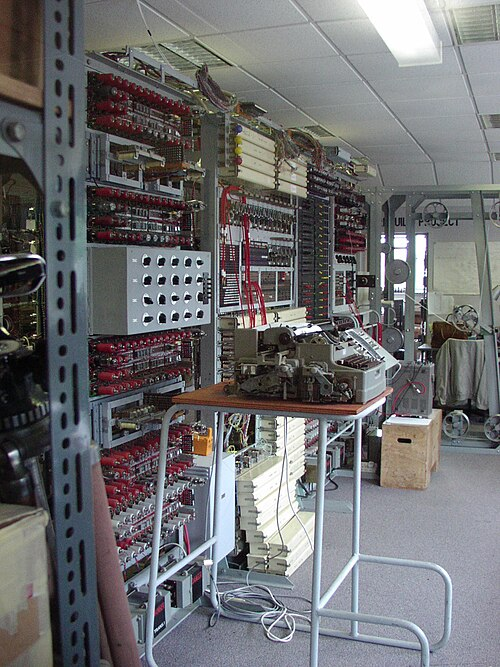

When the war in Europe ended, the fastest computing machines in the world
were ten [Colossi](kloom:e/colossus-computer) in two blocks at [Bletchley Park](kloom:e/bletchley-park), and almost no one could be
told. For thirty years the people who had built and run them said nothing,
and histories of the computer were written without them. The story came out
in pieces: photographs in 1975, a technical history in 2000, and a working
machine rebuilt from memory, scraps of circuit diagrams and eight wartime
photographs.

## Broken up, and two kept

Eight of the ten were dismantled, [GCHQ](kloom:e/gchq) says, so that their parts could be
reused; some of the parts, sanitized, went to Max Newman's new computing
laboratory at Manchester. Two Colossi and two [Tunny](kloom:e/lorenz-cipher) machines went with the
codebreakers to GCHQ's new headquarters at Eastcote in April 1946, and to
Cheltenham between 1952 and 1954. There they were put to other work, among it
counting characters on one-time pad tape to test it for randomness. The dates
of their end differ. Wikipedia's Colossus article has one, _Colossus Blue_,
dismantled in 1959 and the other in the 1960s; its Flowers article says
1959 and 1960; GCHQ says the machines' functions were in use until the early
1960s, and a GCHQ engineer recalled maintaining one for a year in that
decade, with a few circuit diagrams and no handbook.

The paper went too, though the tellings differ here as well. In the account
Wikipedia quotes, **[Tommy Flowers](kloom:e/tommy-flowers)** was told to destroy the records and burnt
the drawings in a furnace, and called it "a terrible mistake". GCHQ says he
was ordered to hand the documentation over to GCHQ. **[Tony Sale](kloom:e/tony-sale)** wrote that
the original machine drawings were burnt in 1960.

## The Official Secrets Act

Everyone who had worked on Tunny had signed the [Official Secrets Act](kloom:e/official-secrets-act), and
kept it. Flowers went back to telephone exchanges. The government paid him
£1,000, which did not cover what he had spent of his own money, and he shared
much of it with his team. When he later asked the Bank of England for a loan
to build a machine like Colossus, he was refused, because the bank did not
believe such a machine could work, and he could not tell it that he had
already built ten. Meanwhile the American [ENIAC](kloom:e/eniac) of 1946 was taken for the first
large electronic computer, which Sale later called a myth; in 1972 **Herman Goldstine**,
who knew nothing of Colossus, wondered how Britain had so quickly produced so
many good computer projects after the war.

The silence broke from outside. **[Brian Randell](kloom:e/brian-randell)**, a computer scientist at
Newcastle, wrote to the Prime Minister, Edward Heath, in 1972 about the
wartime work and got the first official admission that the organization had
existed. F. W. Winterbotham's _The Ultra Secret_ of 1974 told the Enigma
story. In October 1975 the government released a set of captioned
photographs of Colossus, and in June 1976 Randell presented a paper on it at
a conference on the history of computing at [Los Alamos](kloom:e/los-alamos-national-laboratory), with **Allen
Coombs** answering questions beside him. The Tunny story itself stayed
classified. In 1995 the NSA released some 5,000 wartime documents,
among them the American **Albert Small**'s _Special Fish Report_ of 1944,
which described how Colossus was used; and in October 2000 GCHQ released the
[_General Report on Tunny_](kloom:e/general-report-on-tunny) to the Public Record Office. GCHQ, in 2024, dated
the revelation of Colossus's existence to "the early 2000s"; the museum at
Bletchley dates the first declassification to 1975.

## Rebuilt from photographs

In 1993 Tony Sale, a former MI5 engineer then at the Science Museum, gathered
what survived: eight wartime photographs and fragments of circuit diagrams
that some engineers had kept. He redrew the racks from the photographs, and
**Arnold Lynch**, who had designed the optical tape reader in the war,
redesigned it with him to his original specification. The Duke of Kent
inaugurated the rebuild in July 1994, and switched on a basic working
Colossus on 6 June 1996, with Flowers present. The project's start is dated 1993
by Sale and 1992 by the museum, and its finish 2007 by the museum and 2008
by Wikipedia.

| Year | Event                                                       |
| ---: | ----------------------------------------------------------- |
| 1945 | eight Colossi broken up; two kept                           |
| 1946 | the two moved to GCHQ at Eastcote; later to Cheltenham      |
| 1959 | Colossus Blue dismantled; the other in 1960 or the 1960s    |
| 1972 | Randell obtains an official admission that the work existed |
| 1975 | captioned photographs of Colossus released                  |
| 1976 | Randell's paper at Los Alamos                               |
| 1994 | the rebuild inaugurated at Bletchley Park                   |
| 1995 | the NSA releases wartime reports, among them Small's        |
| 1996 | a basic rebuilt Colossus switched on, 6 June                |
| 2000 | the _General Report on Tunny_ released                      |
| 2007 | the rebuild finished; the Cipher Challenge                  |

In November 2007 the finished machine was set against radio amateurs in a
_Cipher Challenge_: three messages enciphered on a Lorenz SZ42 were sent from
the computer museum in Paderborn. Colossus broke its message in about three
and a half hours, after the team lost a day to poor reception on wartime
radio sets. It came second. **Joachim Schüth**, a German radio amateur and
software engineer, with a program of his own, found all twelve wheel settings in 46 seconds by the museum's
count, and less than a minute by Wikipedia's. His laptop, he said, read
ciphertext 240 times faster than Colossus.

As of September 2026 the rebuild stands in Block H at the [National Museum of
Computing](kloom:e/the-national-museum-of-computing), in the place Colossus 9 once occupied. How the first of the
machines was built, its valves and its tape reader, is the story of the
Colossus frame on the main spine.
