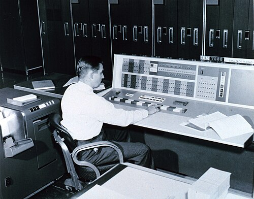
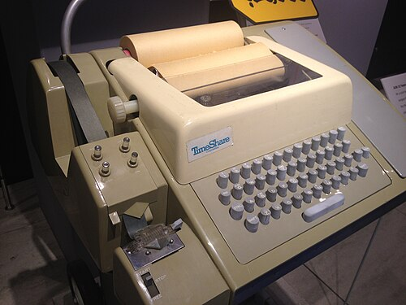

By 1960 a large computer ran in _batch_. Programmers punched their decks,
handed them in, and came back for the printout; operators fed the jobs
through one after another so that the expensive machine never waited. The
machine was used well and the people badly. Fernando Corbató and his
colleagues at MIT wrote in 1962 that under batch monitors each bug usually
took "several hours to eliminate, if not a complete day".

## The idea, twice over

The cure was to let many people use one machine at once, each at a
typewriter, while the machine switched among them faster than they could
notice. Two people are credited with it, and they meant different things.
**Christopher Strachey** filed a British patent application for "time
sharing" in February 1959 and read a paper, "Time Sharing in Large Fast
Computers", in Paris that June. **John McCarthy** wrote a memo at MIT
proposing to time-share the Computation Center's expected "transistorized
IBM 709", dated 1 January 1959, though he later allowed that it might have
been written a year later. In McCarthy's telling, Strachey's idea was not
his: Strachey had meant a machine running several programs to keep busy
while one programmer debugged, not every user behaving as though the
machine were his own. Strachey agreed, in a letter of 1974 (which dates
his paper to 1960), and thought his use of the word the more natural one. The phrase had in fact been used for
multiprogramming for years.

## CTSS

The system that worked came from **Corbató**, with **Marjorie
Merwin-Daggett** and **Robert Daley**, at the MIT Computation Center. They
called it an interim experiment. Written first for the IBM 709 and then
moved to the IBM 7090, it was demonstrated in November 1961 in the usual
account; McCarthy remembered a demonstration some time in 1962. Their paper of May 1962 describes four users: three at Flexowriter
typewriters, and a fourth, ordinary batch job running in the background.
The supervisor sat in the lowest 5,000 words of memory and a user's
program in the upper 27,000. At first only one user's program was in
memory at a time; the others waited on magnetic tape, for want of a disk.

The scheduler is the plate. A program entered a queue at a level set by
its size, and at level ℓ it ran for up to 2^ℓ _quanta_ before it was put at
the back of the next level down. A program that answered its user quickly
stayed near the top; a long computation sank, running in longer and longer
bursts, so the time spent swapping it in and out became small. Every
program ran at least as long as it took to swap, so the machine never
spent more than half its time swapping. For the 7090 they estimated a
quantum of 16 milliseconds and, with the disk then available, only about
four users with a worst reply to a trivial command of 32 seconds; a fast
drum might serve 120. CTSS went into routine service in 1963, and a second
copy ran MIT's [Project MAC](kloom:e/project-mac), whose successor system, Multics, is a story of
its own. It had the first password logins and early messages between
users.

## Dartmouth, and BASIC

At Dartmouth College, **John Kemeny** and **Thomas Kurtz** wanted every
student to use a computer, not only scientists. McCarthy told Kurtz to try
time-sharing. With a National Science Foundation grant they bought a
**GE-225**, with a separate **Datanet-30** to scan the terminal lines, and
a dozen undergraduates wrote the system. It began work at 4 a.m. on 1 May
1964, running Kemeny's new language, **BASIC**, and that autumn hundreds
of freshmen used it from twenty Teletypes. BASIC was FORTRAN made
forgiving:

| Say                  | FORTRAN                | BASIC                    |
| -------------------- | ---------------------- | ------------------------ |
| count 1 to 10 by 2   | `DO 100, I = 1, 10, 2` | `FOR I = 1 TO 10 STEP 2` |
| end of the loop      | statement `100`        | `NEXT I`                 |
| if I is 5, go to 100 | an arithmetic `IF`     | `IF I=5 THEN 100`        |

Kemeny and Kurtz gave the compiler away and put terminals in local schools.
Their system's makers wrote in 1968 that a response averaging more than
ten seconds "destroys the illusion of having one's own computer". By 1972
it served more than a hundred users at once, because most of what they
asked took less than a second of computer time.

| System | Running from | Computer           | Terminals                        |
| ------ | ------------ | ------------------ | -------------------------------- |
| CTSS   | 1961 (shown) | IBM 709, then 7090 | 3 Flexowriters in 1962           |
| DTSS   | 1 May 1964   | GE-225, Datanet-30 | 20 Teletypes in 1964; 40 by 1965 |

## Computing as a utility

McCarthy drew the conclusion in a talk at MIT's centennial in 1961:
computing "may someday be organized as a public utility", like the
telephone system. General Electric sold time on systems grown from
Dartmouth's, and for two decades mainframe makers and bureaus rented
computing time to banks and businesses from their own data centres. MIT, for its part, waited for a new machine: IBM
asked it to hold off, McCarthy recalled, while it designed a family that
took longer than expected.
