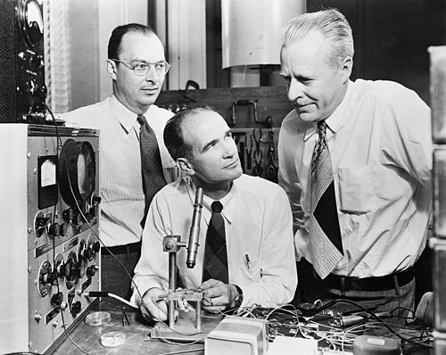
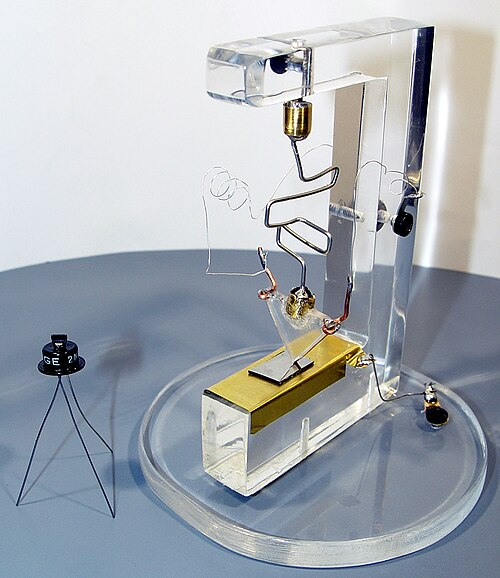

Every machine so far in this story switched with something hot, fragile
or slow: a relay's armature, a valve's glowing filament. The telephone
network was built from both, by the million, and it was the telephone
company that paid for a switch with no moving parts and no heater. It came
out of a slab of [germanium](kloom:e/germanium) at **[Bell Telephone Laboratories](kloom:e/bell-labs)** in Murray
Hill, New Jersey, a week before Christmas 1947.

## The telephone company's problem

Bell Labs was the research arm of AT&T. In 1945 its executive vice president,
**Mervin Kelly**, backed a new solid-state physics group under **[William
Shockley](kloom:e/william-shockley)**, and among its aims, the Computer History Museum's history
says, was a semiconductor replacement for the unreliable valves and
electromechanical switches of the Bell System. The war had taught
laboratories to purify germanium and silicon for radar detectors, and in
his Nobel lecture **[John Bardeen](kloom:e/john-bardeen)** says the semiconductor program began
in early 1946 with that material in hand.

Shockley's first idea was a _field-effect_ amplifier: a voltage on a plate
over a thin film of semiconductor should change how well it conducts. It
did nothing measurable. Bardeen, a theorist, proposed that electrons
trapped at the surface, _surface states_, were screening the field, and
the group turned to studying surfaces. Working with the experimenter
**[Walter Brattain](kloom:e/walter-brattain)**, Bardeen found that a contact on the germanium could
inject _holes_, missing electrons that behave as positive charges, which
flowed to a second contact nearby and changed its current. Bardeen
estimated the contacts would need to be about 0.005 cm apart.

## Two gold points

Brattain made them with a razor. He laid gold foil over the edge of a
plastic wedge, slit the gold at the tip, and pressed the wedge onto the
germanium with a spring: two contacts a hair's breadth apart. On 16
December 1947 it amplified. The plate draws it in section. One point, the
_emitter_, is biased forward and injects holes; the other, the
_collector_, is biased the other way and collects them, and a small change
in the emitter's current makes a larger change in the collector's. On 23
December Brattain and his colleagues showed it to the laboratory's
managers.

How much it amplified depends on the source. Brattain's notebook, as
quoted by Wikipedia, records a power gain of 1.3 and a voltage gain of 15
on 16 December, and a power gain of 18 at the demonstration a week later;
the museum's history says the input was amplified up to 100 times. John
Pierce named it the [_transistor_](kloom:e/transistor), the winner of an internal ballot, and
Bell Labs announced it at a press conference in New York on 30 June 1948.

## The quarrel

The publicity photograph was staged. Shockley sits at the bench, but the
patent, filed on 17 June 1948, named only Bardeen and Brattain: Bell's
lawyers found Shockley's field-effect idea too close to a 1925 patent by
**[Julius Lilienfeld](kloom:e/julius-edgar-lilienfeld)** to claim. Shockley, stung, spent a month of what the
museum calls intense theoretical work and on 23 January 1948 conceived a
different device, the [**junction transistor**](kloom:e/bipolar-junction-transistor): a sandwich of n-type and
p-type germanium, in which injected carriers cross the thin middle layer,
the _base_, through the bulk of the crystal rather than along its surface.
That is how every bipolar transistor has worked since. It took Gordon
Teal's single crystals and Morgan Sparks's grown junctions until 1951 to
make one well; Bell announced it on 4 July 1951. Shockley kept Bardeen and
Brattain off the junction work, and Bardeen left Bell Labs that year.

In 1956 the three shared the [Nobel Prize in Physics](kloom:e/nobel-prize-in-physics) "for their researches
on semiconductors and their discovery of the transistor effect".

## A switch for computers

In a computer a transistor is a switch: current into the base turns the
collector current fully on or fully off. Bell licensed the patents to any
company that paid $25,000, and taught them how at a symposium in April 1952. The first computers followed. At Manchester University a prototype
built by Richard Grimsdale and Douglas Webb under [Tom Kilburn](kloom:e/tom-kilburn) ran on 16
November 1953, with 92 point-contact transistors and 550 diodes. Bell's
**TRADIC**, built for the US Air Force in 1954, used about 700
point-contact transistors and over 10,000 diodes at 1 MHz on less than
100 watts. The museum calls TRADIC fully transistorized; Wikipedia says a
single valve amplifier still supplied its clock power, as a few valves
did in Manchester's machine.

| Machine                        | Running       | Transistors                                   | Diodes      |
| ------------------------------ | ------------- | --------------------------------------------- | ----------- |
| Manchester Transistor Computer | November 1953 | 92 (point-contact)                            | 550         |
| Bell Labs TRADIC               | 1954          | about 700 (point-contact)                     | over 10,000 |
| Manchester, full version       | 1955          | 200 point-contact, or 250 junction, by source | 1,300       |

The next machine on the spine, MIT's [**Whirlwind**](kloom:e/whirlwind-i), still ran on valves,
and gave computers the memory they kept for twenty years. The switch
itself went on shrinking, and its story continues in the trail from here.
