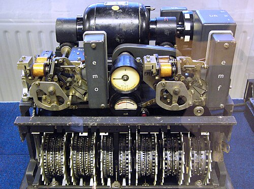

From 1940 British listening stations heard a new kind of German radio
traffic: not Morse but the rapid warble of a teleprinter. In the summer of
1941 an experimental link between Vienna and Athens began carrying it, and in
time it carried messages between the German High Command and army commands
across occupied Europe, enciphered by a machine nobody in Britain had seen.
[Bletchley](kloom:e/bletchley-park) called such traffic _Fish_, and the first link, and then the
machine behind it, [**Tunny**](kloom:e/lorenz-cipher). Early in 1942 its codebreakers worked out how
the machine was built, on paper, from the key it produced.

## Letters as five bits

A teleprinter sends each character as five on-or-off impulses in the
international teleprinter code, ITA2, a descendant of **[Émile Baudot](kloom:e/emile-baudot)**'s
five-unit code: thirty-two characters in all, written at Bletchley as dots
and crosses. In 1917 the Bell engineer **[Gilbert Vernam](kloom:e/gilbert-vernam)** had shown how to
encipher such a stream: add a key to it, impulse by impulse, modulo 2, so that
dot plus dot is dot, cross plus cross is dot, and dot plus cross is cross.
Adding the same key again gives the plain text back. Vernam's key was a
punched tape; the German machine made its key with wheels.

The machine, the Germans' **Lorenz SZ40**, later SZ42 (_Schlüssel-Zusatz_,
cipher attachment), sat between the teleprinter and the radio. Each of its
twelve wheels carried a ring of cams that could be set up or down, and each
wheel's count of cams differed from the others, so the patterns took an
astronomically long time to come round together.

| Wheels (Tutte's names) | Cams on each       | How they moved                                                     |
| ---------------------- | ------------------ | ------------------------------------------------------------------ |
| χ₁–χ₅ (chi)            | 41, 31, 29, 26, 23 | one step for every letter                                          |
| μ₆₁ (motor)            | 61                 | one step for every letter                                          |
| μ₃₇ (motor)            | 37                 | one step when μ₆₁ showed a cross                                   |
| ψ₁–ψ₅ (psi)            | 43, 47, 51, 53, 59 | all five one step when μ₃₇ showed a cross, on the SZ40; else still |

Each impulse of the key was the sum of a chi wheel and a psi wheel, and the
key was added to the plain text: _Z_ = _P_ ⊕ χ ⊕ ψ′, where ψ′, the _extended
psi_, is the psi stream with its pauses. The plate draws the twelve wheels to
scale and the two additions in each of the five impulses.

## The operator who sent it twice

A stream cipher has one fatal weakness: two messages sent on the same key.
Add the two cipher texts and the key cancels, leaving the sum of two plain
texts, which a skilled reader can pull apart. Tunny's operators sent a
twelve-letter _indicator_ in clear with each message, giving the wheel
settings, so a repeated setting was visible. On 30 August 1941, the [_General
Report on Tunny_](kloom:e/general-report-on-tunny) records, two very long messages went out with the same
indicator, HQIBPEXEZMUG: the same message typed twice by hand, with different
spacing, misspellings and corrections. (Two Wikipedia articles give the date
as 31 August.) **[John Tiltman](kloom:e/john-tiltman)**, a veteran of the Research Section, read the
pair, and from them reconstructed 3,976 letters of key. The Germans may have
noticed: the traffic almost stopped for a few days, and no more true depths
were recorded that year.

With invented bits, one impulse of a depth works like this:

| Stream                          | Letters 1–8 (invented) |
| ------------------------------- | ---------------------- |
| key                             | x • x x • • x •        |
| message A, plain                | • x x • • x • •        |
| message B, plain                | • x • • x x • x        |
| message A, cipher (plain ⊕ key) | x x • x • x x •        |
| message B, cipher (plain ⊕ key) | x x x x x x x x        |
| A ⊕ B, cipher: the key has gone | • • x • x • • x        |

The last row is exactly the sum of the two plain texts, with no key in it.

## A machine reconstructed from its key

For months the key resisted analysis. **[Bill Tutte](kloom:e/w-t-tutte)**, a young Cambridge
chemist and mathematician, was handed a copy by Major Gerry Morgan, head of
the Research Section: "see what you can do with this", in his telling.
He wrote out the first impulse of the key in rows of 575 letters, 23 × 25,
a guess from the indicators, and saw repeats running on a diagonal, not down
the columns. Rows of 574 lined them up; 574 is 2 × 7 × 41, and on a period of
41 the repeats were plain. The first impulse was a wheel of 41 cams plus a
second stream that repeated every 43 but sometimes stood still. The whole
Research Section then took the other impulses apart, and found the motor
wheels.

The _General Report_ puts that first success towards the end of January
1942, and calls it found "almost accidentally", naming nobody; Tutte himself
said that to credit him with working out all of it alone was an
exaggeration. He blamed two German mistakes together, the long depth and
poor psi patterns, and thought either alone would have been survivable.
Nobody at Bletchley saw a Lorenz machine until 1945.

Knowing the structure was not reading the traffic. In July 1942 [Alan Turing](kloom:e/alan-turing)
spent a few weeks in the Research Section and devised _Turingery_, a hand
method of recovering the cam patterns from a length of key by _differencing_,
adding each character to the next. That month a new section under Major
**Ralph Tester**, the [**Testery**](kloom:e/testery), began breaking messages by hand; by the end
of the war it had 118 staff working three shifts. In October 1942 the
Germans replaced the twelve-letter indicators with numbers from a book, and
depths became rare. Something faster than hand work was needed, and the
answer began with Tutte's statistics and a machine the [Wrens](kloom:e/womens-royal-naval-service) named after a
cartoonist.
