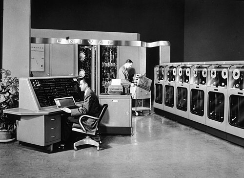

The first computers were built by universities and governments for
themselves. **UNIVAC**, the _Universal Automatic Computer_, was built by a
company to sell. Its first customer was the United States Census Bureau,
which had counted with punched cards since 1890, and its fame came from a
single night of television.

## A company from the ENIAC

**J. Presper Eckert** and **John Mauchly**, who had built the ENIAC, left
the University of Pennsylvania in March 1946 after a dispute over who would
own their patents, and started their own firm in Philadelphia. A National
Bureau of Standards study contract, on the Census Bureau's behalf, became
the specification of UNIVAC, and a contract to build it followed in 1948.
The money never lasted. The firm took on a small machine, BINAC, for
Northrop to earn cash, and was rescued in 1948 by $500,000 from American
Totalisator, the racetrack-machine company, whose vice-president Harry
Straus became its chairman. Straus died in a plane crash in October 1949,
his board withdrew, and on 15 February 1950 **Remington Rand**, the
typewriter and office-machine maker, bought the Eckert–Mauchly Computer
Corporation.

The first UNIVAC passed its acceptance tests for the Census Bureau on 31
March 1951, and was dedicated on 14 June at the Eckert–Mauchly plant in Philadelphia, where the
National Bureau of Standards formally handed it over. For the guests it
tabulated the 1950 census returns for Monroe County, Iowa, all 11,814
people, in a table ready to print. By Wikipedia's account it stayed in Philadelphia as the
company's demonstrator until December, and the Pentagon's, the second
built, was installed first; the Army's 1955 survey of computers has the
Census machine in operation from March 1951. The Census Bureau used its machine on part of the 1950
population census and all of the 1954 economic census.

## Decimal, duplicated, on tape

UNIVAC was built for business records, not ballistics, and it worked in
decimal. Its 1,000 words of twelve characters were held in mercury delay
lines, a hundred channels of ten words, in seven tanks. Each digit was six
bits: four in _excess-three_ code, the digit plus three, and two zone bits
that turned digits into letters, with a check pulse added to make the count
of ones odd. Every arithmetic operation was done twice, in duplicate
circuits, and the results compared.

Its great novelty was the **UNISERVO**, the first tape drive sold with a
computer. It ran half-inch tape of nickel-plated phosphor bronze, up to
1,500 feet a reel, at 100 inches a second, recording 128 digits to the inch
across eight channels: six for the character, one for the check pulse and
one for a sprocket. Data went in blocks of 60 words, 720 digits in about six
inches, with two and a half inches of blank tape between blocks for the
drive to start and stop. The plate shows that layout, and eight digits
written across the tape.

## Election night

On 4 November 1952 CBS put a UNIVAC on the air to forecast the presidential
election. A team led by the Pennsylvania statistician **Max Woodbury** and
Remington Rand's **Herbert Mitchell** had spent a month on the method
(another account has Mauchly and Woodbury programming it at Mauchly's
home). At 9:15 in the evening, with 3,398,745 votes counted, the printer
typed its forecast, against most predictions a landslide, at odds it
printed as "00 TO 1", read since as 100 to 1:

|                      | UNIVAC at 9:15 pm | Result (Wikipedia) |
| -------------------- | ----------------: | -----------------: |
| States, Ike          |                43 |                 39 |
| Electoral, Ike       |               438 |                442 |
| Electoral, Stevenson |                93 |                 89 |
| Popular, Ike         |        32,915,049 |         34,075,529 |

The men round the machine could not believe it. They cut a "national trend
factor" from 40 per cent to 4 and ran it again; the 9:54 forecast, 268 to
263, was the one broadcast. By 10:32 the returns had shown the 40 per cent
figure to be closer, and a Remington Rand executive went on air to
explain. The figures here are from a report of January 1953; the popular
vote is given as 32,915,949 in some later accounts, and Eisenhower's actual
total differs by 500 between two Wikipedia articles.

## The first generation compared

The table gives each machine's store as built, with figures from the
builders' histories and from the Army's 1955 survey.

| Machine         | Year | Main store                             |   Bits | Add time           | Valves |
| --------------- | ---: | -------------------------------------- | -----: | ------------------ | -----: |
| ENIAC           | 1946 | 20 accumulators of 10 decimal digits   |      — | 200 µs             | 17,468 |
| Manchester Baby | 1948 | Williams tube, 32 words of 32 bits     |  1,024 | 1.2 ms (any order) |   ~550 |
| EDSAC           | 1949 | Mercury, 512 words of 17 bits          |  8,704 | ~1.5 ms (average)  | ~3,000 |
| Ferranti Mark 1 | 1951 | Williams tubes, 512 lines of 20 bits   | 10,240 | 1.2 ms (any order) |  4,050 |
| UNIVAC I        | 1951 | Mercury, 1,000 words of 12 characters  | 72,000 | 120 µs             |  5,400 |
| IBM 701         | 1952 | Williams tubes, 2,048 words of 36 bits | 73,728 | 60 µs              |  4,000 |

The 1955 survey counted ENIAC's valves after years of additions, and times
UNIVAC's addition without the wait for the store; Wikipedia gives UNIVAC
6,103 valves and a 525-microsecond add. UNIVAC's bits count six per
character, without check pulses.

Remington Rand's price rose from $159,000 in the first contracts to a
million dollars and more. The 1955 survey counted 22 UNIVACs built;
Wikipedia gives 46 in all. IBM, whose [701](kloom:e/ibm-701) was announced in May 1952,
installed 19 of those. Every machine in the table ran on valves. The device that would replace them had already
been made, at Bell Labs in 1947.
