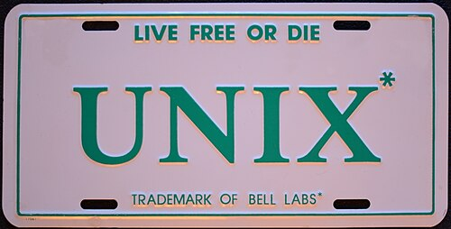

For its first fifteen years [Unix](kloom:e/unix) belonged to a company barred from the
computer business. A consent decree of 1956 kept [AT&T](kloom:e/at-and-t) out of it. Unix was
licensed to universities cheaply, source and all, and they built on it.
That changed with the break-up of the Bell System. The settlement signed
on 8 January 1982 freed AT&T from the old decree, and on 1 January 1984 it
gave up its local telephone companies and entered the computer business,
where observers expected it to challenge IBM. Unix became a product, and
its family fell out.

## A product, and a price

AT&T's System III came in 1982, and [**System V**](kloom:e/unix-system-v) in January 1983. The
Research Unix of the 1970s had cost a university $150 and anyone else $20,000;
the licence for System V, Release 2 cost a company $43,000 for its first
processor.

| Licence                               |       Year | Price                             |
| ------------------------------------- | ---------: | --------------------------------- |
| Sixth Edition, to a university        |       1975 | $150                              |
| Sixth Edition, to anyone else         |       1975 | $20,000                           |
| System V Release 2 source, education  |       1984 | $800, $400 each further CPU       |
| System V Release 2 source, commercial |       1984 | $43,000, $16,000 each further CPU |
| Berkeley's Networking Release 1 or 2  | 1989, 1991 | $1,000 a tape, then free to copy  |
| BSDI's BSD/386, source and binaries   |       1992 | $995                              |

Meanwhile Berkeley's [4.2BSD](kloom:e/berkeley-software-distribution) had networking and System V did not. At a
USENIX conference in the mid-1980s AT&T's staff wore buttons reading
"System V: Consider it Standard", and there were posters reading
"4.2 > V". Each vendor's Unix drifted from the next: by the late 1980s the
database company Informix was building for more than a hundred Unix
systems.

## Two camps

In 1987 AT&T and [Sun](kloom:e/sun-microsystems), the leading vendor of Berkeley Unix, set out to merge
the two into one, released in 1988 as **System V Release 4**. Other
licensees feared that Sun would own the future. In January 1988 Armando
Stettner of DEC proposed a joint development group to the rival vendors;
Apollo, Bull, DEC, Hewlett-Packard, IBM, Nixdorf and Siemens founded the
[**Open Software Foundation**](kloom:e/open-software-foundation) that year. Sun's Scott McNealy said the
letters stood for "Oppose Sun Forever". AT&T answered with **Unix
International**. One analyst took comfort that "Two Unixes are a lot better
than 225".

Stettner had earlier designed this licence plate as a promotion, borrowing
New Hampshire's motto and carrying Bell Labs' trademark notice. The drawing
sets the family out as lanes on a time line, with the branches, the merger
and the two years of the lawsuit.

Standards offered a neutral ground. The IEEE's [**POSIX**](kloom:e/posix) project began in
1984, from work by the users' group /usr/group; [Richard Stallman](kloom:e/richard-stallman) suggested
the name. Its first standard, IEEE 1003.1-1988, defined a programmer's
interface that System V and BSD, and some systems that were not Unix at
all, could meet with reasonable effort. The parts of the Unix C library
that could not travel had been handed to it by the C standard's committee.
In 1993 the camps made peace in the Common Open Software Environment:
Wikipedia's article on the wars dates it to March, its article on Unix
International to May. That summer AT&T sold its Unix business, [Unix System
Laboratories](kloom:e/unix-system-laboratories) (USL), to Novell (in June, says one Wikipedia article; in July,
another), and Novell passed the Unix trademark to the standards group
X/Open in October. In 1996 the OSF and X/Open merged as the Open Group.

## USL v. BSDi

In January 1992 a new company, [Berkeley Software Design](kloom:e/berkeley-software-design), began selling
BSD/386: Berkeley's free Networking Release 2 with six missing files
written by Bill Jolitz, for $995, with the telephone number 1-800-ITS-UNIX.
USL sued. When the judge would hear the case only on the six files, USL
sued the University of California too. In McKusick's account, Judge
Dickinson Debevoise heard the arguments in December 1992 and some six weeks
later refused the injunction and dismissed all but two of the complaints;
AT&T, Wikipedia's article on the case notes, had shipped its own 32/V
without copyright notices. Wikipedia's BSD article says instead that the
suit brought an injunction on Net/2. The university countersued in
California, claiming AT&T had used Berkeley code in System V without the
credit its licence required.

Novell's chief executive, Ray Noorda, preferred the market to the court.
The case was settled in January 1994 (McKusick; Wikipedia says February):
three files of 18,000 were removed, about seventy gained USL copyright
notices, and USL agreed not to sue anyone building on the cleaned release,
**4.4BSD-Lite**, which came that June. Every free BSD had to restart from
it.

## What it cost

For nearly two years nobody could be sure the free BSDs were legal to
ship. In those years a Finnish student's kernel, announced on 25 August
1991 and containing no AT&T code, met the GNU project's tools. [Linus
Torvalds](kloom:e/linus-torvalds) later said that if 386BSD, or GNU's own kernel, had been available
when he started, he would probably not have written his. The free Unix that
took the open ground was the one that owed Bell Labs nothing but its ideas.

All of it, the standards, the camps and the court case, was a quarrel over
a system two programmers had written for themselves on a cast-off PDP-7
in 1969: back to where this trail began, with Unix itself.
