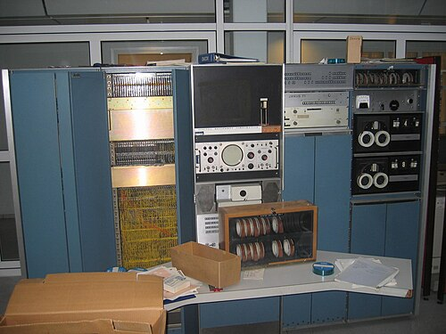
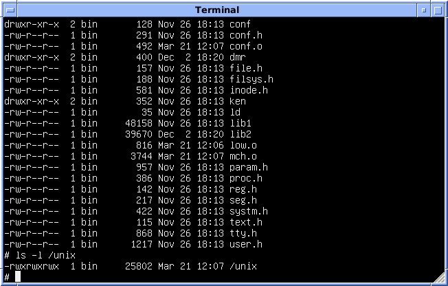

In 1969 a few programmers at Bell Labs lost the computer they liked
working on, and built a smaller one of their own in software, on a machine
nobody else wanted. Its ideas were simple enough to explain in an
eleven-page paper, and they became the pattern for the systems that run most
servers and phones today.

## After Multics

Bell Labs had joined MIT and General Electric in _Multics_, an ambitious
time-sharing system, and by 1969 it was pulling out: Multics was late,
expensive and not yet usable. Among the last holdouts were **Ken
Thompson**, **Dennis Ritchie**, **Doug McIlroy** and **Joe Ossanna**. What
they wanted to keep, Ritchie wrote in 1979, was not just a place to program
but "a system around which a fellowship could form". Through 1969 they
asked management for a PDP-10 or a Sigma 7 and promised to write an
operating system for it. The proposals were never quite refused and never
accepted.

So the work went on at the blackboard. Thompson, Rudd Canaday and Ritchie
designed a file system there; most of it was Thompson's, and Ritchie
believed his own contribution was the idea of _device files_. Meanwhile
Thompson had written a game, _Space Travel_, which cost about $75 of
computer time a play on the Labs' big GE 635. He found a little-used
**PDP-7**, a Digital Equipment machine with a good display, and moved the
game to it. Then, on the same machine, he built the file system, a notion
of processes, a few programs to copy, print, delete and edit files, and a
command interpreter, the _shell_. Once it had its own assembler the system
could maintain itself. Brian Kernighan suggested the name in 1970, a pun
on Multics; Kernighan has claimed the coining, and nobody remembers who
settled on the spelling.

## Everything a file

In early 1970 the group asked for a **PDP-11**, about $65,000, and got it
by promising the Patent department a text-processing system. It arrived
that summer, without a disk until December; the Unix that ran on it from
February 1971 had 24 kilobytes of memory, 16 for the system and 8 for one
user program, and a disk of half a megabyte. Three typists from the Patent
department used it through the second half of 1971.

The design, as Ritchie and Thompson described it in the _Communications of
the ACM_ in July 1974, rests on a few ideas:

- **One file system, a tree.** Directories are files that map names to
  files. A path such as `/usr/ken/paper` is followed from the root, one
  directory at a time. A file is just bytes; its structure is the business
  of the programs that use it, not the system.
- **Devices are files.** Each device has a _special file_ in `/dev`. To
  punch paper tape, a program writes to `/dev/ppt`. So file and device
  input and output work alike, a program that expects a file name can be
  handed a device, and the same permissions protect both.
- **Processes.** A running program is a process. `fork` copies one, `exec`
  replaces the copy with a new program, and `wait` lets the parent wait for
  it. The PDP-7's first `fork` took, Ritchie recalled, 27 lines of
  assembly code.
- **The shell is an ordinary program**, kept in a file like any other, so
  anyone could write another.

The plate follows `/usr/ken/paper` through its directories to an entry in
the _i-list_. The entry, an _i-node_, holds the file's mode and size and
the disk blocks where its contents lie. The i-node for `/dev/ppt` leads to
no blocks, but to the tape punch.

| Year | Machine   | Memory                   | What the papers say                            |
| ---- | --------- | ------------------------ | ---------------------------------------------- |
| 1969 | PDP-7     | 18-bit words             | one program in memory at a time, two terminals |
| 1971 | PDP-11/20 | 24 KB, 0.5 MB disk       | 16 KB for the system; files limited to 64 KB   |
| 1974 | PDP-11/45 | 144 KB                   | Unix takes 42 KB; about 40 installations       |
| 1978 | PDP-11/70 | 768 KB, two 200 MB disks | kernel 90 KB; over 600 installations           |

The 1974 paper's boast was about cost. Unix could run on hardware costing
as little as $40,000, and less than two man-years had gone into the main
system software. It had by then been rewritten, in the summer of 1973,
from assembly language into a new language, C. A Fifth Edition system, run
now in an emulator, lists its whole kernel, `/unix`, at 25,802 bytes.

## A system nobody could sell

The paper, first given at a symposium in October 1973, brought requests
for copies, and here the law shaped the story. Under a **1956 consent
decree** settling an antitrust case, the Bell System could enter no
business but common-carrier communications, and had to license its patents
on request. Unix could not become a product. So AT&T licensed it, with its
source code and with no support, for little more than the cost of the
tape: in 1975 a university paid a nominal $150, a company $20,000.
Thompson shipped tapes himself. Students learned operating systems by
reading its code, a user group met in New York in 1974, and by the 1978
revision of the paper over 600 installations were running it.

Sources differ over when it first ran on the PDP-11. One history says
1970; Ritchie's own account has the disk arriving in December, and the
1974 paper dates PDP-11 Unix to February 1971. This frame follows Ritchie.

What happened next is a trail of its own: the Multics it came from, the
language it was rewritten in, the pipes that joined its programs, the
Berkeley version that spread it, and the wars over whose Unix was real.
