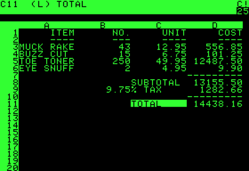

A business plan on paper is a grid of numbers in which most of the numbers
depend on others. Change one assumption, the price or the growth rate, and
every figure downstream has to be worked out and written in again, by hand.
In 1979 two programmers in Massachusetts put that grid on the screen of an
[Apple II](kloom:e/apple-ii) and made it redo its own arithmetic. They called it [**VisiCalc**](kloom:e/visicalc),
the visible calculator, and it was the first program people bought a
personal computer in order to run.

## A calculator with a screen

**[Dan Bricklin](kloom:e/dan-bricklin)** was studying for an MBA at Harvard Business School in the
spring of 1978. The usual account has a professor building a financial model
on a blackboard ruled like ledger paper, and erasing a column of entries each
time a number changed. Bricklin's own telling starts with a daydream in
class: a calculator he could slide about the desk like a mouse, its results
hanging in the air in front of him. He tried out the screen in BASIC on the
school's time-sharing system that spring, and settled on rows and columns so
that every value had a name. His first working version on an Apple II, on a
machine borrowed from the publisher **Dan Fylstra**, is dated 8 October 1978
in his journal. The Apple's game paddle proved too sluggish to steer the
cursor, so he used its two arrow keys.

His friend **[Bob Frankston](kloom:e/bob-frankston)** wrote the program itself, from November 1978,
in 6502 assembly language, using an assembler on MIT's [Multics](kloom:e/multics) time-sharing
system at night, when an hour cost a dollar. The two founded **Software
Arts** on 2 January 1979, working from the attic of Frankston's flat in
Arlington, and Fylstra's **Personal Software** agreed to publish it for a
royalty of 35.7 percent.

## Cells, formulas and recalculation

The screen showed a window onto a sheet of lettered columns and numbered
rows, and every cell had an address, like B4. A cell held a label, a number
or a formula, and a formula began with a digit or an operator (+B2\*B3), so
that the program could tell it from a word; functions began with an at
sign, as @SUM did. Commands began with a slash. Money was kept in a form of
decimal arithmetic, so that sums of cents came out exact. Whenever a number
changed, the whole sheet was calculated again and redrawn.

_Again_ hid a decision. When formulas depend on each other, the order in
which cells are computed matters. Following each formula's dependencies
would have meant storing pointers that the Apple II had no memory to spare
for, so VisiCalc swept the sheet in plain order, row by row or column by
column, and relied on the user to notice a formula that had read a
cell before it was updated. The plate draws a small sheet with its
dependencies, invented for the purpose:

| Cell | Label  | Entry        |  Value |
| ---- | ------ | ------------ | -----: |
| B1   | PROFIT | +B4-B5       | 190.00 |
| B2   | UNITS  | 120          |    120 |
| B3   | PRICE  | 4.50         |   4.50 |
| B4   | SALES  | +B2\*B3      | 540.00 |
| B5   | COSTS  | 200+1.25\*B2 | 350.00 |

Change the units to 200 and recalculate row by row. B1 comes first, and
subtracts the old costs from the old sales:

| Cell | After one pass | After a second pass |
| ---- | -------------: | ------------------: |
| B1   |         190.00 |              450.00 |
| B4   |         900.00 |              900.00 |
| B5   |         450.00 |              450.00 |

Pressing the recalculate key a second time puts it right. Later
spreadsheets advertised _natural order_ recalculation, which follows the
dependencies, as a feature; the idea was older than VisiCalc, in a
mainframe budgeting program called LANPAR written in 1969. Frankston judged
the simpler order the right trade for the Apple II, and memory was the
reason: the program was meant to fit a 16 KB machine and ended up needing
32 KB.

## The tail that wags the dog

The analyst **Ben Rosen** saw it in mid-1979 and wrote that VisiCalc "could
some day become the software tail that wags (and sells) the personal
computer dog." It was demonstrated at the West Coast Computer Faire and
launched at the National Computer Conference on 4 June 1979; Frankston dates
the first production copy to 17 October. It cost under $100 and needed an
Apple II of about $2,000, and buyers took both: more than a quarter of the
Apple IIs sold in 1979 were reportedly bought for it, and [Wozniak](kloom:e/steve-wozniak) said small
businesses, not hobbyists, bought nine in ten. Nothing on the larger
machines worked like it. More than 700,000 copies sold in six years.

It could not be patented, since software then could not be, and rivals came.
[**Lotus 1-2-3**](kloom:e/lotus-1-2-3), written by **[Mitch Kapor](kloom:e/mitch-kapor)** for the [IBM PC](kloom:e/ibm-personal-computer)'s larger memory
and eighty-column screen, took the market from 1983, and Lotus bought
Software Arts in 1985. VisiCalc was already on the IBM PC among its
first programs: the machine that business bought next.
