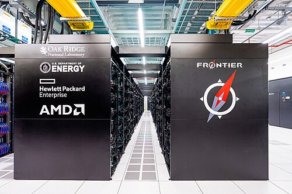

This frame describes computing as of 28 September 2026. The story began
with pebbles laid in the columns of a marble board, so that where a pebble
lay said what it was worth. Place value is still the whole trick, only
now it is kept in binary, in switches too small to see, and there are more
of them than anyone can count exactly.

## How many

Nobody counts the world's computers directly; each count is someone's
estimate of one kind of machine, and they overlap.

| What was counted                                        | Number           | Counted by              |
| ------------------------------------------------------- | ---------------- | ----------------------- |
| ARM-based chips shipped since the 1980s                 | over 350 billion | Arm, May 2026           |
| Connected devices other than phones and computers, 2025 | 21.1 billion     | IoT Analytics, forecast |
| Wireless connections                                    | 8.8 billion      | GSMA, 2026              |
| Smartphones shipped in 2025                             | 1.26 billion     | IDC                     |
| Personal computers shipped in 2025                      | 284.7 million    | IDC                     |

IoT Analytics, which excludes phones, computers and tablets from its count
of "connected devices", expected them to reach 39 billion by 2030. Many
of them are small processors inside other things, a thermostat or a
factory sensor, that nobody thinks of as a computer.

## The fastest

At the other end is the supercomputer. The TOP500 list, compiled twice a
year since 1993 by timing each machine on the same dense linear-algebra
benchmark, had a new leader in June 2026. **LineShine**, at the National
Supercomputing Centre in Shenzhen, ran it at 2.198 exaflops, 2.198 × 10¹⁸
floating-point operations a second, on 13,789,440 processor cores. It uses
no graphics accelerators, only custom 304-core LX2 processors,
and it is the first Chinese machine at the top since Sunway TaihuLight in 2017. The American **El Capitan**, at Lawrence Livermore, is second at
1.809 exaflops. Five machines on the list now reach an exaflop. The first
list's leader, in June 1993, a Connection Machine CM-5 at Los Alamos, ran
the benchmark at 59.7 gigaflops, about 37 million times slower.

## What it costs in energy

Speed is bought with electricity. **Jonathan Koomey** and colleagues
showed in 2010 that the number of computations done per unit of energy had
doubled about every 1.57 years since the 1950s; he and Sam Naffziger found
in 2016 that after 2000 the doubling had slowed to about every 2.6 years.
The chart takes the fastest machine on each TOP500 list where its power
was reported, and divides its benchmark speed by its power.

| No. 1 on the TOP500 | First list at the top | Speed (HPL)     | Power     | Gigaflops per watt |
| ------------------- | --------------------- | --------------- | --------- | -----------------: |
| Earth Simulator     | June 2002             | 35.86 teraflops | 3,200 kW  |              0.011 |
| Roadrunner          | June 2008             | 1.026 petaflops | 2,345 kW  |               0.44 |
| K computer          | June 2011             | 8.162 petaflops | 9,899 kW  |               0.82 |
| Sunway TaihuLight   | June 2016             | 93.01 petaflops | 15,371 kW |                6.1 |
| Fugaku              | June 2020             | 415.5 petaflops | 28,335 kW |               14.7 |
| Frontier            | June 2022             | 1.102 exaflops  | 21,100 kW |               52.2 |
| El Capitan          | November 2024         | 1.742 exaflops  | 29,581 kW |               58.9 |
| LineShine           | June 2026             | 2.198 exaflops  | 42,220 kW |               52.1 |

Over twenty years the fastest machine became about 4,700 times more
efficient; in the four years since Frontier it has not improved: the
newest leader, built of processors alone, draws 42 megawatts.

All the world's data centres together used about 415 terawatt-hours of
electricity in 2024, around 1.5 per cent of the world's consumption, by the
International Energy Agency's estimate. In April 2026 the agency put 2025
at 485 TWh, up 17 per cent, with AI-focused data centres up 50 per cent,
and expected about 950 TWh by 2030, some 3 per cent of the world's demand.
The chips, clusters and power of AI itself are a subject of their own.

## How far down

Physics sets a floor. **Rolf Landauer** argued in 1961 that erasing one bit
of information must give off at least _kT_ ln 2 of heat: at room
temperature, about 2.9 × 10⁻²¹ joules. LineShine spends about 1.9 × 10⁻¹¹
joules on each floating-point operation, roughly ten thousand million
times more, as the plate draws, though a floating-point operation erases
far more than one bit, so the true margin is smaller. Computers that erase
nothing, reversible ones, escape even that bound in principle, and
quantum computers, still experimental, compute in another way altogether.

## The whole story

Every step in this story made the same work cheaper. Tables of logarithms
turned multiplying into adding; gears did the adding; punched cards fed
the gears; valves and then transistors did it electronically, and the
stored program let one machine do any of it. The chip made the machine
small enough to sell as a part, then cheap enough to own, then to carry.
Networks joined them, and shared software gave them something in common
to run.

From a pebble on a line to switches flipping billions of times a second,
every machine in this story has done one thing: held numbers in places,
and moved them. We are still counting.
