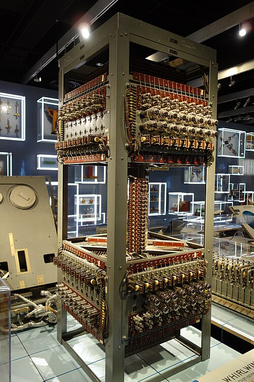
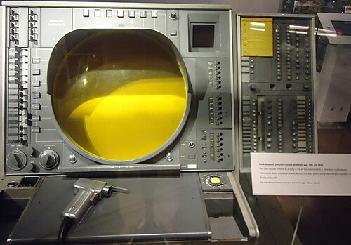

Every computer so far had worked through a batch of numbers and printed
the answer. **Whirlwind**, at the Massachusetts Institute of Technology,
was built to keep up with the world as it happened: first an aircraft in a
simulator, then real aircraft on radar. To do that it needed a memory fast
and reliable enough, and the one its builders invented ran almost every
computer for the next twenty years.

## A simulator that became a computer

The project began in the Servomechanisms Laboratory under **Jay Forrester**
as a flight simulator for the Navy's Office of Naval Research. An analog
design proved too inflexible, and after a colleague saw ENIAC in 1945 the
team turned to digital. By 1947 Forrester and **Robert Everett** had a
design unlike its contemporaries: a 16-bit word handled all at once, in
parallel, rather than a digit at a time, for speed. Construction began in
1948, with about 5,000 valves and a budget near a million dollars a year.
On 20 April 1951 it computed interception courses for aircraft. The Navy
had lost interest by then, but the Air Force, alarmed by the Soviet atomic
bomb of 1949, had not. In September 1950 a radar at Hanscom Field sent an
aircraft's track down a telephone line to Whirlwind, and the result
appeared on its screen.

Its weakness was the store. Whirlwind was built around electrostatic
storage tubes developed at MIT, a cousin of the Williams tube. They were
late, held less than planned, and took constant repair.

## Memory in a ring

Forrester had thought about a three-dimensional store since 1947. In the
spring of 1949 he saw an advertisement for **Deltamax**, a magnetic alloy
with a nearly square _hysteresis loop_, and saw how to build it. A small
ring, a _core_, magnetised one way round holds a 1 and the other way a 0,
and keeps it with the power off. Its square loop is the point: a current
below a threshold leaves the core as it was, while one above it flips the
core completely.

That makes **coincident-current** selection possible. The cores sit at the
crossings of a grid of wires, X wires along the rows and Y wires down the
columns. Send half the switching current down one X wire and half down one
Y wire, and only the core where they cross feels the whole of it; every
other core on those wires feels half and stays as it was. A plane of
32 × 32 cores needs 64 drive wires, not 1,024. The plate draws a
four-by-four plane and the loop.

| Core                       |   X |   Y | Inhibit | Total | Flips? |
| -------------------------- | --: | --: | ------: | ----: | ------ |
| At the crossing, writing 1 | I/2 | I/2 |       0 |     I | yes    |
| At the crossing, writing 0 | I/2 | I/2 |    −I/2 |   I/2 | no     |
| Same row, other column     | I/2 |   0 |       0 |   I/2 | no     |
| Same column, other row     |   0 | I/2 |       0 |   I/2 | no     |

(In units of the current I that flips a core.) To read, the selected core
is driven towards 0. If it held a 1 it flips, and the change induces a
pulse in a **sense** wire threaded through every core of the plane; if it
held a 0, nothing happens. Reading destroys the bit, so every read is
followed by a write that puts it back. A stack of planes, one per bit of
the word, holds a whole word at each crossing, and an **inhibit** wire in
each plane carries an opposing half current wherever that bit must stay 0.

Forrester's student **William Papian** built a two-by-two array in October 1950. Metal cores switched too slowly, and ferrite ones, tried in May 1952,
switched in under a microsecond. A 16,384-bit ferrite store, 32 × 32 × 16,
went into a separate Memory Test Computer in May 1953. On 8 August 1953 it
replaced the first bank of storage tubes in Whirlwind, and a second core
bank replaced the other on 5 September. The quarterly report gave the
access time as 9 microseconds, against about 25 for the tubes, with far
less maintenance. IBM's 704 took core to the market in 1955, and core
remained the main memory of nearly every computer until semiconductor
memory chips displaced it in the 1970s.

## SAGE

Whirlwind became the prototype of **SAGE**, the Semi-Automatic Ground
Environment. Its Cape Cod test system was running by September 1953, and
IBM built the production machine, the **AN/FSQ-7**. Each was a pair of
computers, one running and one standing by, with 49,000 valves, about 250
tons and a 3,000-kilowatt power supply. The first went into service at
McGuire Air Force Base, New Jersey, on 1 July 1958. Radars fed each
**direction center** over telephone lines; operators watched tracks on
round display tubes and picked one out with a **light gun**, invented at
Lincoln Laboratory by Everett. Counts differ: Lincoln Laboratory lists 24
direction centers and 3 combat centers, with 24 FSQ-7s and 3 FSQ-8s built;
IBM's history says 27 centers and 56 computers. SAGE ran until January 1984.

SAGE's programs ran to more than 500,000 lines, by far the largest yet
written. Writing programs was becoming as big a job as building machines,
and the next frame is a language made to shorten it: Fortran.
