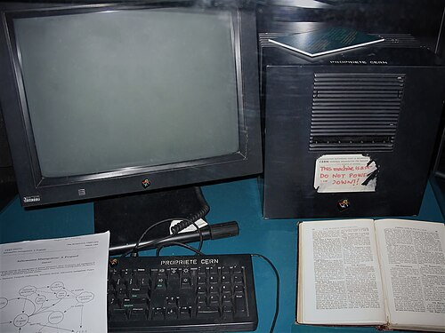
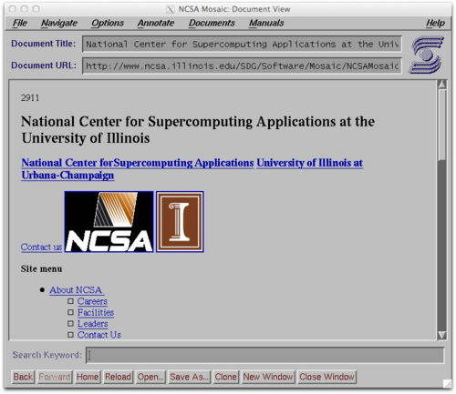

By 1989 the [internet](kloom:e/internet) could carry a file or a letter to almost any
research machine, but only to someone who already knew where to look.
[CERN](kloom:e/cern), the particle physics laboratory outside Geneva, had the problem in
miniature: several thousand people, many staying two years or so, and
their knowledge leaving with them. "Often, the information has been
recorded," one of its staff wrote, "it just cannot be found."

## Vague but exciting

**[Tim Berners-Lee](kloom:e/tim-berners-lee)** wrote "Information Management: A Proposal" in March
1989 and sent it round again, unchanged but for the date, in May 1990. It
argued that CERN's real working structure was not its organisation chart
but "a multiply connected 'web' whose interconnections evolve with time",
and that its documents should be linked the same way: [_hypertext_](kloom:e/hypertext), text
whose words lead to other texts, spread across many computers "without
requiring any central control or coordination". The only name he had for it then was "Mesh". His manager **Mike
Sendall** called it "vague, but exciting", and accepted it. **Robert
Cailliau**, who had proposed a hypertext project of his own, joined him.

Berners-Lee wrote the first browser, which was also an editor, on a NeXT
workstation in the second half of 1990, and called it _WorldWideWeb_. The
first web site, describing the project itself, went up on 20 December 1990
on his NeXT, which served as the first web server. A simpler _line-mode_
browser followed, which could run on any terminal, and in August 1991 he
announced the software on the Usenet newsgroups.

## Three small inventions

The web needed three things, and each was kept small.

- An **address**, later the URL, naming how to fetch a document, from
  which machine, and where on it:
  `http://info.cern.ch/hypertext/WWW/TheProject.html`.
- A **protocol**, [HTTP](kloom:e/http). In its first form, of 1991, a browser opened a TCP
  connection to the server, on port 80 unless told otherwise, and sent one
  line: the word `GET`, a space and the document's path. The server sent
  back the document and closed the connection, which marked the end. There
  were no headers, and an error came back as an ordinary page.
- A **language**, HTML, in which a page marks its headings and paragraphs,
  and its links, each an anchor pointing at another address.

The plate draws all three: pages on two servers linked by anchors, the
address in its parts, and the single line out and the page back. No
central registry had to approve a link: any page could point at any other
on any server. Keeping a page private or its traffic secret was left to later layers; the
encryption the web now runs over is the last frame of the trail on the
internet's layers.

## Given away

On 30 April 1993 CERN put the [World Wide Web](kloom:e/world-wide-web) software in the public
domain. By then others were writing browsers.
At the [National Center for Supercomputing Applications](kloom:e/national-center-for-supercomputing-applications) (NCSA) in Illinois,
**[Marc Andreessen](kloom:e/marc-andreessen)** and **Eric Bina** released [**Mosaic**](kloom:e/ncsa-mosaic) in January 1993,
the first browser to show pictures in the page among the text rather than
in a separate window. Andreessen left with **Jim Clark** of Silicon
Graphics to found the company that became [Netscape](kloom:e/netscape), whose Navigator, out in
December 1994, drew a page while it was still downloading and was free for
non-commercial use. Microsoft licensed a Mosaic of its own, from Spyglass,
to make Internet Explorer.

## Growth

**Matthew Gray** counted web sites from 1993 with a program he called the
_Wanderer_.

| Date         |     Web sites | Counted by      |
| ------------ | ------------: | --------------- |
| June 1993    |           130 | Gray's Wanderer |
| June 1994    |         2,738 | Gray's Wanderer |
| June 1995    |        23,500 | Gray's Wanderer |
| January 1996 | about 100,000 | Gray's Wanderer |
| July 2026    | 1,494,915,628 | Netcraft        |

In the second half of 1993 the number doubled in under three months. The
web overtook the internet's older uses as fast. On the NSFNET backbone it
was half of one per cent of the traffic in June 1993 and 23.9 per cent in
March 1995, level with file transfer, which had fallen from 42.9 per cent
to 24.2. The two counts in the chart were made in different ways and are
not strictly comparable: in July 2026 Netcraft's survey had answers from
1.49 billion sites on 305 million domains.

The web was given away, and so was much of the software it ran on.
Sharing code is the next part of the story.
