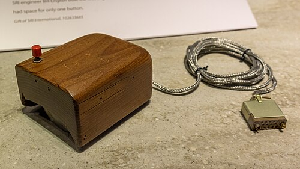
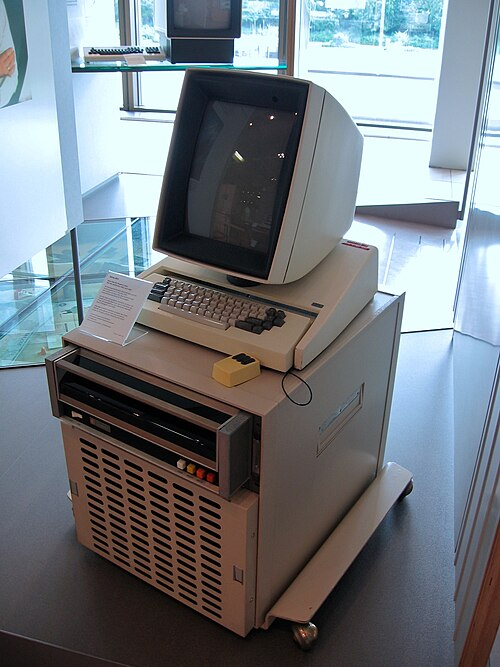

In 1973 a computer that did not share itself went to work in a research
laboratory in Palo Alto. It sat under a desk, it drew everything on its
screen dot by dot from its own memory, and its user pointed at things with a
box on a wire. Xerox never sold it. Almost everything a reader now does on a
personal computer was first done on it.

## The demonstration

The prelude came five years earlier, on 9 December 1968, when **[Douglas
Engelbart](kloom:e/douglas-engelbart)** of the Stanford Research Institute gave a ninety-minute
demonstration to about a thousand people at the Fall Joint Computer
Conference in San Francisco. His _oN-Line System_ (NLS) ran on an SDS 940
back at the institute in Menlo Park, reached through two home-made 1,200-baud
modems and a microwave video link. He moved a cursor with a wooden [_mouse_](kloom:e/computer-mouse),
opened windows, followed a link by clicking underlined text, and edited a
document together with two colleagues back at the laboratory, whose faces
and screens shared his. The mouse, built by **Bill English** to Engelbart's
sketches, was patented in 1970. The demonstration earned a standing ovation
and, as **Andy van Dam**, who was in the audience, later put it, almost no
further impact.
Several of its engineers, English among them, moved to Xerox.

## A computer for one person

Xerox opened its **[Palo Alto Research Center](kloom:e/parc-company)** (PARC) in July 1970. A memo
by **[Butler Lampson](kloom:e/butler-lampson)** in 1972 proposed a small machine for each researcher,
and **[Charles Thacker](kloom:e/charles-p-thacker)** designed most of it. The first [Altos](kloom:e/xerox-alto) ran in the
spring of 1973 (1 March by one account, April by another). The 1976 hardware
manual defines what PARC meant: a machine not shared with anyone, with power
and storage enough for one user's work.

Its screen was the radical part. It stood in portrait, like a sheet of
paper, 606 dots across and 808 down, and every dot was one bit of main
memory. A scan line took 38 sixteen-bit words, and the whole screen 30,704
of the machine's 65,536: nearly half its memory held the picture. There was
almost no display hardware. The processor's own microcode fetched each word
in turn into a sixteen-bit shift register, which clocked it out to the tube
as dots, sixty fields a second. The plate draws that path. The same
microcode also served the disk, the keyboard and the network, [**Ethernet**](kloom:e/ethernet),
which was invented at PARC to join Altos to each other and to their printers.

| The Alto, as its 1976 manual describes it |                                           |
| ----------------------------------------- | ----------------------------------------- |
| Screen                                    | 606 × 808 dots, portrait, refreshed 60×   |
| Memory                                    | 64K words of 16 bits, 850 ns              |
| Processor                                 | microcoded, emulating a Data General Nova |
| Input                                     | keyboard, three-button mouse, keyset      |
| Storage                                   | a Diablo disk cartridge of 2.5 MB         |
| Network                                   | Ethernet, 3 Mbit/s                        |

## What it ran

Because the screen was a bitmap, text could be set in real fonts at real
sizes. **Bravo**, written by Lampson, **Charles Simonyi** and colleagues and
working by 14 September 1974, was the first editor to show a document as it
would print: _what you see is what you get_. Its screen had 72 dots to the
inch, almost exactly the printer's 72.27 points, while PARC's printers had
300, so the screen could only approximate the page. Those printers were
PARC's too: **Gary Starkweather** had moved there in 1971 to turn a Xerox
copier into a printer by drawing on its drum with a laser, and with Lampson
and Ronald Rider built it into a machine the Altos printed on.

**[Alan Kay](kloom:e/alan-kay)**'s Learning Research Group, with **Dan Ingalls** and **Adele
Goldberg**, built [**Smalltalk**](kloom:e/smalltalk), a language of objects sending each other
messages, and moved it to the Alto in April 1973. Its environment was the
first with _overlapping windows_ and pop-up menus, and the operation that
made them possible, copying a rectangle of bits from one place to another
(_BitBLT_), was defined on the Alto. About 2,000 Altos were built, roughly
a thousand in use at Xerox and five hundred at universities by the late
1970s. None was sold as a product: _Byte_ told its readers in 1981 that
nobody outside research was ever likely to be able to buy one.

## The visit

In 1979 [Apple](kloom:e/apple-inc) was a year from going public, and Xerox's venture arm wanted
a stake. In **Malcolm Gladwell**'s telling, **[Steve Jobs](kloom:e/steve-jobs)** offered to let
Xerox buy 100,000 shares for $1 million if PARC would open its doors to
Apple. People from Apple visited PARC twice late that year; Stanford's
history puts Jobs on the second visit. **Larry Tesler** worked the Alto for
them, with Apple's **Bill Atkinson** leaning in as close to the screen as he
could.

The legend has Apple stealing the future on those afternoons. Stanford's
history of the [Macintosh](kloom:e/macintosh-128k) finds it wrong in most particulars: Apple's Lisa
and Macintosh projects were already aiming at bitmapped screens and a
pointing device, several Apple engineers knew PARC's work, and PARC, which
published freely, had shown the Alto to some 2,000 visitors in 1975
alone. What Apple took was a conviction, and what it built differed: a mouse
with one button instead of three, which a design firm made cheap enough to
sell with every machine (Gladwell sets PARC's at $300 against Apple's $15). Xerox's own product, the **Star**, came in 1981 at
over $16,000 a workstation.

By then a computer had already reached ordinary desks, by a different road:
in 1977, in a beige plastic case, from a young company in Cupertino.
