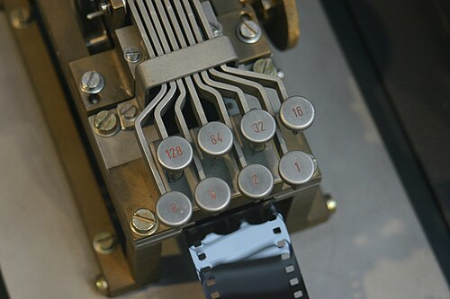
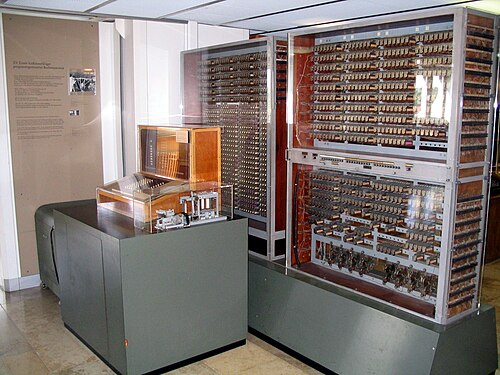

**Konrad Zuse** was a civil engineer at the Henschel aircraft works outside
Berlin in the mid-1930s, and his job was calculating: the same long
sequences of arithmetic on structural problems, over and over. He decided a
machine should do them, quit, and began to build one in his parents' living
room in Kreuzberg. By the usual reckoning his third machine, finished in
1941, was the first working computer that was both programmable and fully
automatic, and it was built out of telephone relays.

## Binary, in sheet metal

His first machine, the **Z1**, built from 1936 to 1938, had no relays at
all. It was mechanical, cut from thin metal sheets with a jigsaw by Zuse and
his friends: some 20,000 parts by one count, 30,000 metal parts by another,
driven by an electric motor. The design was the remarkable part. It worked
in binary, turning numbers into decimal only at the keyboard and the
display, and in _floating point_, a number held as a significand and a
binary exponent, which Zuse called "semilogarithmic". Its program came on punched 35 mm
cinema film, one instruction to a row. It never worked reliably: the sheets
did not move together precisely enough. The **Z2** of 1940 kept the
mechanical memory and did its arithmetic with relays, and at a demonstration
to the German aviation research institute, the DVL, it worked well enough to
win part of the money for a third machine.

## The Z3

Zuse built the **Z3** from 1938 and showed it to an audience from the DVL on
12 May 1941. It was the Z1's design in relays: about 2,600 of them in one
account, 2,000 in another, 1,400 of those holding the memory's 64 words. A
word was 22 bits: a sign, an exponent of seven bits running from −64 to 63,
and fourteen bits of significand after a leading 1 that, since it was always
there, was never stored. The lowest exponent meant zero and the highest
infinity, and the machine flagged operations on them as exceptions, as
floating-point hardware still does.

Numbers went in on a keyboard as four decimal digits and an exponent button,
and came out on a row of lamps. The program came in on punched film, eight
bits a row. The plate punches a short one that multiplies two numbers from
memory, adds a third, stores the result and shows it.

| Instruction | What it does        | Opcode    | Cycles |
| ----------- | ------------------- | --------- | -----: |
| Pr _z_      | load from address z | 11 zzzzzz |      1 |
| Ps _z_      | store to address z  | 10 zzzzzz |    0–1 |
| Ls1         | add                 | 01 100000 |      3 |
| Ls2         | subtract            | 01 101000 |    4–5 |
| Lm          | multiply            | 01 001000 |     16 |
| Li          | divide              | 01 010000 |     18 |
| Lw          | square root         | 01 011000 |     20 |
| Lu          | read the keyboard   | 01 110000 |   9–41 |
| Ld          | display the result  | 01 111000 |   9–41 |

The opcodes are as the historian **Raúl Rojas** read them from Zuse's patent
application of 1941. Zuse gave three seconds for a multiplication, which
puts the clock at about five cycles a second. A program to compute a complex
matrix, for the flutter of aircraft wings, was written and used on it, but
the Z3 was never put into everyday operation, and a request to rebuild it
with valves was refused as not important to the war. It was destroyed in an
air raid on Berlin on 21 December 1943. The Z1 went too: in the same month
by one account, on 30 January 1944 by another. Zuse's company built a
working replica of the Z3 in 1961, now in the Deutsches Museum in Munich.

## Universal, in principle

What the Z3 lacked was a conditional jump: its program ran straight through,
and the only loop was to glue the two ends of the film together. In 1998
Rojas showed that this was enough, in principle. Run every branch of the
program every time, but let only the chosen one change memory, by computing
each assignment as _a_ = _a_ · _t_ + (1 − _t_) · (_b_ op _c_), where _t_
is 0 in the chosen branch and 1 elsewhere, and _t_ itself comes from
arithmetic. Even halting works: 0/0 stops the machine with a lamp. So the Z3
could, with a long enough film, simulate any computer with bounded memory.
Rojas was plain that nobody would program it so, and that "in the way the
Z3 was really programmed", it was not equivalent to a modern computer.
Who should be called the inventor of the computer has long been argued, and
often acrimoniously, as Rojas put it; in Germany the usual answer is Zuse.

## Relays elsewhere, and after

Zuse was not alone with relays. At Bell Labs **George Stibitz** built a
binary adder of relays in 1937, on his kitchen table as the story goes, and his **Complex
Number Calculator** went into service in 1940. In September that year, at
Dartmouth College, he ran it from a teletype over telegraph lines to New
York: the first computing done at a distance. Zuse, for his part, knew
nothing of Shannon's switching algebra, and worked out his own.

His **Z4**, begun in 1942, was moved out of Berlin in February 1945 and
reached the Alps on an army truck. Rented to ETH Zurich from 1950, with a
conditional jump added, it was in 1950 and 1951 the only working digital
computer in Central Europe, and it survives. Between 1942 and 1945 Zuse also
designed _Plankalkül_, a programming language with loops and branches:
excerpts appeared in 1948, the whole in 1972, and the first implementation
in 1975.

Relays clicked a few times a second. The machines that came next switched
with valves and had no moving parts, and the first of them was built in
secret in Britain, in 1943, to read German ciphers.
