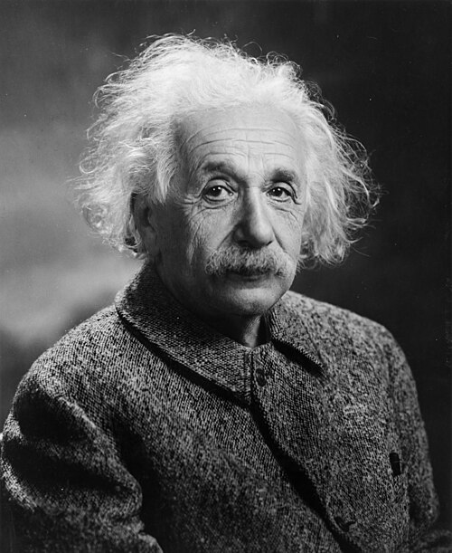

The theory that **[John Wheeler](kloom:e/john-archibald-wheeler)** and [Feynman](kloom:e/richard-feynman) built at Princeton between 1940 and 1942 was wrong, or at least unused, and Feynman said so himself. It still made him. It taught him to think of physics as whole paths through space and time rather than as fields changing from one instant to the next, and it gave him the idea, which he admitted stealing from Wheeler, that a positron is an electron running backwards in time.

## An electron that does not act on itself

The problem came from his reading at MIT. Classical electromagnetism, and the quantum theory built on it, gave a point electron an infinite energy, because the electron's own field acts back on it. Feynman's cure, as he described it in his Nobel lecture of 1965, was to forbid that: a charge acts only on other charges, directly, after the delay light takes to cross between them. With no field of its own, there was no self-energy to be infinite.

At Princeton he learned the flaw. An accelerated charge radiates, and the work done against _radiation resistance_ is what pays for the light it sends out. Since Lorentz, that resistance had been explained as the charge acting on itself. Forbid self-action and the force vanishes, and energy is no longer conserved.

## Waves from the future

Some time in 1940, stuck on another problem, Feynman told Wheeler an idea: perhaps the resistance was the reaction of distant charges, shaken by the first and shaking it back. Wheeler saw at once that the reply would depend on the other charges' mass and distance, and would arrive too late. Then he went further. [Maxwell's equations](kloom:e/maxwells-equations) have two kinds of solution, _retarded_ waves that travel outwards into the future and _advanced_ waves that travel inwards from it, and physicists had always thrown the second away. Suppose the charges of a surrounding _absorber_ reply by advanced waves: their answer would reach the source at the very moment it was shaken.

Feynman went home to work out the proportions and found that everything came out right if every charge radiates half retarded and half advanced. His Nobel lecture gives the example the plate draws. Surround a source with an absorbing wall ten light-seconds away, and put a test charge one light-second from the source.

| Time (s) | Event                                                                                  |
| -------- | -------------------------------------------------------------------------------------- |
| −1       | The source's advanced wave meets the test charge; so does the wall's, exactly opposite |
| 0        | The source is shaken; the wall's advanced reply arrives: radiation resistance          |
| +1       | The source's retarded wave meets the test charge; the wall's adds to make it full      |
| +10      | The source's retarded wave reaches the wall and shakes its charges                     |

The advanced effects cancel everywhere except at the source, where they supply exactly the missing force, and the world looks as though only retarded waves existed. Wheeler found that **Hugo Tetrode** and **Adriaan Fokker** had written such direct-interaction theories in the 1920s, and Fokker's action gave the fifty-fifty mixture automatically. Feynman rewrote it compactly as a single principle of least action with no field in it.

## The first seminar

Wheeler had Feynman present the work at the physics department's weekly colloquium. **[Eugene Wigner](kloom:e/eugene-wigner)**, who ran it, invited the astronomer **Henry Norris Russell**, **[John von Neumann](kloom:e/john-von-neumann)**, **[Wolfgang Pauli](kloom:e/wolfgang-pauli)**, then visiting from Zurich, and **[Albert Einstein](kloom:e/albert-einstein)**, who did not normally come. In Feynman's recollection of 1966, his hands shook as he took his notes from the envelope, and the fear went as soon as he was talking physics. Pauli rose to object, and turned to Einstein for agreement; Einstein said no, only that the theory was hard to square with general relativity, which was itself less certain than electrodynamics. Feynman admitted to Weiner that he could not remember what Pauli's objections were. The later memoir, and accounts built on it, give Pauli a prescient warning that the theory would be hard to quantise; that is the telling of forty years on.

Wheeler booked the following week's colloquium for the quantum version, which he believed he had. He did not, and cancelled. Feynman read a ten-minute paper on the classical theory at the American Physical Society's meeting in Cambridge, Massachusetts, in February 1941, word for word, and remembered it as dull.

## Two papers, late

Wheeler planned a grand series of five papers and wrote them in his own historical style; Feynman thought the twenty-seven pages he had drafted were what the theory deserved. The war intervened. "Interaction with the Absorber as the Mechanism of Radiation" appeared in _Reviews of Modern Physics_ in 1945, presented as the third part of the series, and "Classical Electrodynamics in Terms of Direct Interparticle Action" in 1949. The other parts never came. **Fred Hoyle** and **Jayant Narlikar** carried the idea into a theory of gravity in the 1960s, the direction Einstein's remark had pointed.

One day Wheeler telephoned him at the Graduate College: all electrons have the same charge and mass, he said, because they are all the same electron, a single world line knotted back and forth through time. Feynman did not believe the one electron. He kept the backwards part.

What the classical theory lacked was a quantum version, and the usual recipe needed something the [absorber theory](kloom:e/wheeler-feynman-absorber-theory) did not have. That problem became his thesis.
