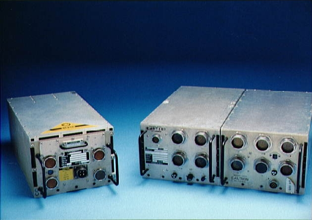

The commission handed its report to President [Reagan](kloom:e/ronald-reagan) in the Rose Garden,
and it was made public on 9 June 1986: a first volume of
findings and nine recommendations, and four more of appendices and
testimony. **Appendix F**, in the second volume, is signed by [Feynman](kloom:e/richard-feynman) alone:
"Personal Observations on Reliability of Shuttle".

## Version 23

How it got there is his story, told in a talk at [Caltech](kloom:e/california-institute-of-technology) in 1987. He wrote
it while the panels drafted their chapters, and sent it to
**Alton Keel**, the commission's executive director, who said he would show
it to everybody. Later Feynman found that no commissioner had seen it. When they did, they liked it, but the meetings were spent polishing
the main report's wording, so he agreed that it should go in as an
appendix. Keel then marked whole sections for deletion as repetitious.

At the last minute [Rogers](kloom:e/william-p-rogers) proposed a tenth recommendation, never discussed
at a meeting, that [NASA](kloom:e/nasa) should continue to have the nation's support.
Feynman thought it read like the NASA summaries he had found at the start,
listing every trouble and concluding that flying could continue. He sent
Rogers a telegram: take my signature off the report unless there is no
tenth recommendation and my report appears unchanged from its 23rd
version. General [Kutyna](kloom:e/donald-kutyna) was sent to talk him round and began, by Feynman's
telling, by saying that he was on Feynman's side. They settled on a
compromise: the tenth recommendation became a concluding thought, and
where it had strongly recommended, it now only urged. He signed, and the
appendix went in.

## Beyond the boosters

He had asked himself whether the booster's failures were a local disease or
a general one, and so he looked at the two other systems he had time for.
The **[main engines](kloom:e/rs-25)**, he found, were remarkable machines, with more thrust
for their weight than any before, and good engineering went into them. But
they had been designed all at once, top down, rather than built up from
tested parts, so each fault was expensive to diagnose and hard to fix
without redesign. The engines had not reached their designed life of 55
missions: the high-pressure turbopumps were being replaced every few
flights. Turbine blades cracked, and the certification rules had been
loosened step by step to keep the engines flying, in the same slide he had
found in the boosters' seals.

The **avionics** were the exception. The orbiter's computers ran more than
250,000 lines of code; four identical computers took the same inputs from
every copy of every sensor, compared their answers, and voted out any one
that disagreed, with a fifth, carrying only the programs for ascent and
descent, standing by. The plate draws that arrangement. The software was
checked from the bottom up and again by an independent group acting as a
hostile customer, and an error found in testing was treated as serious.
He called it of the highest quality, with no sign of the gradual
self-deception he had found elsewhere. The hardware was old, with
ferrite-core memories, and he suggested modern machines would do better.
The sensors and the thrusters, by contrast, had failures that were
tolerated rather than fixed.

NASA replaced the computers in 1991 with the upgraded model, which did the
work of the old pair in a single box.

## The last sentence

His conclusions were short. When a launch schedule outruns the engineering,
he wrote, the criteria are altered, subtly and with apparently logical
arguments, so that flights can still be certified. The shuttle therefore
flew with a chance of failure of the order of a percent, while management
claimed a thousand times less, whether to reassure Congress or because they
did not hear their own engineers. Ordinary citizens had been invited to fly
as if it were an airliner. The astronauts, like test pilots, should know
their risks; he honored their courage, and wrote that [Christa McAuliffe](kloom:e/christa-mcauliffe) had
shown the same courage, closer to knowing the true risk than NASA
management would have had the public believe. NASA owed the public
frankness, so that they could decide how to spend what they had. Then his
last sentence: "For a
successful technology, reality must take precedence over public relations,
for nature cannot be fooled."

Two years later the shuttle flew again with a redesigned joint. What
changed, and what did not, is the last frame of this trail.
