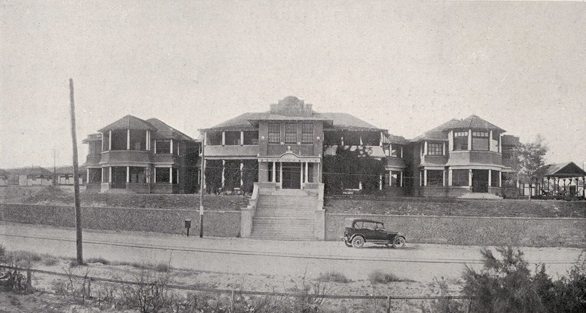

For the two years [Feynman](kloom:e/richard-feynman) spent at [Los Alamos](kloom:e/los-alamos-national-laboratory), **[Arline Feynman](kloom:e/arline-feynman)** lay in a
sanatorium in [Albuquerque](kloom:e/albuquerque-new-mexico), about a hundred miles to the south by his
reckoning. [Oppenheimer](kloom:e/j-robert-oppenheimer) had found her the bed, in the Presbyterian
sanatorium; she was moved to another hospital once or twice. There was no
cure for tuberculosis yet. He was twenty-four.

## Weekends in Albuquerque

He went down every weekend. How he got there depends on who tells it. In
his 1966 interview with Charles Weiner he said he hitchhiked and found
whatever rides he could, and that he had arranged in advance with two
friends who owned cars, **[Klaus Fuchs](kloom:e/klaus-fuchs)** and **Paul Olum**, to borrow one
in an emergency. Later accounts, Wikipedia's among them, drawing on James
Gleick's biography, have him borrowing Fuchs's Buick for the ordinary
weekends as well. Money was tight: his salary, $380 a month, covered about
half of their costs and her medical bills, and they spent down her savings.

In his memory it was a happier time than New Jersey had been. The rules
were easier, and her room filled with books, a record player and brushes
for the Chinese calligraphy she took up. At weekends he cooked steak on a
grill on the hospital lawn. She could not leave her bed, so she played her
tricks by post. For his birthday she had newspapers printed announcing
that the whole nation was celebrating it, and had one sent to everyone at
Los Alamos whose name she could collect. Their letters, read by an Army
censor from the end of 1943, are the story of the trail frame
**censorship**.

## 16 June 1945

In June 1945 his [IBM](kloom:e/ibm) group was racing to finish a calculation for the test
of the bomb when the hospital telephoned. He borrowed Fuchs's car and drove
south with some soldiers he had picked up. The tyres gave out on the way:
four flats in the 1966 telling, three in the 1975 one. The soldiers talked
a garage into fixing one at once; after the last he left the car twenty or
thirty miles out and hitchhiked in. Her father was already there.

He sat with her until she died, on 16 June 1945. He was twenty-seven. He described the hours with a physicist's detachment, and said
so. The plate draws the one detail he kept for the record. He had given her
a clock whose numbers turned, rather than a dial, when she first fell ill,
and had mended it more than once. After she died the nurse wrote down the
time, 9:22, and the clock was found stopped at 9:22. He was proud that he
had noticed why: the nurse had picked the wobbly clock up to read it in the
dim light, and that had stopped it. His description does not say how the
clock worked; the plate draws numbers on turning drums.

| What he told          | 1966 interview | 1975 talk                           |
| --------------------- | -------------- | ----------------------------------- |
| Whose car             | Klaus Fuchs's  | Klaus Fuchs's                       |
| Flat tyres on the way | four           | three                               |
| Where Arline lay      | Albuquerque    | Albuquerque; Santa Fe, in one aside |

## Keeping a straight face

Back at Los Alamos he dreaded condolences. His friends **[Nicholas
Metropolis](kloom:e/nicholas-metropolis)** and Julius Ashkin, he said, understood at once and simply
stayed near him, and hardly anyone put on a long face. Fuchs took him
visiting, and he sat eating grapes in a psychologist's house, wondering
whether anyone so observant could tell what he felt, if he chose not to
show it. Years later, when Fuchs confessed in 1950 to spying for the
Soviet Union, Feynman savoured the irony: in that room two men had been
hiding what was in their heads.

He did not cry then. In 1966 he said it came a month or two later; in
_What Do You Care What Other People Think?_ (1988) the moment came in Oak
Ridge, in front of a dress in a shop window that she would have liked.

His father died on 8 October 1946. Nine days later Feynman wrote Arline a
letter, telling her that he loved her still, and put it away unsent. It
was published in _Perfectly Reasonable Deviations from the Beaten Track_
(2005), the collection of his letters. "I love my wife. My wife is dead,"
he wrote, and he ended with a postscript apologising for not mailing it,
since he did not know her new address.

Her death came a month before the test she had never been told about. He
was on leave in New York when the telegram came calling him back for
**[Trinity](kloom:e/trinity-nuclear-test)**.
