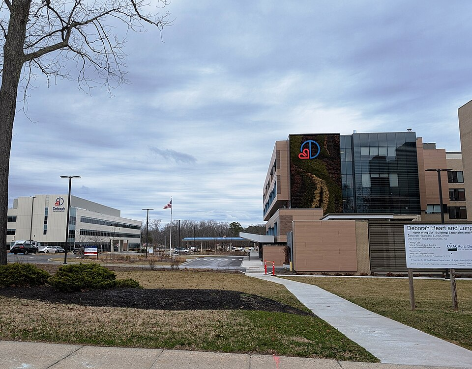

On 29 June 1942, a few weeks after his PhD, Feynman married **Arline Greenbaum** in a city office on Staten Island, with no family or friends present and two strangers as witnesses. She had tuberculosis, and after the ceremony he drove her to a sanatorium in the New Jersey pines. They had known each other since they were thirteen.

## Far Rockaway

He met her, he told Charles Weiner in 1966, at about thirteen and a half, through a junior centre in Far Rockaway where she belonged to the art group. He joined the art group to be near her, though he had no interest in art, took her to dances, and competed for her with a friend who wrote plays. They graduated from high school the same day, and his parade of prizes that day, he liked to think, helped his case. Through his years at MIT they wrote to each other every week, and she came up for dances. They were engaged, by his reckoning, when he was about twenty.

She was an artist, and in his account she changed him as much as he changed her: she made him pay attention to beauty and to the humanities, and he gave her his habit of refusing to act on what other people would think. The rule they made together was that they would always tell each other the truth and face whatever it was. The title of his second memoir, _What Do You Care What Other People Think?_ (1988), is a question she asked him, and its title chapter is his telling of their story.

## A diagnosis

Her illness began, in his 1966 account, with a swelling on her neck that a doctor in Far Rockaway called typhoid fever. Feynman read up on typhoid in the Princeton medical library, pointed out that the test had been negative, and was told by her parents to stop interfering. The swellings moved, and a second doctor found them in the lymph glands. Feynman went back to the library. Among the causes of swollen lymph glands, he read, tuberculosis was the easy one to diagnose; the rest, Hodgkin's disease among them, were fatal.

When the doctors settled on Hodgkin's disease, they, her parents and his own asked him to tell her it was only glandular fever, and he gave in. She found out by overhearing her mother, and forgave him on one condition: that he never lie to her again. They decided to marry at once. He went to the dean and asked whether he could keep his place at Princeton as a married man, and was told no: his support would not continue if he married. Then a biopsy found tuberculosis of the lymph glands. That gave her, as he remembered being told, five to seven years and perhaps a recovery, and she wondered aloud whether it was good news, since now they could not marry yet. Other accounts, Wikipedia's among them, say she was not expected to live more than two years. The diagnosis is usually dated to 1941; Feynman himself gave no date.

| Stage                         | What he was told                            |
| ----------------------------- | ------------------------------------------- |
| A lump on her neck            | Typhoid fever, though the test was negative |
| Swellings in the lymph glands | Cause unknown; a hospital case conference   |
| The doctors' verdict          | Hodgkin's disease, fatal in a few years     |
| The biopsy                    | Tuberculosis of the lymph glands            |

There was no drug that cured tuberculosis until streptomycin, first used in the mid-1940s. Treatment was rest.

## Staten Island and Deborah

By the summer of 1942 the thesis was done and the war work was paying. He borrowed his friend Bill Woodward's station wagon, laid mattresses in the back, and carried her from her parents' house. On the way they were married on Staten Island; the ferry crossing, he said, was their honeymoon. Because of the infection he could kiss her only on the cheek. Then he took her on to **Deborah Hospital** in Browns Mills, a tuberculosis sanatorium in the Pine Barrens founded in 1922 to treat patients who could not pay. The plate maps the day, and his weekend journey from Princeton, about twenty-six miles as the crow flies.

She lay still for most of the day, as ordered, with a sack of lead shot on her shoulder, and did everything the doctors told her. He visited every weekend, gave the hospital what money he could spare, and in between they wrote letters. The buildings in the photograph are Deborah now; it turned to heart and lung disease when antibiotics emptied the sanatoriums.

In the spring of 1943 Wilson's group was invited west, and Robert Oppenheimer himself found a sanatorium for Arline in Albuquerque. Their story goes on at Los Alamos.
