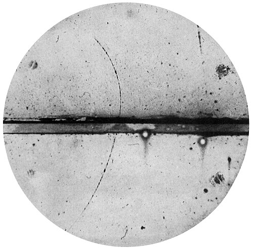

In the spring of 1949 [Feynman](kloom:e/richard-feynman) sent the [_Physical Review_](kloom:e/physical-review) the first of his two papers on [quantum electrodynamics](kloom:e/quantum-electrodynamics). It was called "The Theory of Positrons", it was received on 8 April and printed that September, and its central move is still startling to read. A [positron](kloom:e/positron), the electron's antiparticle, can be treated as an electron travelling backwards in time.

## Holes in a sea

The positron had been predicted before it was found. **[Paul Dirac](kloom:e/paul-dirac)**'s equation for the electron, of 1928, had solutions with negative energy, which ought to have let every electron fall into them. Dirac's answer was that the negative-energy states are already full, a sea of electrons that cannot be seen, and that a gap in the sea would behave as a particle of positive charge. In 1932 **[Carl Anderson](kloom:e/carl-david-anderson)** photographed one in a cloud chamber at Caltech.

Hole theory worked, but it was hard to calculate with. Every process had to keep track of the sea: a pair of particles appearing was an electron lifted out of the sea, leaving a hole; a pair disappearing was an electron falling into one. In the theory's standard form, the terms in which pairs are made and destroyed had to be written separately from those for ordinary scattering, and got their signs from the bookkeeping of the sea.

## One road, seen from the air

Feynman proposed instead to follow the charge, not the particle. Take a pair made at one point in space and time and a positron that later meets another electron and annihilates with it. Drawn as world lines, the paths of particles through space and time, the three pieces join into one continuous line: the incoming electron runs forward in time to the meeting, then the line runs back in time to the point where the pair was made, and then forward again as the new electron. The part that runs backwards is the positron.

The paper puts it as a picture. A bombardier flying low over a road sees three roads below him, until two of them join and vanish, and he understands that he has flown over a long switchback in a single road. The plate draws such a line and cuts it at three moments.

| Moment                         | What is there                  |    Total charge |
| ------------------------------ | ------------------------------ | --------------: |
| before the pair is made        | one electron                   |              −1 |
| between creation and meeting   | two electrons and one positron | −1 − 1 + 1 = −1 |
| after the positron annihilates | one electron                   |              −1 |

The table is the plate's own example, not from the paper. At every moment the charge is the same, because it is carried by one line.

In the mathematics, the electron's amplitude to go from one point to another is chosen so that its positive-energy part runs forward in time and its negative-energy part runs backward. With that one choice, the paper showed, the scattering of electrons and positrons, the making of pairs and their annihilation are all the same calculation, and the relative signs of the terms come out right by themselves, provided electrons obey the exclusion principle. An appendix proves that it gives the same answers as hole theory.

## Whose idea

Feynman said where it came from. In his Nobel lecture he credited the observation to **[John Wheeler](kloom:e/john-archibald-wheeler)** during his Princeton years, in the telephone call recounted in the frame on the absorber theory, and said that of Wheeler's idea he took only this part. He did not claim priority on paper either: the abstract says the backward waves may be pictured as by **[Ernst Stückelberg](kloom:e/ernst-stueckelberg)**, and a footnote credits Stückelberg with discussing positrons as electrons with their proper time reversed. The Swiss physicist had shown in 1941, in the _Helvetica Physica Acta_, that relativistic mechanics could describe the making of a pair by a world line that turns back in time; Feynman's footnote cites a 1942 paper of his. The picture is now often called the _Feynman–Stückelberg interpretation_. In 1950 **[Yoichiro Nambu](kloom:e/yoichiro-nambu)** extended it to every creation and annihilation of pairs.

Feynman was careful about what it meant. In the Nobel lecture he called the backward-moving electron very convenient but not strictly necessary, since it is exactly equivalent to Dirac's sea. Nothing in it lets a signal go into the past. What it did was make the diagrams simpler: in them, an electron line whose arrow points backwards in time is a positron, and one diagram replaces several of the older theory's terms.

The paper was the first of two. Before either appeared, a younger physicist who had learned the methods from Feynman at Cornell had already shown in print that they and his rivals' were one theory: the next frame is Dyson.
