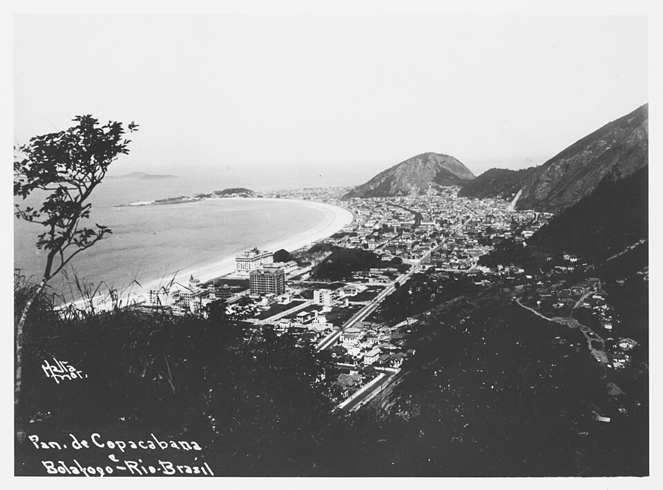

From September 1951 to May 1952 [Feynman](kloom:e/richard-feynman) lived in **[Rio de Janeiro](kloom:e/rio-de-janeiro)**, in a
hotel on Copacabana beach, and taught physics in Portuguese. He called it
ten months. It was the year Caltech had promised him, and he had arranged
it for a reason he explained to Charles Weiner in 1966 with some
embarrassment: after the bomb he had been sure that a war was coming, that
the scientific countries of the north would destroy each other, and that
the habits of scientific thinking, which he believed were fragile, should be
planted somewhere else. By the time he got to Rio, he said, the fear had
mostly faded. The affection for Brazil did not.

## A center, a language and a band

He had first visited in 1949, for six weeks, after sitting next to the
Brazilian physicist **[Jayme Tiomno](kloom:e/jayme-tiomno)** at a meeting of the American Physical
Society and saying he was thinking of South America. Tiomno arranged an
invitation to the **[Centro Brasileiro de Pesquisas Físicas](kloom:e/centro-brasileiro-de-pesquisas-fisicas)** (CBPF), a
research center founded that January by Tiomno, **[José Leite Lopes](kloom:e/jose-leite-lopes)** and
[César Lattes](kloom:e/cesar-lattes), whose share in discovering the pion had made him a national
hero. The universities, Feynman said, would not easily take in physicists
trained abroad, so the center was set up outside them.

He learned the language in his own way. At Cornell he had taken Spanish,
because more countries spoke it; when Brazil came up, a Portuguese member
of Cornell's psychology department spent a few weeks converting his Spanish
into rough Portuguese. Technical Portuguese turned out to be easy, he said,
since the long words are nearly English; it was the short everyday ones
that were hard. He lectured in Portuguese from the start. Leite Lopes later
confirmed that he spoke it reasonably well and taught all year, at the
university's Faculdade Nacional de Filosofia and at the center.

He did physics too. He worked with Leite Lopes on meson theory, wrote to
[Enrico Fermi](kloom:e/enrico-fermi) from his hotel about pion scattering, and kept up with Caltech
through a radio amateur who patched him through to friends there. And he
found the music. In his memoir [_"Surely You're Joking, Mr. Feynman!"_](kloom:e/surely-youre-joking-mr-feynman) he
tells how he joined a samba school's percussion and learned the
_frigideira_, a small metal pan struck with a stick, well enough to play it
in the Carnival parade. That is his telling, and the drumming that ran
through the rest of his life is another frame's story.

## Physics by rote

What he is best remembered for in Brazil is a lecture. Teaching electricity
and magnetism, he found that his students could recite laws perfectly and
use none of them. His favorite example was **[Brewster's angle](kloom:e/brewsters-angle)**. Asked
about it, they answered at once: light reflected from a material of index
_n_ is completely polarized when the tangent of the angle equals _n_. Yet
when he handed them a piece of Polaroid and told them to look at the light
off the bay, they were astonished that turning it made the water go dark.
They had never connected the sentence to anything they could see. The plate
draws the geometry they had memorized.

| Surface | Index _n_ | Brewster's angle |
| ------- | --------- | ---------------- |
| Water   | 1.33      | 53.1°            |
| Glass   | 1.50      | 56.3°            |
| Diamond | 2.42      | 67.5°            |

The angles are computed here from tan θ = _n_. In his telling, to Weiner in
1966 and again in the book, at
the end of the year he was invited to speak on his experience, told the
audience of professors and officials that no science was being taught in
Brazil, and proved it by opening their best textbook at random and reading
out a definition of _triboluminescence_ that said nothing about crushing
sugar in the dark and seeing it flash.

That story was polished over thirty years, but the lecture happened, and a
Brazilian historian, **Ildeu de Castro Moreira**, has recovered it. It was
given on 5 May 1952 in the main auditorium of the Faculdade Nacional de
Filosofia, under the title "My experience as a professor in Brazil". No
text by Feynman survives. The biologist Oswaldo Frota-Pessoa reported it in
the _Jornal do Brasil_ on 25 May: Feynman had told them plainly, in the
imperfect Portuguese of a year's learning, that they were not truly
teaching science and their students were not learning it. An editorial in the scientific
society's journal recorded his two points: science has value, and it was
not being taught. The documents confirm the substance; the details of the
scenes are his.

He went back to Rio many times. In June 1963 he gave the keynote at the
first Inter-American Conference on Physics Education there, and said the
same things, with Brewster's law again, to delegates from all over Latin
America. Before that, on a summer visit soon after his return, he was back in Rio
working out what the excitations of **liquid helium** must look like.
