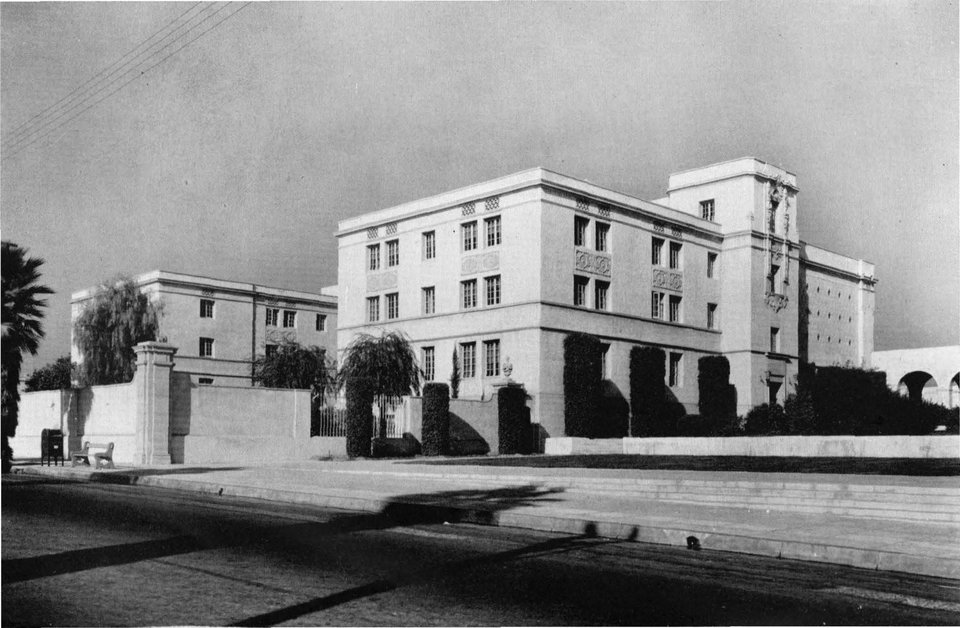

In 1950 [Feynman](kloom:e/richard-feynman) accepted a professorship at the **[California Institute of
Technology](kloom:e/california-institute-of-technology)** in [Pasadena](kloom:e/pasadena-california), and he never moved again. He was on its faculty
for thirty-eight years, from his early thirties until his death in 1988,
far longer than he had spent anywhere else. It was not an easy decision,
by his own account, and the reasons he gave were a mixture of the serious,
the personal and the meteorological.

## Bacher's offer

The man who brought him was **[Robert Bacher](kloom:e/robert-bacher)**, a nuclear physicist he knew
from [Cornell](kloom:e/cornell-university) and from [Los Alamos](kloom:e/los-alamos-national-laboratory), where the two of them had gone walking and
climbing with [Hans Bethe](kloom:e/hans-bethe). In 1949 Bacher left the Atomic Energy Commission to
chair Caltech's Division of Physics, Mathematics and Astronomy. The division
then had seventeen professors, nine of them physicists, and a chair that had
stood empty since [Robert Millikan](kloom:e/robert-millikan) retired in 1945. Bacher set out to build
it up, and the physicist he wanted most was Feynman. He offered a large
salary and a paid year away, which Feynman wanted to spend in Brazil.

Feynman had first seen Caltech when he was invited to lecture there on his
new electrodynamics, lectures he later thought too hard for the audience.
In his long interview with Charles Weiner in 1966 he described the months
that followed as a balance he could not tip. He compared himself to a
donkey between two equal piles of hay, with a twist: whenever he leaned
towards Caltech and wrote to say so, Cornell improved something and the
other pile grew. What settled it, as he told it, was that Caltech agreed to
give him the year in Brazil at the start, and even agreed when he warned
that he might stay in Brazil for good.

He gave Weiner other reasons too, and they are revealing. One was the Ithaca
winter: a day of cold slush when he had to fit chains to his car's tyres
with freezing hands, and decided he was done with that part of the world.
The other was Cornell itself. It was a whole university, with a hotel
school and a department of home economics, and he found the conversation in
its cafeteria diluted. Caltech was nearly all science and engineering. He
could sit down beside any student or professor, in biology or astronomy,
and expect to be understood. It was, he agreed, his kind of place.

## Arriving

The Nobel Foundation's biography, written with him in 1965, has him as a
visiting professor at Caltech in 1950 and then professor of theoretical
physics, and from 1959 Richard Chace Tolman Professor. He lived at first in
a small cottage behind the house of a Caltech mathematician, within walking
distance of the campus. He remembered the first year as quiet, with a light
teaching load, and could not recall doing much research in it.

The dates around the move are muddled, and his own memory was one cause.
In 1966 he could not say which came first, a summer job at UCLA or the
offer, and put his first visit to Brazil in 1950; other sources place it in
the summer of 1949. Wikipedia's article on Bacher dates the Brazilian year
1950–51, but his letters from Rio and a Brazilian study of his visits put
it in 1951–52. This frame follows the documents.

| Date                | Event                                                  |
| ------------------- | ------------------------------------------------------ |
| 1949                | Bacher moves to Caltech; Feynman's first weeks in Rio  |
| 1950                | Feynman appointed to Caltech                           |
| Sept. 1951–May 1952 | The year in Rio de Janeiro                             |
| 28 June 1952        | Marries Mary Louise Bell                               |
| 1953                | His first papers on liquid helium                      |
| 20 May 1956         | He and Bell separate; the divorce is final in May 1958 |
| 1959                | Richard Chace Tolman Professor of Theoretical Physics  |

## A second marriage

At Cornell he had become attached to **Mary Louise Bell**, from Neodesha,
Kansas, who was studying the history of Mexican art and textiles. She
followed him to Caltech, and while he was in Brazil she taught at Michigan
State. He proposed to her by letter from Rio, and they married in Boise,
Idaho, on 28 June 1952, soon after he returned. It was his second marriage;
his first wife, Arline, had died in 1945. It went badly. They quarrelled,
disagreed about politics, and separated in May 1956. The divorce was granted
on grounds of "extreme cruelty", and her testimony, summarised later in an
FBI report, described a man who worked calculus problems in his head from
the moment he woke, and a violent temper when he was interrupted. That
record is hers and the FBI's; he left no public account of the marriage.

Before any of that, though, Caltech owed him the year it had promised, and
he went to spend it in Rio de Janeiro.
