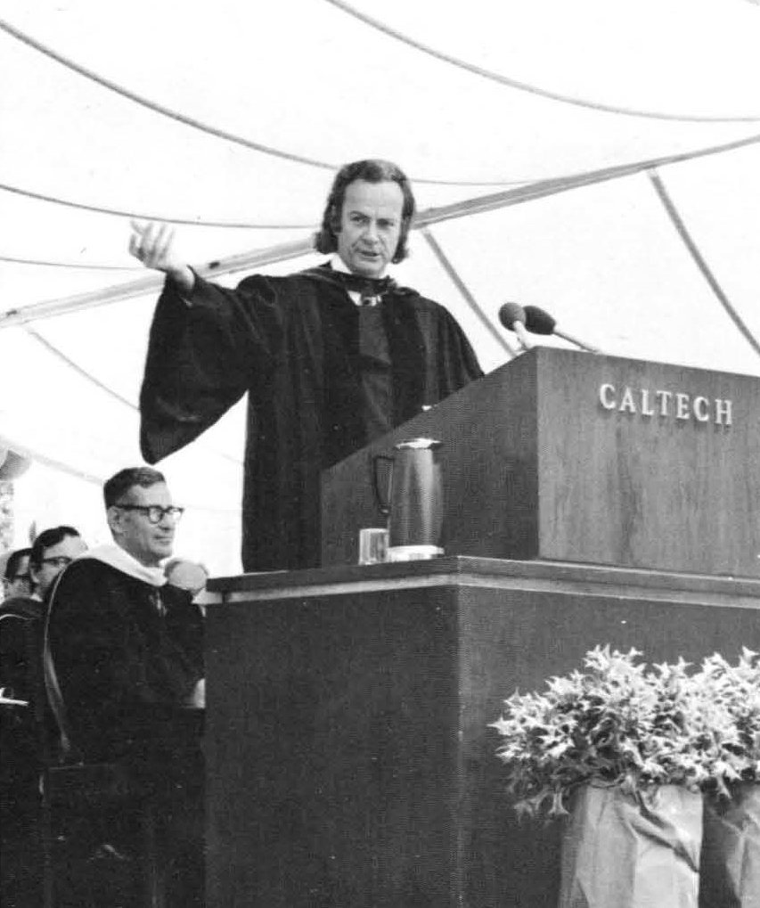
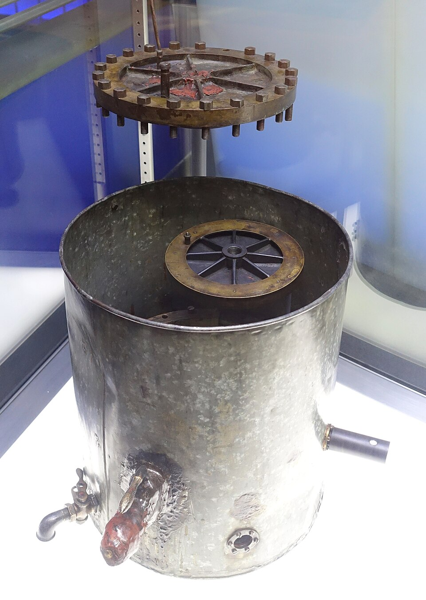

In June 1974 Feynman gave the commencement address at Caltech, under a
tent on the lawn, to the graduating class. It was printed that month in
Caltech's magazine _Engineering and Science_ as **"Cargo Cult Science"**,
and it has been read and quoted, by scientists and by their critics, ever
since. It is the plainest statement he made of what he thought science
demanded of a person.

## The planes don't land

He began with what he had been looking into: isolation tanks, Esalen, a
man practising reflexology on a woman's toe, Uri Geller failing to bend a
key in a hotel bathroom. Then he turned to things more people believed:
methods of teaching reading, and of treating criminals, that were called
scientific and had not been shown to work.

His image for all of it came from the South Seas. During the war, he said,
islanders had watched aeroplanes land with wonderful goods, and now they
built runways, lit fires beside them, and put a man in a wooden hut with
wooden headphones to wait for the planes. The form was perfect; no planes
landed. Research that copies the outward forms of science without its
substance, he called **cargo cult science**. It is a parable, not
ethnography: anthropologists such as Lamont Lindstrom have argued that
the label lumps together very different Melanesian movements and carries a
sneer at the people in them.

## Leaning over backwards

What the imitations lack, he said, is a kind of utter honesty that nobody
teaches explicitly: report everything that might make your result wrong,
the other explanations and how you ruled them out, and the facts that
disagree with your theory as well as those that fit. Then came the line
the talk is remembered for: "The first principle is that you must not
fool yourself—and you are the easiest person to fool." The rest follows:
publish whichever way the result comes out, tell a senator that the hole
should be drilled in another state if that is the answer, and tell the
public honestly that a piece of astronomy has no application.

He gave examples, and two of them have been checked since.

**Millikan's electron.** Robert Millikan measured the charge on the
electron with falling oil drops, the plate's first drawing, and got it
slightly too low because he used a wrong value for the viscosity of air.
Feynman said that later values crept up from Millikan's a step at a time,
because experimenters who got a higher number hunted for a mistake and
those who got Millikan's did not. The record is roughly as he said, and
messier. The scientist and author Christian Hill has tabulated the
published values. The first X-ray measurement, in 1928, agreed with
Millikan's; the next ones, in 1929 and 1931, came in higher; and
Kellström's new measurement of the viscosity of air, published in 1936,
showed where the oil drops had gone wrong. The reviews of the constants
caught up by 1937.

| Year | Measurement                  | Charge (10⁻¹⁹ coulomb) |
| ---- | ---------------------------- | ---------------------- |
| 1913 | Millikan, oil drops          | 1.5920                 |
| 1928 | Wadlund, X-rays              | 1.5924                 |
| 1929 | Birge, review of the values  | 1.5911                 |
| 1929 | Bäcklin, X-rays              | 1.5988                 |
| 1931 | Bearden, X-rays              | 1.6031                 |
| 1937 | Birge, review of the values  | 1.6021                 |
| 1951 | DuMond and Cohen, review     | 1.60185                |
| 2019 | fixed exactly, by definition | 1.602176634            |

**Mr. Young's rats.** In 1937, Feynman said, a man named Young ran rats
down a corridor with doors along both sides and could not train them to
go to the third door, because they always found some clue to the door
that had food last time. He painted the doors, masked the smells, covered
the corridor, and finally found that the rats heard the floor, which he
cured by laying the corridor in sand. Later experimenters ignored his
care. For decades nobody could find the paper. In 2023 the writer Gwern
Branwen, with a reader's help, traced the work to **Quin Fischer Curtis**,
whose theses at the University of Michigan in 1931 and 1936 controlled the
rats' floor cues in exactly this way, sand included, in a research
programme that published little. The name and date in the talk were
wrong; the experiment was real.

## His own standard

The talk ended with a wish: that the graduates find a place where they
were free to keep this kind of integrity without being forced to trade it
for their jobs or their funding. It became the last chapter of _"Surely
You're Joking, Mr. Feynman!"_ in 1985, and his work on the Challenger
commission would test the same standard against an institution.

His next passion had nothing to do with physics: a country on an old
stamp, and whether anyone could still go there.
