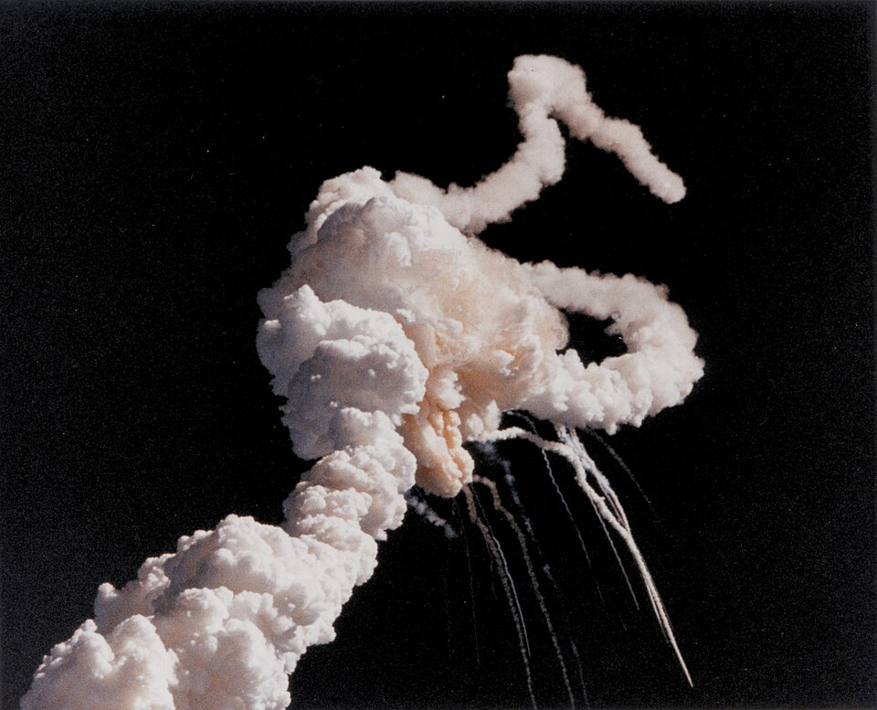

At 11:38 in the morning of 28 January 1986, the space shuttle **[Challenger](kloom:e/space-shuttle-challenger-disaster)**
lifted off from Kennedy Space Center on flight 51-L, the twenty-fifth of the
program. Seventy-three seconds later it broke apart over the Atlantic. Its
crew of seven were killed: Dick Scobee, Michael Smith, Judith Resnik,
Ellison Onizuka, Ronald McNair, Gregory Jarvis and **[Christa McAuliffe](kloom:e/christa-mcauliffe)**, a
schoolteacher from New Hampshire who was to have taught lessons from orbit.
Because a teacher was aboard, schools across the country watched the launch live.

## A call from a former student

A few days later [Feynman](kloom:e/richard-feynman) had a telephone call from **William Graham**, the
acting head of [NASA](kloom:e/nasa), who had once sat in his lectures at Caltech and at
Hughes Aircraft. Graham wanted him on the investigation. By his own account
his first instinct was to refuse: he had a rule of keeping away from
Washington and from government. His friends told him to accept, and his
wife, **Gweneth**, told him he would see things the others would not. On 3
February President Reagan set up a [Presidential Commission](kloom:e/rogers-commission) under the former
Secretary of State **[William P. Rogers](kloom:e/william-p-rogers)**, and Feynman was on it.

He was sixty-seven and not well. Surgeons had removed a large abdominal
tumour, a rare cancer, in 1978; during the investigation, he mentioned
later, his cardiologist was looking after him by telephone; and in 1986 his
doctors found a second cancer. He took the red-eye to Washington anyway,
after a day of briefings from engineers at the Jet Propulsion Laboratory in
Pasadena, where the [O-rings](kloom:e/o-ring) came up almost at once.

## The rubber in the glass

The solid rocket boosters were built in segments, and each joint between
segments was sealed by two rubber **O-rings**, about a quarter of an inch
thick, on a circle twelve feet across. When the rocket fired, the joint
flexed open by a fraction of an inch, and the rubber had to spring out and
follow it within a fraction of a second. On the morning of the launch the
air at the pad was 36°F, colder than any launch before it.

On **11 February**, at a public hearing in Washington, NASA's booster
manager **[Lawrence Mulloy](kloom:e/lawrence-mulloy)** explained the joint using a cross-section model
that was passed along the table. Feynman asked him, on the record, whether
the rubber had to be resilient, and whether it would be dangerous if it lost
that resilience for a second or two. Mulloy agreed that it would. Feynman
had already taken the two pieces of rubber out of the model. He squeezed
one in a small C-clamp and put it in the glass of ice water in front of
him.

After a recess he spoke. The rubber, he said, once squeezed at the
temperature of ice, did not spring back: for some seconds there was no
resilience in it at all. "I believe that has some significance for our
problem," he told the commission. The plate draws the demonstration: the clamp and the
glass, and beside them the recovery the rubber had to make. The two curves
are schematic, not measurements: the commission later found that a warm
O-ring springs back about five times faster than one at 30°F.

| When            | What happened                                     |
| --------------- | ------------------------------------------------- |
| 28 January 1986 | Challenger lost, 73 seconds after lift-off        |
| 3 February      | The President announces the commission            |
| 11 February     | The ice-water demonstration at the public hearing |
| 6 June          | The commission reports to the President           |

## His telling and the record

Feynman told the story many times: in a talk at Caltech published in 1987,
and at length in _What Do You Care What Other People Think?_ (1988). In his
telling, he rehearsed the experiment in Graham's office that morning, and
General **[Donald Kutyna](kloom:e/donald-kutyna)**, sitting beside him, kept whispering that it was
not yet the moment, until it was, and the next day's papers explained what
he had had no time to. The hearing transcript, which is public, confirms
the question to Mulloy and the words he said after the recess; it records
nothing of the clamp or the whispering, which were not spoken into the
microphones.

It was not the discovery of the cause. Engineers at the booster's maker had
argued against the launch because of the cold, the night before, and the
commission learned of that the day before the hearing. What Feynman did
was show, with a hardware-store clamp, what the engineers had meant. How the
commission worked, and what he found beyond the rubber, is the trail _The
commission_.
