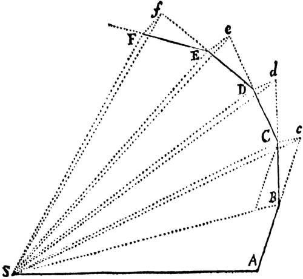

In 1964 [Feynman](kloom:e/richard-feynman) gave two sets of lectures about how physical laws are
found. One was a single hour for Caltech freshmen, on the motion of the
planets, which was lost for nearly thirty years. The other was seven
lectures at Cornell for a general audience, filmed by the BBC and printed
as [_The Character of Physical Law_](kloom:e/the-character-of-physical-law). Both turn on the same example: [Newton's
law of gravitation](kloom:e/newtons-law-of-universal-gravitation), a law guessed, worked out and checked against the sky.

## The lost lecture

On 13 March 1964, at the end of the winter term, **Rochus Vogt**, who had
taken over the freshman course, invited Feynman back to give one lecture as
a treat. He chose to prove, with nothing but plane geometry, that a planet
pulled by an inverse-square force moves in an ellipse. [Newton](kloom:e/isaac-newton) had done it
that way in the _Principia_ of 1687, and Feynman had tried to follow him,
but Newton relied on properties of conic sections, a lively subject in
Newton's day, that Feynman did not know. So he
made up a proof of his own.

It goes in three steps, and the plate draws the second and third.

1. **Equal areas.** Newton's first proposition, drawn above, shows that a
   body pulled only toward a fixed point sweeps out equal areas in equal
   times. That is [Kepler](kloom:e/johannes-kepler)'s second law, and Feynman began with Newton's own
   figure.
2. **Equal angles.** Feynman cut the orbit not into equal times but into
   equal angles at the sun. Far from the sun the planet takes longer to
   cross each angle, in proportion to the square of its distance, and the
   force on it is weaker by the same square. So in every equal angle the
   sun changes the planet's velocity by the same amount, each time turned
   by the same angle. Draw all the velocities from one point, and their tips
   lie on a circle.
3. **The ellipse.** That circle, with the point it is drawn from set off
   its center, is the starting point of a construction every geometry
   student could follow, and it traces an ellipse. The orbit is that
   ellipse turned through a right angle.

A diagram of velocities like this is a _hodograph_, which William Rowan
Hamilton described in 1846, and [James Clerk Maxwell](kloom:e/james-clerk-maxwell) used a similar argument
in _Matter and Motion_ (1877). Feynman's proof was his own, but the idea
was not new.

The lecture was taped, but no photographs of its blackboard were ever
found, though the archives kept them for the other lectures. Leighton left
it out of the books. In
April 1992 Caltech's archivist **Judith Goodstein**, clearing Leighton's old
office, found the transcript and a few pages of Feynman's notes. Her
husband, the physicist **[David Goodstein](kloom:e/david-goodstein)**, worked out the missing
diagrams from those sketches on a voyage through the Panama Canal in
December 1994. Norton published _Feynman's Lost Lecture_ in 1996, with the
recording on a compact disc.

## The Messenger Lectures

Cornell has invited a speaker to give its [Messenger Lectures](kloom:e/messenger-lectures) since 1924.
Feynman, who had taught at
Cornell from 1945 to 1950, gave seven in November 1964. The BBC filmed them
and published the text in 1965; MIT Press brought it out in the United
States in 1967.

| Lecture | Title                                                    |
| ------- | -------------------------------------------------------- |
| 1       | The law of gravitation, an example of physical law       |
| 2       | The relation of mathematics and physics                  |
| 3       | The great conservation principles                        |
| 4       | Symmetry in physical law                                 |
| 5       | The distinction of past and future                       |
| 6       | Probability and uncertainty: the quantum-mechanical view |
| 7       | Seeking new laws                                         |

In 2009 **[Bill Gates](kloom:e/bill-gates)** bought the rights to the films and put them online
free, as Project Tuva; Cornell published the BBC's recordings itself in 2015.

## First, a guess

The last lecture is the one people quote. It describes the search for a new
law in three moves: "First we guess it." Then you work out what the guess
predicts, and then you compare the predictions with nature, by experiment.
If they disagree, the guess is wrong, however beautiful it is and however
clever or famous the person who made it. What the method never supplies is
the guess itself, and Feynman made no pretense that it did. A year later,
in Stockholm, he would describe his own guesses, most of them wrong.
