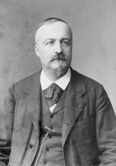

If a thrown ball takes every path at once, why do we only ever see it on
one? The sum over histories answers the question that the principle of
least action had left open since Fermat: not why nature should be thrifty,
but why it looks as if it were. The answer is a piece of nineteenth-century
mathematics called **stationary phase**, and Dirac had already sketched it
in 1933.

## Arrows that agree

Each path contributes an arrow turned by its action divided by _ħ_, the
reduced Planck constant, about 1.05 × 10⁻³⁴ joule-seconds. Take a family of
paths, each bent a little more than the last. Near the classical path the
action is stationary: bending the path changes the action only to second
order, so the arrows of all the nearby paths point almost the same way and
add up to a long arrow. Farther out the action changes faster and faster,
each arrow is turned a little more than its neighbour, and they curl round
on themselves and add up to almost nothing.

The plate draws those arrows, laid head to tail, as the **Cornu spiral**.
The phase is taken to grow as the square of _u_, a measure of how far a
path bends, which is how any action behaves near its stationary point. The
nearly straight stretch through the middle is the classical path and its
neighbours. The tight coils at each end are the paths far away, winding
round two points and cancelling. The total is the line from one coil's
centre to the other's. **Augustin Fresnel** met the same integrals in 1818
in the diffraction of light, and **Alfred Cornu** drew them as this spiral
in 1874, to read diffraction off a graph. The method is due to **George
Stokes** and **Lord Kelvin**.

The table, computed for this frame, adds the arrows of equal bands of paths,
each band two units of _u_ wide. The units are the drawing's own.

| Band of paths                  | Phase at its middle | Length of its arrow |
| ------------------------------ | ------------------- | ------------------- |
| −1 to +1, around the true path | 0                   | 1.79                |
| 1 to 3                         | 1 turn              | 0.18                |
| 3 to 5                         | 4 turns             | 0.042               |
| 7 to 9                         | 16 turns            | 0.010               |
| every path                     | —                   | 1.41                |

The band around the true path gives more than the whole sum; everything
else only winds it back a little. That is why the true path appears to be
the one taken, and why it is the path of stationary action: stationary is
exactly the condition for the neighbours to agree. Feynman made this
argument in the _Lectures on Physics_, in the chapter that begins with
Mr. Bader.

## How big is big?

Whether the neighbours agree depends on how much the action changes when a
path is bent, measured in units of _ħ_. For a particle moving freely, or in
uniform gravity, bending the path sideways by a hump of height _a_ over a
time _T_ adds exactly _m_ _a_² π² / 4 _T_ to the action. The objects and
distances below are invented examples; the arithmetic is exact.

| Thing, and its trip        | Hump   | Extra action    | Phase turned       |
| -------------------------- | ------ | --------------- | ------------------ |
| 100 g ball, 1 s in the air | 34 cm  | 0.029 J·s       | 2.7 × 10³² radians |
| 100 g ball, 1 s in the air | 1 µm   | 2.5 × 10⁻¹³ J·s | 2.3 × 10²¹ radians |
| electron, 1 ns in flight   | 1 µm   | 2.2 × 10⁻³³ J·s | 21 radians         |
| electron, 1 ns in flight   | 0.1 µm | 2.2 × 10⁻³⁵ J·s | 0.21 radians       |

The first row is the humped path of the least-action frame on the main
spine. For the ball, bending the path by a thousandth of a millimetre turns
its arrow some 10²¹ radians: its neighbours cancel at once, and only an
unimaginably thin tube of paths around the classical one survives. That
tube is the trajectory. For the electron, paths a tenth of a micrometre
apart are nearly in step, so a wide band of them adds up, and the electron
behaves like a wave that can pass through two slits.

## The mirror

Feynman told the same story for light in _QED_ (1985). Every piece of a
flat mirror reflects, but the arrows from the ends of the mirror curl and
cancel, and only the part near where the angles are equal, the path of least
time, gives the light we see. Scrape away the strips whose arrows point the
wrong way and the ends reflect after all: a diffraction grating. Fermat's
principle and Hamilton's are both what is left of the sum over histories
when the arrows turn fast.

Where the method went after 1948, into statistics, fields and
supercomputers, is the subject of path integrals today.
