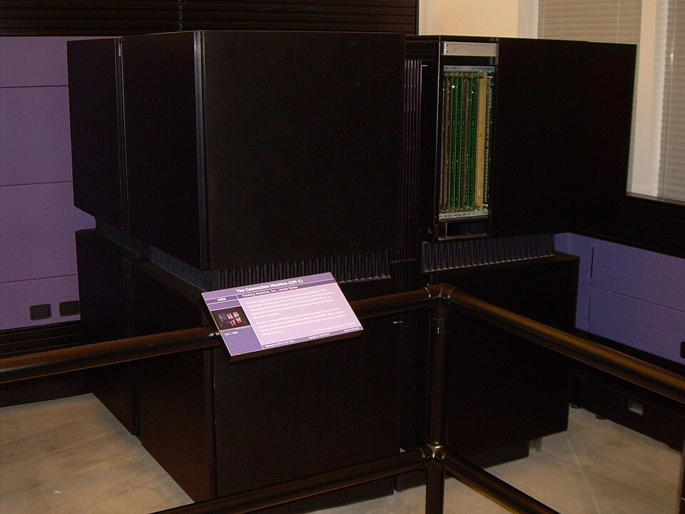

In 1983 a graduate student at MIT's Artificial Intelligence Lab, **[W.
Daniel Hillis](kloom:e/danny-hillis)**, told [Feynman](kloom:e/richard-feynman) over lunch that he was starting a company
to build a computer out of a million small processors. Feynman called it
"positively the dopiest idea I ever heard", Hillis recalled, and by the
end of the meal had agreed to spend the summer working there. They knew
each other through Feynman's son **[Carl](kloom:e/carl-feynman)**, an MIT undergraduate who had
helped with Hillis's thesis project, the **[Connection Machine](kloom:e/connection-machine)**.

The main source for what followed is Hillis's own account, "Richard
Feynman and the Connection Machine", published in _Physics Today_ a year
after Feynman died. It is a friend's memoir, fond and funny, and most of
this frame rests on it.

## Reporting for duty

The company, **[Thinking Machines Corporation](kloom:e/thinking-machines-corporation)**, had just been
incorporated and had rented an old mansion outside Boston, on the Robert
Treat Paine estate in Waltham. Feynman arrived the next day, saluted, and
asked for his assignment. Nobody had one ready, so they sent him to buy
office supplies. While he was out they decided what worried them most,
and when he came back with the pencils they gave it to him: the
**router**.

Wiring a million processors each to each would need, by Hillis's count,
some 10¹² wires. Instead the processors were to sit at the corners of a
hypercube, each talking directly only to its neighbours along each
dimension, with messages passed from corner to corner. The first plan was
a 20-dimensional cube. The machine they built, the **CM-1**, had 65,536
one-bit processors, sixteen to a chip, and its 4,096 router chips sat on
a 12-dimensional cube. The plate draws four of those dimensions. A
message's address, compared bit by bit with where it is, says which
dimensions it still has to cross, one hop for each 1. When two messages
want the same wire, one waits in a buffer. The question for Feynman was
how many buffers each chip needed.

He studied the circuit diagrams, Hillis wrote, as if they were objects of
nature, simulating each circuit with pencil and paper. By the end of the
summer he had an answer in the form of **partial differential
equations**, in continuous variables such as the average number of 1 bits
left in a message's address. The engineers' own discrete analysis said
seven buffers per chip; his equations said five. In September they
decided to play safe and ignore him. By the next spring the chip was
slightly too large to manufacture, the only way to shrink it was to cut
the buffers to five, and they built it that way. It worked.

## A logarithm from Los Alamos

Feynman invited his Caltech friend **[John Hopfield](kloom:e/john-hopfield)** to give the
company's first seminar, and then worked out how to run Hopfield's [neural
network](kloom:e/hopfield-network) on the machine, one processor for each neuron. The part he was
proudest of, Hillis says, was a routine for logarithms that he had
invented at Los Alamos. Any number between 1 and 2 can be written as a
product of factors of the form 1 + 2⁻ᵏ, and testing each factor in binary
takes only a shift and a subtraction. The logarithm is then the sum of the
factors' logarithms, read from a small table that every processor could
share. The table is a worked example of this frame's own, for 1.7.

| Factor          | Its logarithm | Left to factor | Running sum |
| --------------- | ------------- | -------------- | ----------- |
| 1 + 2⁻¹         | 0.405465      | 1.133333       | 0.405465    |
| 1 + 2⁻³         | 0.117783      | 1.007407       | 0.523248    |
| 1 + 2⁻⁸         | 0.003899      | 1.003488       | 0.527147    |
| 1 + 2⁻⁹         | 0.001951      | 1.001531       | 0.529098    |
| 1 + 2⁻¹⁰        | 0.000976      | 1.000554       | 0.530074    |
| 1 + 2⁻¹¹        | 0.000488      | 1.000066       | 0.530562    |
| _ln 1.7, exact_ |               |                | _0.530628_  |

He also tested whether the machine, which had no floating-point hardware,
could do physics. He wrote a lattice QCD program in a parallel BASIC of
his own invention, ran it by hand, and concluded that it would beat a
special-purpose machine Caltech was building. From then on he pushed the
company toward numerical simulation.

The first program to run on the machine, in April 1985, was [Conway's game
of **Life**](kloom:e/conways-game-of-life), a cellular automaton. Feynman wondered aloud whether physics
at the bottom might be one, and when [Stephen Wolfram](kloom:e/stephen-wolfram) used the machine to
simulate fluids as imaginary ball bearings on a hexagonal grid, Feynman
gave the company the plain explanation it used from then on.

He worked there on and off for five years, soldering boards and painting
walls between problems in databases, geology, protein folding and images.
In the same years he was asking the opposite question about computers:
not how many processors, but how small one could be, which is the next
frame's.
