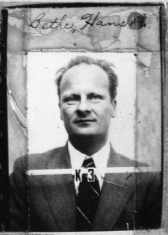

In the autumn of 1945 Feynman left Los Alamos for **Cornell University**
in Ithaca, New York, one of the first group leaders to go. He went because
of one man. **Hans Bethe**, head of the Theoretical Division at Los Alamos
and a Cornell professor, had recommended him to Cornell's physics
department as early as October 1943, and Cornell made him an offer in
August 1944, which he accepted. When Berkeley tried to take him in May
1945, Cornell matched its salary of $3,900 a year. Feynman told an
interviewer in 1966 that he never considered going anywhere else: he
wanted to be where Bethe was.

## A professor with nowhere to sleep

He remembered the arrival in detail. He stopped on the way to give a talk
at Iowa State, then took the train east, and on it wrote out the whole of
the course he had been asked to teach, mathematical methods of physics for
graduate students. He reached Ithaca late at night and found every hotel
full. After wandering the town he slept on a couch in the lobby of a
campus building, with a janitor's permission, and ran to the physics
office in the morning expecting to teach. He was a week early. When he
asked the student union for a room, the clerk told him that things were so
tight a professor had had to sleep in a lobby the night before.

The course, he said later, was much like the famous lectures he would give
at Caltech in the 1960s: an attempt to show the whole subject at once and
how its pieces fit. His students learned it, to his surprise. One of them,
**Robert Walker**, later built Caltech's own course in mathematical physics
on it. He also taught electricity and magnetism, and later he went to
live at the **Telluride House**, a residence for scholarship students
that liked to have a faculty member in the house.

## Grief

He came to Cornell a widower. His wife **Arline** had died of tuberculosis
in Albuquerque that June, and the bomb he had helped to build had been
used on two cities in August. He brought with him the sense, which the
Trinity frame tells, that anything built would soon be destroyed, and in
October 1946, after his father's death, he wrote to Arline the letter he
never sent.

## Burned out

He had meant to take a short rest and then go back to the research he had
put aside for the war. The rest did not end. He read the _Arabian Nights_
in the library, went to student dances, played his drums and sat on the
grass. Preparing courses, which he later recognised as a full-time job,
seemed to him then like nothing. He became convinced, he told the
interviewer, that he was burned out and would never accomplish anything
again.

Meanwhile the offers kept coming, and Cornell, which learned of them, kept
raising his salary. He had several raises before he had even arrived. They
made things worse: everyone else's opinion of him rose as his own fell.

| Offer                                      | When          | What he did                     |
| ------------------------------------------ | ------------- | ------------------------------- |
| University of California, Berkeley         | May 1945      | Refused; Cornell matched it     |
| University of California, Los Angeles      | Cornell years | Refused                         |
| Institute for Advanced Study and Princeton | c. 1946–47    | Refused, and it broke the spell |

The last was the best. The **Institute for Advanced Study**, where Einstein
worked, offered him a place with a half-time professorship at Princeton
University attached, so that he would have students as well as time. He
was shaving, he said, when it struck him how absurd it was. They thought
he was good; he was not; and he was under no obligation to live up to
anyone else's idea of him. The guilt lifted. Within a day or so **Robert
Wilson**, head of Cornell's Laboratory of Nuclear Studies, called him in
and told him, unprompted, that when a university hires a professor the
risk is the university's, not his: plenty of professors only teach, and
that is fine.

These are Feynman's tellings, in the 1966 interview and in the chapter of
_"Surely You're Joking"_ called "The Dignified Professor", and they agree
in outline. What the documents add is the offers' dates and money, which
the table takes from Jagdish Mehra's biography as the Wikipedia article
reports it. The date of the Institute's offer is not fixed there; the
table's is inferred from his account that it came near the end of his
second year.

What he decided was to play with physics again, as he had as a boy, for
nothing but the fun of it. Within days, in the students' cafeteria,
someone threw a plate into the air, and the next frame, "He decided just
to PLAY.", begins there.
