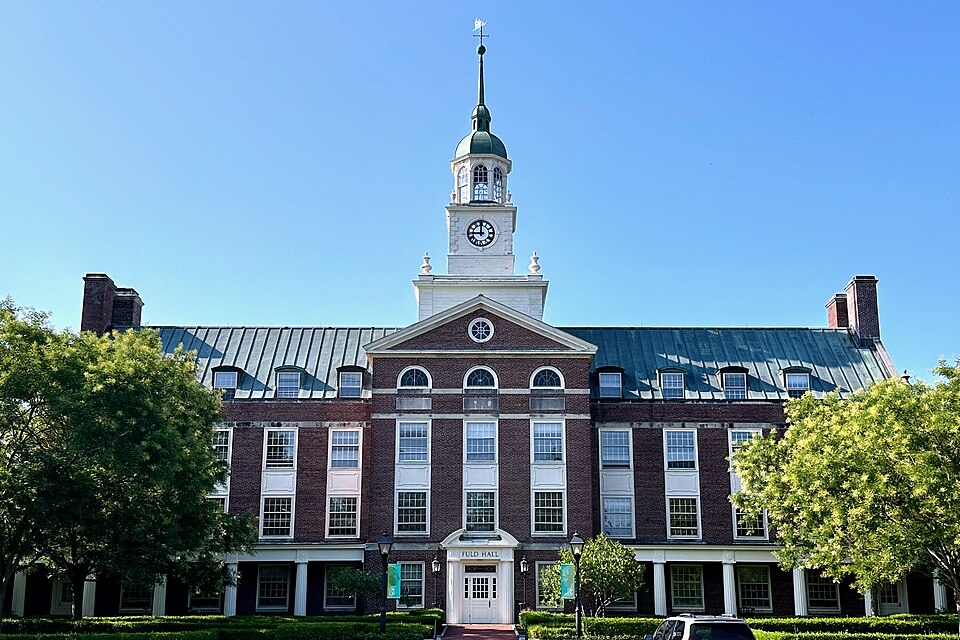

By the mid-1950s Feynman diagrams were in every theorist's hands, and it is tempting to think they spread because they were printed. The historian **David Kaiser**, in _Drawing Theories Apart_ (2005) and the articles around it, counted who used them and how they learned, and found that the papers alone taught almost nobody. The diagrams travelled with people.

## An intellectual hotel

When **J. Robert Oppenheimer** became director of the Institute for Advanced Study in Princeton in 1947, he set out to make it a place where young theorists spent a year or two after their doctorates, which he called an intellectual hotel. He told _Time_ that the best way to send information is to wrap it up in a person. The cohort that arrived in September 1948 included Freeman Dyson, fresh from the frame Dyson, and he taught the rest. Then they left for teaching jobs, and took the diagrams with them.

Kaiser followed the postdocs out. **Norman Kroll** went to Columbia; **Fritz Rohrlich** to Cornell, Princeton and the State University of Iowa; **Kenneth Watson** to Berkeley, Indiana and Wisconsin; **Robert Karplus** to Harvard and Berkeley; **Donald Yennie** to Stanford. Their students' dissertations thank them for the training, and their homework sets asked for little more than the right diagrams for a given process. Where none of them landed, almost no one picked the diagrams up. Rohrlich warned the University of Pennsylvania that its graduate students would have to choose other topics, because nobody there could teach the method. At Berkeley, **Henry Stapp** read Feynman's and Dyson's papers and Dyson's lecture notes as carefully as he could, and still could not learn to calculate from them, and chose a different thesis.

| _Physical Review_, 1949–54                                               | Kaiser's count |
| ------------------------------------------------------------------------ | -------------: |
| papers using Feynman diagrams                                            |            139 |
| their authors                                                            |            114 |
| papers from the Institute's postdocs or their students                   |    over 4 in 5 |
| authors with no traceable contact with another user                      |              2 |
| authors who began as graduate students                                   |            37% |
| authors who began as postdocs                                            |            45% |
| authors who began as young faculty, under seven years past the doctorate |            10% |

The count of diagram papers doubled every 2.2 years; by 1954 each fortnightly issue carried two of them on average. Older physicists, Kaiser concludes, did not retool.

## Different pictures in different places

Each school drew them its own way. Cornell's students' diagrams came to look like each other's and unlike Columbia's, Rochester's or Chicago's, and Kaiser pairs mentors' diagrams with their students' to show the family resemblance. Abroad, the pattern repeated. In Britain the diagrams spread by the same kind of personal contact. In Japan, with few American contacts, they met a home-grown rival: **Sin-Itiro Tomonaga**'s group in Tokyo had drawn its own "transition diagrams" in 1948, and submitted them two days before Dyson's first paper reached the _Physical Review_. In the Soviet Union, with the Cold War closing the channels, the diagrams appeared in papers some three years later than in the United States and Japan, and came into general use only after American and Soviet physicists began meeting again in the mid-1950s.

## New meanings

Fewer than a fifth of the diagram papers of 1949–54 used them as Feynman and Dyson had, to calculate small corrections in quantum electrodynamics. More than half applied them to the nuclear force, where the coupling between particles was not 1/137 but somewhere between 7 and 57, and each extra pair of vertices made a term bigger rather than smaller. Feynman told **Enrico Fermi** in 1951 not to believe any calculation in meson theory that used a diagram. Physicists kept drawing them anyway, as pictures of collisions in the new accelerators, and as a quick way to judge which of two processes should dominate.

By the early 1960s **Geoffrey Chew** and his students at Berkeley went further. They discarded the field theory the diagrams came from, and kept the diagrams as the language of a new theory of strongly interacting particles. Chew wrote in 1961 that he expected the diagrammatic approach to be divorced from field theory altogether. Meanwhile solid-state physicists adapted the diagrams to the many-body problem: electrons in metals, interacting in their billions. **Richard Mattuck**, in _A Guide to Feynman Diagrams in the Many-Body Problem_ (1967), compared working without diagrams to crossing the Amazon without a map.

Schwinger, Kaiser records, said the diagrams had brought computation to the masses, and that they were pedagogy, not physics. Kaiser agrees about the pedagogy and turns it round: the diagrams became universal because people were trained to start every calculation by drawing them. They began with two electrons and one photon, in the frame this trail branches from: Diagrams.
