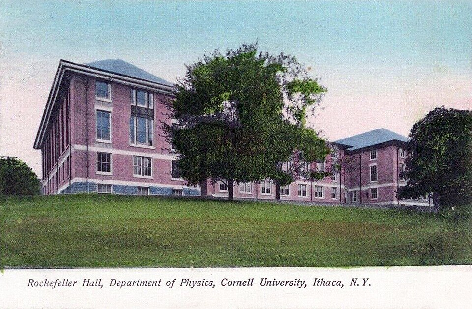

After [Pocono](kloom:e/pocono-conference), [Feynman](kloom:e/richard-feynman) did what he had decided there: he wrote it down. Two
papers went to the [_Physical Review_](kloom:e/physical-review) from the Department of Physics at
Cornell in the spring of 1949. **"The Theory of Positrons"** was received
on 8 April, and **"Space-Time Approach to Quantum Electrodynamics"** on 9
May. Both appeared in the issue of 15 September 1949, on pages 749 and 769. They carried pictures that would change how physicists calculate.

## The problem they solved

In [quantum electrodynamics](kloom:e/quantum-electrodynamics) nearly every answer is a sum. An electron
scattering off another may exchange one quantum of light, or two, or emit
one and reabsorb it on the way, and each possibility is a term in a series
that runs in powers of a small number, about 1/137. In the methods of the
day each term was worked out by following the system forward step by step
in time, splitting the field into parts that depend on who is moving, and
treating electrons and positrons as separate cases. The work was long, and
it was easy to lose a term or count one twice.

Feynman's papers claim, in their first line, that the matrix elements for
complicated processes can be written down directly, and that each term has
a simple physical picture. The picture is the bookkeeping. Each line and
each point of it stands for one factor in the expression, and the drawing
tells you which factors to multiply and what to sum over.

## Reading Fig. 1

The plate redraws the paper's first figure, with its own labels. Time runs
up. Electron _a_ goes from point 1 to point 3; electron _b_ from 2 to 4.
On the way _a_ emits a quantum at 5, which _b_ absorbs at 6. Read off the
lines and you have the paper's equation (4), its "fundamental equation for
electrodynamics":

| On the drawing                     | In the equation   | Meaning                                       |
| ---------------------------------- | ----------------- | --------------------------------------------- |
| electron line from 1 to 5          | K₊(5,1)           | amplitude for _a_ to get from 1 to 5          |
| point 5, where the wavy line joins | γμ                | the electron emits a quantum (a Dirac matrix) |
| wavy line from 5 to 6              | δ₊(s²₅₆)          | amplitude for the quantum to get from 5 to 6  |
| point 6                            | γμ                | the other electron absorbs it                 |
| lines 5 to 3, 2 to 6 and 6 to 4    | K₊(3,5) and so on | the rest of each electron's journey           |
| every possible place for 5 and 6   | ∫∫ dτ₅ dτ₆        | add up all of them                            |

Multiply by −_ie_², one _e_ for each meeting point. Feynman notes that it
does not matter whether 5 comes before 6 or after: the same expression
covers both orders, where the older method needed two terms. For more
quanta, draw more lines. The paper also gives the same rules in terms of
momentum, where each electron line between meetings becomes a factor
(_p_ − _m_)⁻¹ and each internal quantum a 1/_k²_, and writes the
scattering of light by an electron, the Compton effect, as one line of
two terms.

Its companion, "The Theory of Positrons", supplies the other ingredient:
a positron is treated as an electron running backwards in time, so pair
creation and annihilation need no separate machinery. The functions K₊
are what physicists now call [_propagators_](kloom:e/propagator). Feynman added a modification
that kept nearly every integral finite, then showed that the physical answers do
not depend on it once the electron's mass and charge are fixed at their
measured values. The results, he wrote, agree with [Schwinger](kloom:e/julian-schwinger)'s, and the
paper points to **[Freeman Dyson](kloom:e/freeman-dyson)**'s proof, published earlier that year,
that the two methods are equivalent.

## One evening

In his Nobel lecture of 1965 Feynman chose a moment from before
publication as the one that convinced him the method was real. At a
Physical Society meeting, **Murray Slotnick** reported a calculation of an
electron scattering off a neutron in two versions of meson theory, which
had taken him six months. Feynman worked both out that evening, with the
momentum transfer left general, and showed him the next day that setting
it to zero gave Slotnick's answers. He called it a moment like receiving
the Nobel Prize.

He never claimed the [diagrams](kloom:e/feynman-diagram) were a new theory. Most of the ideas he had
chased since Princeton, he said in the lecture, did not survive into the
final result; what did was a much quicker way of getting answers everyone
could check. Their spread, the positron running backwards and Dyson's part
in it are the subject of the trail "The diagrams", which branches from
here and begins with the [Lamb shift](kloom:e/lamb-shift).
