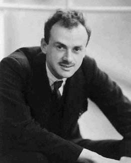

In November 1932 **[Paul Dirac](kloom:e/paul-dirac)**, at St John's College, Cambridge, sent a
nine-page paper, written in English, to a Soviet physics journal, the
_Physikalische Zeitschrift der Sowjetunion_. "The Lagrangian in Quantum
Mechanics" appeared in its third volume in 1933. Eight years later a
refugee who knew it, **[Herbert Jehle](kloom:e/herbert-jehle)**, showed it to a Princeton graduate
student who needed exactly what was in it.

## What Dirac wrote

Quantum mechanics, Dirac began, had been built by analogy with [Hamilton](kloom:e/william-rowan-hamilton)'s
form of classical mechanics, with its positions and momenta at one instant.
But there was reason to think the Lagrangian form the more fundamental. It
gathers all the equations of motion into one statement, that the action is
stationary, and the action is the same for every observer moving uniformly,
which the Hamiltonian is not.

So he asked what in quantum theory corresponds to the action. His answer
was the _transformation function_, the amplitude to find a particle at one
place at a later time given where it was at an earlier one. Over a long
interval, he wrote, it corresponds to the exponential of _i_ times the
action divided by _ħ_; over one short step of time, to the exponential of
_i_ times the Lagrangian times that step, divided by _ħ_. He chained the
short steps together, integrating over every intermediate position, and
noticed something more. When _ħ_ is very small, the exponential spins so
fast as an intermediate position changes that its integral nearly vanishes,
except near positions where the action is stationary. That, he wrote, is how
the quantum rule turns into the classical [principle of least action](kloom:e/action-principles).

| What Dirac said                                     | What he did not say                      |
| --------------------------------------------------- | ---------------------------------------- |
| the short-time amplitude _corresponds to_ e^(iεL/ħ) | that it is equal, or how to normalise it |
| amplitudes compose by integrating over the middle   | that the integral runs over whole paths  |
| small _ħ_ leaves only the stationary action         | how to compute anything with it          |

The words he used were "corresponds to" and "analogue". He did not say how
literally to take them.

## A beer, and a blackboard

The story is [Feynman](kloom:e/richard-feynman)'s, told twice within a few months: in his Nobel lecture
of December 1965 and to Charles Weiner in March 1966, and the two tellings
agree. He was trying to make a quantum theory of his and [Wheeler](kloom:e/john-archibald-wheeler)'s action,
which ties a charge's motion at one time to another charge's at other times
and so has no Hamiltonian. At a beer party at the Nassau Tavern he asked
Jehle, who had come to America in 1941 after escaping internment in France,
whether he knew any way to get quantum mechanics from an action. Jehle knew
Dirac's paper and brought it to the library next day.

Feynman read "analogous" and, in his telling, asked what use an analogy
was. He decided Dirac must mean equal, set the two things equal for a
particle in a potential, found he had to put in a constant, expanded both
sides for a short step of time, and got [Schrödinger's equation](kloom:e/schrodinger-equation). Jehle, he
said, was copying it into a notebook as he worked. Feynman said he had only
been finding out what Dirac meant; Jehle told him he had made a discovery.
Neither telling gives the date, but Jehle's arrival puts it in 1941.

## Proportional, or only sometimes?

The step is not quite as clean as the story. The rule works exactly when the
Lagrangian is a quadratic function of velocity, as for a particle moving in
a potential, and Feynman's 1948 paper says so. **N. D. Hari Dass**, who
knew Jehle, argued in 2020 that for more general Lagrangians the short-time
amplitude and Dirac's exponential are neither equal nor proportional,
because quantum theory does not fix the order of positions and momenta in a
product, and each choice of order gives a slightly different answer. On
that reading, Dirac's caution was a mathematician's care, not a failure of
nerve.

James Gleick's biography, as Hari Dass quotes it, has a coda. At Princeton
after the war Feynman asked Dirac whether he had known that the two
quantities were proportional. Dirac asked, "Are they?", heard that they
were, and walked away.

What he had on the blackboard that day was still one short step in time.
Joining the steps into whole paths came a day or two later, and it is the
subject of the [path integral](kloom:e/path-integral-formulation).
