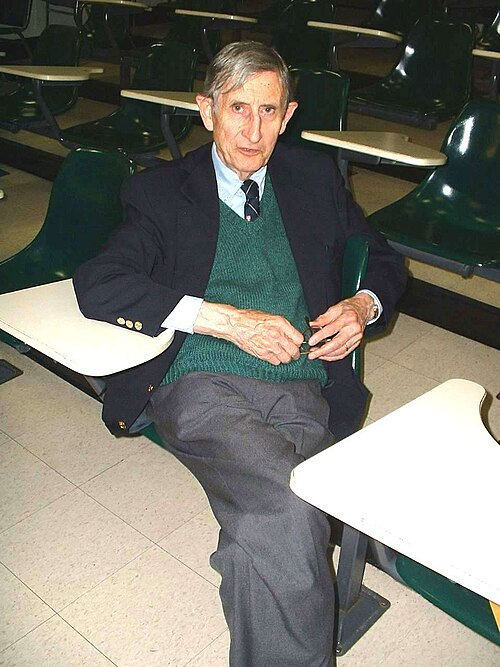

**[Freeman Dyson](kloom:e/freeman-dyson)** was twenty-three when he arrived at [Cornell](kloom:e/cornell-university) in the autumn of 1947, an English mathematician from Cambridge who had spent the war doing operational research for RAF Bomber Command. He had come on a Commonwealth Fellowship to learn physics from **[Hans Bethe](kloom:e/hans-bethe)**. He wrote home every week or two, and his letters, published in 2018 as _Maker of Patterns_, are the closest record there is of how [Feynman's diagrams](kloom:e/feynman-diagram) got out of [Feynman](kloom:e/richard-feynman)'s head.

## A private version of the quantum theory

Dyson's first impression, in November 1947, was of a young professor who kept everyone amused, who had a private version of quantum theory that might be useful for some problems, and who was always sizzling with new ideas, most of them never finished. By March 1948 he had seen more. **[Julian Schwinger](kloom:e/julian-schwinger)** at Harvard had built a theory that removed the infinities of the frame Lamb shift, and Weisskopf had brought an account of it to Cornell. Feynman, Dyson wrote, had attacked the same problem from a different direction and reached a roughly equivalent theory by himself. But his ideas were as hard to make contact with as Bethe's were easy.

## Cleveland to Albuquerque

In June 1948 Feynman drove west to see a woman in Albuquerque, and took Dyson with him. They covered the eighteen hundred miles from Cleveland in three and a half days, Feynman at the wheel all the way, averaging sixty-five miles an hour outside towns. In Albuquerque they were stopped for speeding and fined ten dollars and $4.50 costs. On the road Feynman talked about his wife Arline, who had died at Albuquerque three years before, about marriage, and about Los Alamos, and Dyson decided that he was an exceptionally well-balanced person whose opinions were his own. The historian **[David Kaiser](kloom:e/david-kaiser-physicist)** adds that the talk about diagrams went on in the car too. (The woman in Albuquerque, Dyson reported, turned Feynman down.)

Dyson spent the rest of the summer at the University of Michigan's summer school, listening for six weeks to Schwinger lecture on his theory. He was, as he said later, the only person who had spent six months hearing Feynman and six weeks hearing Schwinger. Then he took a Greyhound bus east. On the third day, after forty-eight hours of riding, he began to think hard about the two theories, and before he knew it had proved that they were the same. He wrote to Bethe when he reached Chicago.

## The papers

| When           | What                                                                  |
| -------------- | --------------------------------------------------------------------- |
| June 1948      | the drive west with Feynman                                           |
| summer 1948    | Schwinger's lectures at Ann Arbor                                     |
| September 1948 | the bus east; Dyson arrives at the Institute for Advanced Study       |
| 6 October 1948 | "The Radiation Theories of Tomonaga, Schwinger, and Feynman" received |
| February 1949  | that paper published, the first on the diagrams                       |
| June 1949      | "The S Matrix in Quantum Electrodynamics" published                   |
| September 1949 | Feynman's own two papers published                                    |

The first paper showed that Schwinger's theory, **[Sin-Itiro Tomonaga](kloom:e/shin-ichir-tomonaga)**'s in Japan, which had reached Princeton that spring, and Feynman's were one theory. The plate shows the heart of the connection, as Feynman's own paper later put it: the older methods counted two terms for one photon passing between two electrons, one for each order in which they could emit and absorb it, where Feynman's diagram is a single term with no order in time. Dyson also wrote down how to draw the diagrams and translate them into integrals, and derived those rules from the theory rather than from intuition. The second paper showed that the infinities could be removed from terms of every order, not only the first. Both appeared months before Feynman's own, and Kaiser found that for the next decade they were cited more often than his.

## Teaching it

At the Institute Dyson joined the largest group of young theorists [Robert Oppenheimer](kloom:e/j-robert-oppenheimer) had yet gathered there, ten or eleven by Kaiser's two counts. Their new building was not finished, so for the first weeks they shared one room, and Dyson became their teacher, lecturing, answering questions and setting pairs of them to work on calculations. Oppenheimer was skeptical at first. In February 1949 Feynman came down for three days and gave about eight hours of seminars, and Dyson wrote that even Oppenheimer began to get the spirit of the thing. His lecture notes of 1951, circulated in mimeograph and not published as a book until 2007, reached more physicists still.

When the Nobel Prize went to Tomonaga, Schwinger and Feynman in 1965, Dyson wrote to his parents that he was glad they shared it equally, and that his paper had been the first to do all three justice. He was not included.

What Dyson's rules made possible, one of the Institute pairs soon showed: the next frame, Magnetic moment.
