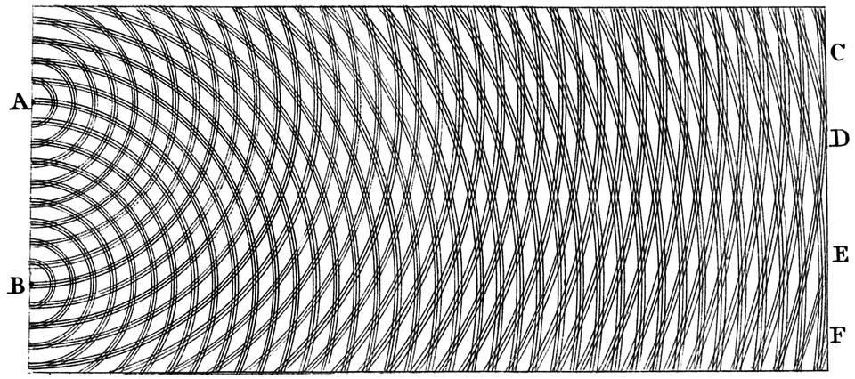

[Feynman](kloom:e/richard-feynman) opened the third volume of his [_Lectures on Physics_](kloom:e/the-feynman-lectures-on-physics) with the
experiment of [two slits](kloom:e/double-slit-experiment), which he said has in it the heart of quantum
mechanics. It is also the easiest place to see what a [sum over histories](kloom:e/path-integral-formulation)
means, because with two slits there are only two histories to add. This
frame works it through with numbers, then keeps adding slits.

## Two slits, two arrows

Light from a source passes a screen with two narrow slits and lands on a
wall. For any point on the wall there are two ways to get there, one through
each slit. Each way contributes an arrow of the same length, pointing in a
direction set by how far the light travels, one full turn for every
wavelength. The chance of arriving is the square of the length of the sum
of the arrows.

The numbers below are invented for this worked example: light of wavelength
500 nm, slits 0.10 mm apart, and a wall one meter away. A point _x_
millimeters from the middle of the wall is farther from one slit than the
other by about _x_ × 0.1 micrometers. Brightness is measured against one
slit open alone, which gives 1.

| Point on the wall | Extra path | Angle between the arrows | Length of the sum | Brightness |
| ----------------- | ---------- | ------------------------ | ----------------- | ---------- |
| 0 mm              | 0 nm       | 0°                       | 2                 | 4          |
| 1.25 mm           | 125 nm     | 90°                      | 1.41              | 2          |
| 2.5 mm            | 250 nm     | 180°                     | 0                 | 0          |
| 3.75 mm           | 375 nm     | 270°                     | 1.41              | 2          |
| 5 mm              | 500 nm     | 360°                     | 2                 | 4          |

Two slits open do not give twice the light of one. Where the arrows point
the same way the wall is four times as bright; where they point opposite
ways it is dark, although light could reach it through either slit alone.
The bands repeat every 5 mm. The plate draws both cases at its foot. Put a
detector at the slits that records which one the light used, and the rule
changes: add the chances, not the arrows, and every point gets 1 + 1 = 2.
The bands vanish.

**[Thomas Young](kloom:e/thomas-young-scientist)** showed the bands with light in [London](kloom:e/london) in 1803, and drew
them as crossing waves. The quantum version is stranger. In 1961 **Claus
Jönsson** at Tübingen did the experiment with a beam of electrons, and in
1974 **Pier Giorgio Merli**, **Gian Franco Missiroli** and **Giulio Pozzi**
sent electrons one at a time: each arrived as a single dot, and
the dots slowly built the banded pattern. Each electron, alone, had two
arrows to add.

## More holes, more screens

Now drill a third slit. There are three ways to each point, three arrows
to add. Drill a hundred: a hundred arrows. Put a second screen with holes
of its own behind the first. A way to the wall is now a choice of one hole
in the first screen and one in the second, a zigzag route, and the number
of routes is the product of the numbers of holes. Each route's arrow is
turned by the whole length of its zigzag. Add a third screen, a fourth, as
many as you like.

Then drill so many holes in each screen that nothing is left of it, and
put so many screens so close together that they fill the space between
source and wall. There are no screens any more. What remains is the rule:
to get from the source to a point, the light, or the electron, takes every
possible route through empty space, and the arrows of all of them are
added. That is the path integral, arrived at without a formula. The telling
is **[A. Zee](kloom:e/anthony-zee)**'s, from the opening of his textbook _Quantum Field Theory in a
Nutshell_ (2003), where a student asks the professor what happens with more
holes; the rule it arrives at is Feynman's second postulate.

For a particle with mass the arrow of each path is turned by its action,
not its length, but the arithmetic is the same. Feynman told the whole of
quantum electrodynamics this way, with little arrows and no equations, in
his 1985 book [_QED_](kloom:e/qed-the-strange-theory-of-light-and-matter).

The rule has a puzzle in it. A thrown ball also has every path open to it,
yet it follows one. Why the others disappear is the classical limit.
