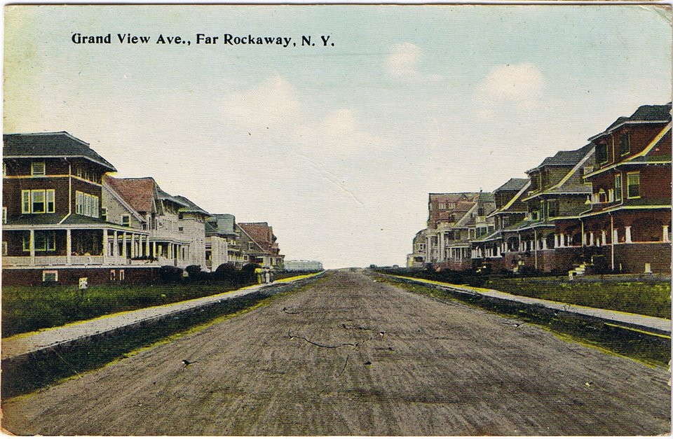

**[Richard Phillips Feynman](kloom:e/richard-feynman)** was born in [New York City](kloom:e/new-york-city) on 11 May 1918, and
grew up in **[Far Rockaway](kloom:e/far-rockaway)**, the far end of Queens, where the city meets the
Atlantic. His family were not scientists and not rich. What they gave him
instead, by his own account, was a way of reading the world, and he used it
for the rest of his life.

## A salesman who asked how we know

His father, **Melville Feynman**, had come to the United States from Minsk
as a small child. He tried several trades, selling car-care products for a time,
before he settled as sales manager for a uniform company. His mother,
**Lucille Phillips**, the daughter of Polish-Jewish immigrants, had trained
as a teacher, and Richard's lifelong sense of humor came from her. A brother, Henry, died at four weeks old
when Richard was five. His sister **[Joan](kloom:e/joan-feynman)** was born nine years after him,
and he encouraged her interest in the sky, once taking her out to see the
northern lights. She became an astrophysicist who studied them.

In a long interview in 1966, Feynman described his father as a man who kept
up a running commentary on everything: the ants under an overturned stone,
the stars, the way birds fly and waves break. At the [American Museum of
Natural History](kloom:e/american-museum-of-natural-history) he stopped at the boulders scored by glaciers, described the
ice grinding its way south, and then asked the question that mattered to
him: how would anyone know there had been ice in New York? What Feynman took
from it, he said, was not the facts, which his father often had wrong, but
the method.

## Twenty feet, at the bedroom window

The family owned an [_Encyclopaedia Britannica_](kloom:e/encyclopaedia-britannica), and his father read it aloud
to him on his lap. When an entry said a dinosaur stood some twenty feet
tall, he stopped and translated. A story of a house is about ten feet, so
the animal standing in their front yard would look straight in at the
bedroom window on the second floor, and its head would be too wide to come
through. The plate draws that sum. Feynman called the habit a disease he
caught for good: whenever he read something, he tried to turn it into what
it really meant.

The same lessons appear, more polished, in the chapter "The Making of a
Scientist" in his 1988 book [_What Do You Care What Other People Think?_](kloom:e/what-do-you-care-what-other-people-think),
written with **[Ralph Leighton](kloom:e/ralph-leighton)** from stories Feynman told aloud. There his
father teaches him that knowing the name of a bird in several languages
tells you nothing about the bird, and that nobody knows why a ball rolls to
the back of a wagon when the wagon is pulled: calling it _inertia_ is only a
name. Those are Feynman's own tellings, shaped by decades of retelling, and
this subject treats them that way. The 1966 interview is closer to the
events, though it is still his memory.

## A house of cousins

The family moved between Far Rockaway, Baldwin and Cedarhurst on Long
Island, and for long stretches shared a house in Far Rockaway with cousins.
By the early 1930s money was tight. He remembered taking his father's weekly
pay check, about a hundred dollars, to the bank himself, and deciding that
five thousand a year was all anyone would need. He never felt poor, he said.

| Year    | Where the family lived                          |
| ------- | ----------------------------------------------- |
| 1918    | New York City; soon Far Rockaway, with cousins  |
| c. 1928 | Cedarhurst, Long Island, for two or three years |
| c. 1930 | Back to Far Rockaway and the cousins            |

The dates in the table are his own estimates from 1966, and he said himself
that he could not fix them. What he could fix, in detail, was what he had
built in his bedroom: a laboratory, and a trade in mending the neighbors'
radios.
