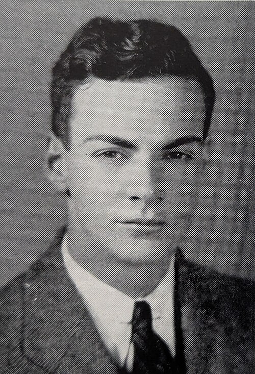

[Feynman](kloom:e/richard-feynman) arrived at the **[Massachusetts Institute of Technology](kloom:e/massachusetts-institute-of-technology)** in the autumn of 1935 and left four years later with two papers in the _Physical Review_, a place among the five best undergraduate mathematicians in North America, and a result on which computational chemistry still leans. The result is the one that gives this frame its title: the force that holds a molecule together is nothing more mysterious than electrostatics.

## Mathematics, engineering, physics

He began in mathematics. Some time in his first year he went to the head of the department and asked what higher mathematics was for, apart from teaching more of it. Becoming an actuary, he was told. In his 1966 interview with Charles Weiner he remembered deciding that he needed to get his hands dirty, switching to electrical engineering, and then realising within months that he had gone too far and that physics lay in between.

He moved fast. Advised by older students in his fraternity, Phi Beta Delta, he passed the examinations for first-year calculus before he arrived. As a sophomore he took **[John Slater](kloom:e/john-c-slater)**'s advanced course in theoretical physics, meant for seniors and graduate students, and sat next to the only other sophomore in the room, **Theodore Welton**, who became his closest friend and sparring partner. **[Philip Morse](kloom:e/philip-m-morse)** taught the two of them quantum mechanics privately, an hour a week in his office, and set them a research problem on the energy levels of light atoms.

## Cosmic rays and the stars

His first paper came from **Manuel Sandoval Vallarta**, who wanted to know whether cosmic rays arriving from outside the galaxy would be scattered by the stars in it, so that more would come from some directions than from others. Feynman proved that, for rays arriving evenly from every side, as much is scattered into any direction as out of it: there is no net effect. "The Scattering of Cosmic Rays by the Stars of a Galaxy" appeared as a letter on 1 March 1939, with Vallarta's name first because, Vallarta said with a smile, he was the senior scientist. Feynman's story of what happened next, that [Heisenberg](kloom:e/werner-heisenberg)'s book on cosmic rays ended with a citation of it, was one he enjoyed telling for the rest of his life.

## Forces in molecules

Slater gave him his senior thesis problem: why does quartz expand so little when it is heated? To answer it, Feynman needed the forces between the atoms, and then the stress across any plane cut through a molecule, and to get the stress he first needed the force. What he found was simple. Once the [Schrödinger equation](kloom:e/schrodinger-equation) has fixed how the electrons are spread around a molecule, the force on each nucleus is just the classical electrostatic pull of that cloud of charge, plus the push of the other nuclei. The plate draws it for a molecule of two atoms: the contours of the electron density, the cloud between the nuclei pulling them together, the nuclei pushing each other apart, and below, the energy curve whose slope those forces equal. Slater challenged him to explain van der Waals forces the same way, and he did.

Slater and **Conyers Herring** thought it should be published. "Forces in Molecules" appeared in _Physical Review_ on 15 August 1939, pages 340 to 343. Feynman himself soon decided it was trivial, a consequence of first-order perturbation theory that could be written in half a line, and was surprised a decade later to hear that chemists were arguing about it.

It is now the **[Hellmann–Feynman theorem](kloom:e/hellmannfeynman-theorem)**, and Feynman was not first. The same statement had been proved by **Paul Güttinger** in 1932, noted by **[Wolfgang Pauli](kloom:e/wolfgang-pauli)** in 1933, and set out by **[Hans Hellmann](kloom:e/hans-hellmann)** in his textbook of quantum chemistry in 1937. Hellmann had been dismissed from his post in Hanover in 1933 because his wife was Jewish, emigrated to Moscow, and was shot in the Great Purge in May 1938, a year before Feynman's paper appeared.

| Year | Who             | Where                                              |
| ---- | --------------- | -------------------------------------------------- |
| 1932 | Paul Güttinger  | _Zeitschrift für Physik_                           |
| 1933 | Wolfgang Pauli  | _Handbuch der Physik_, vol. 24                     |
| 1937 | Hans Hellmann   | _Einführung in die Quantenchemie_ (and in Russian) |
| 1939 | Richard Feynman | _Physical Review_ 56, a senior thesis at MIT       |

His thesis, he told Weiner in 1966, mattered more for the part nobody published: a quantum-mechanical stress tensor at every point in a molecule.

## One of five

In his senior year the mathematics department, short of entrants, persuaded him to sit the **Putnam competition**. He was named one of its five Putnam Fellows for 1939. A feeler came about a graduate scholarship at Harvard, as he remembered it, and he turned it down. He wanted to stay at MIT for graduate school, and Slater would not let him: a student should see how the rest of the world looks. Feynman graduated in June 1939 and went to Princeton, where the head of the physics department had a question about him.
