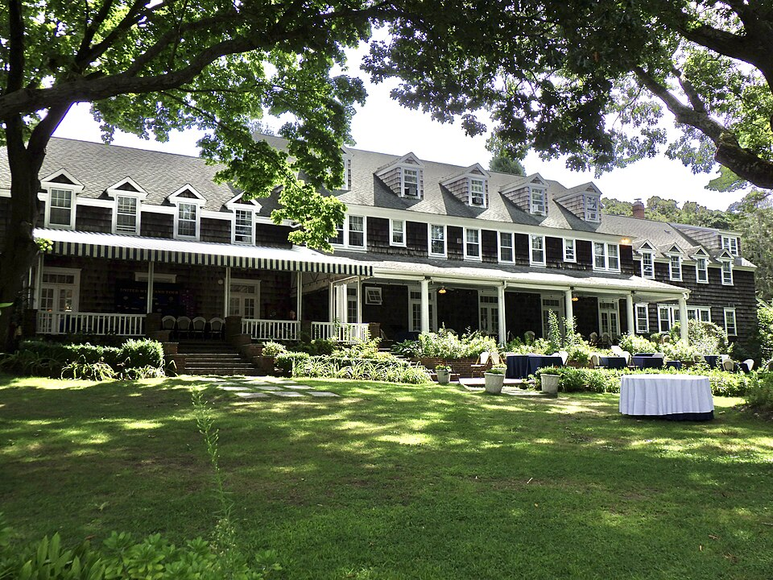

By the late 1930s the theory of light and electrons, [_quantum electrodynamics_](kloom:e/quantum-electrodynamics) or QED, gave good answers to simple questions and nonsense to careful ones. Work out the first correction to anything, the energy of an electron in an atom or the chance of it scattering, and the answer came out infinite. Physicists did not know whether the theory was wrong or whether they were using it wrong. In June 1947 a measurement on the simplest atom there is made the question urgent, and within a few days it pointed to the answer.

## A theory that gave infinity

In 1930 **J. Robert Oppenheimer** calculated how an electron in an atom is disturbed by the electromagnetic field it carries around with it, and found that the shift in its energy was infinite. He concluded that the theory could not be trusted wherever relativity mattered, and that something new was needed. In 1939 **Victor Weisskopf** showed that the infinity was milder than it looked: it grew only with the logarithm of the highest energy included. **Hendrik Kramers** suggested a way to think about it. The electron's interaction with its own field changes its mass, but nobody has ever seen an electron without that field, so the mass measured in the laboratory already includes it. No one knew how to turn the idea into a calculation.

There had been hints that hydrogen disagreed with **Paul Dirac**'s theory of 1928. In 1933 and 1934 spectroscopists at Caltech and at Cornell reported that hydrogen's lines were split slightly less than predicted, but the effect was near the limit of their instruments, another group withdrew a similar report, and it was mostly forgotten.

## Lamb's microwaves

Dirac's theory says that two of hydrogen's excited states, called 2S1/2 and 2P1/2, have exactly the same energy. **[Willis Lamb](kloom:e/willis-lamb)** at Columbia had spent the war in the Columbia Radiation Laboratory, working on microwaves for radar, and saw that they could test that prediction directly. With his student **Robert Retherford** he sent a beam of hydrogen atoms in the 2S state, which is long-lived, through a microwave cavity in a magnetic field. When the microwaves had the right frequency they tipped atoms into a P state, which decays at once, and the beam's signal at the detector dropped. The two states were not equal. The 2S state sat higher, by about 1,000 megahertz in frequency: a few millionths of an electronvolt, or about a part in a million of the energy that binds the electron at that level. The plate draws the n = 2 levels to scale, then magnifies the gap six times.

## Shelter Island

Lamb reported the result at a small conference of about two dozen physicists at the Ram's Head Inn on **[Shelter Island](kloom:e/shelter-island-conference)**, New York, from 2 to 4 June 1947; one account dates it a day earlier. It was the first meeting of its kind since the war. **[Isidor Rabi](kloom:e/isidor-rabi)** reported a second anomaly, in the hyperfine structure of hydrogen, the first hint that the electron's magnetism was not quite what Dirac's theory gave, and Kramers explained his view of the mass. [Feynman](kloom:e/richard-feynman) was there, a young professor at Cornell; he later told his biographer Jagdish Mehra that no conference since had felt as important.

**[Hans Bethe](kloom:e/hans-bethe)**, also of Cornell, was consulting for General Electric in Schenectady, and worked on the problem on the train. His idea was to take Kramers seriously. Calculate the self-energy of the electron bound in hydrogen, subtract the self-energy of a free electron, which is already counted in the measured mass, and see what is left. What was left still diverged, but only logarithmically, and Bethe, whose calculation ignored relativity, simply stopped counting at the energy of the electron's own mass, on the reasoning that a relativistic theory would supply the cutoff. He got 1,040 megahertz. He sent a three-page paper to the conference's participants on 9 June, and it appeared in the _Physical Review_ that August.

| Value for the 2S–2P shift                 | Megahertz |
| ----------------------------------------- | --------: |
| Dirac's theory, 1928                      |         0 |
| Lamb and Retherford, measured, 1947       |    ~1,000 |
| Bethe, on the train, 1947                 |     1,040 |
| Relativistic calculations, 1949           |     1,052 |
| The accepted value today (theory and lab) |    ~1,058 |

The later values are from G. Jordan Maclay's history of the shift (2020). Accounts of the train differ: Feynman, in his Nobel lecture, said it ran from Ithaca and that Bethe telephoned him from Schenectady with the result, while other accounts have Bethe traveling home from the conference by way of New York.

## Renormalization

Bethe's calculation was rough, but it carried the idea that rescued the theory: [_renormalization_](kloom:e/renormalization). Write every answer in terms of the mass and charge that are actually measured, and the infinities are absorbed into quantities that are never seen on their own, leaving finite differences that can be compared with experiment. Feynman called Bethe's estimate the most important discovery in the history of QED. Doing it properly, with relativity, took two years and three different methods, by **[Julian Schwinger](kloom:e/julian-schwinger)**, **[Sin-Itiro Tomonaga](kloom:e/shin-ichir-tomonaga)** and Feynman. Feynman's came with pictures, and its rules are in the next frame, Propagators.
