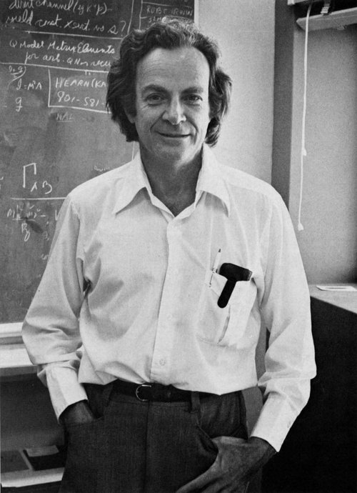
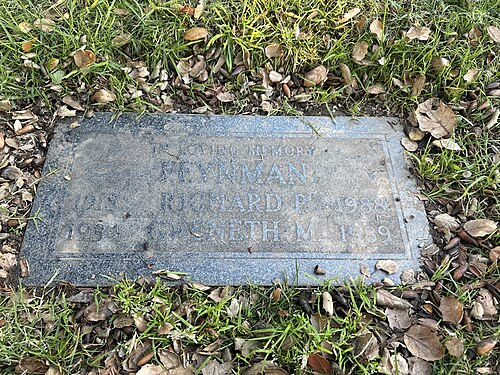

Feynman lived with cancer for the last ten years of his life, and for most of them he went on working as if he did not. In 1978 he went to his doctors with abdominal pains and was found to have a **liposarcoma**, a rare cancer of the body's soft and fatty tissue. The surgeons took out a very large tumour that had crushed one kidney and his spleen. The disease came back, and he went back to the operating table again and again.

## Ten years of operations

The record of the operations is uneven, and the sources count them differently. The _Los Angeles Times_ obituary dated his second operation to 1981, and said that when a call went out for blood, mostly students answered it, and more than a hundred pints were given within hours. The essayist **Algis Valiunas**, writing in 2018, described one operation that lasted more than fourteen hours, in which his aorta split on the table and he needed seventy-eight pints of blood; he does not give its year. In 1986 his doctors found a second cancer, **Waldenström's macroglobulinaemia**, a cancer of the white blood cells, and there were further operations in October 1986 and October 1987.

| Year     | What happened                                                          |
| -------- | ---------------------------------------------------------------------- |
| 1978     | Liposarcoma found; a large abdominal tumour removed                    |
| 1981     | A second operation, and the blood drive at Caltech                     |
| 1986     | The Rogers Commission; a second cancer found; an operation in October  |
| 1987     | A last operation in October                                            |
| Feb 1988 | Admitted to the UCLA Medical Center on 3 February; died on 15 February |

The year of the commission, told in the frame before this one, was also a year of illness, and he knew it. His friend **Danny Hillis**, the designer of the Connection Machine, remembered walking with him in the hills above Pasadena a year or so before his death, while he was recovering from one of the operations. Feynman was telling a funny story about reading up on his own disease and predicting his doctors' diagnosis. When Hillis admitted he was sad because Feynman was going to die, Feynman said that it bothered him sometimes too, but less than Hillis thought, because by his age you have told most of the good stuff you know to other people. Then, at a fork in the trail, he grinned: "I bet I can show you a better way home."

## Still working

He kept teaching and kept learning. In January 1987 he gave a lunchtime seminar at Caltech on the **Bethe ansatz**, a method Hans Bethe had found in 1931 for solving exactly a line of interacting magnetic spins, and on which two-dimensional field theories it could solve. In September 1987 he travelled to a workshop on the island of Wangerooge in Germany and spoke on the difficulties of applying variational methods to quantum field theory; the talk was published after his death. He spent a week working with Hillis on a model of evolution, and was delighted to learn that a textbook had got there first, because it meant they had got it right. The plate draws the Bethe ansatz's simplest case: a ring of spins with one flipped, and the flip spread round the ring as a wave.

## The blackboard

In February 1988 a ruptured ulcer brought on kidney failure. He was admitted to the **UCLA Medical Center** on 3 February and declined the dialysis that might have given him a few more months. His wife **Gweneth**, his sister **Joan** and his cousin Frances Lewine were with him, and he died there on the night of 15 February 1988, aged sixty-nine.

His last words come to us in two versions. James Gleick, in his 1992 biography _Genius_, has him say that he would hate to die twice, because it was so boring. His sister Joan, interviewed for Christopher Sykes's _No Ordinary Genius_ (1994), remembered "This dying is boring." Both are secondhand, and neither can be checked against a recording.

What can still be seen is his blackboard. A photograph in the Caltech Archives shows it as he left it, and it has been reproduced ever since. It is not freely licensed, so it is described here. At the upper left, boxed, he had written "What I cannot create, I do not understand", and below it "Know how to solve every problem that has been solved." To the right is a list headed "TO LEARN": the Bethe ansatz problems, the Kondo effect (apparently crossed off), the two-dimensional Hall effect, a note that reads "accel. temp.", and non-linear classical hydrodynamics. Below them are a few lines of a calculation he had been working on.

He is buried in **Mountain View Cemetery** in Altadena, under a flat stone he shares with Gweneth, who died the following year. The permission for his journey to Tuva, the subject of an earlier frame, arrived after his death. What happened to his name next is the story of the frame that follows, _The legend_.
