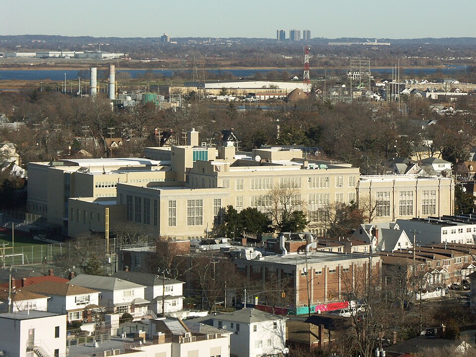

At **[Far Rockaway High School](kloom:e/far-rockaway-high-school)** [Feynman](kloom:e/richard-feynman) was bored in physics class, and his
teacher noticed. One day after class, in the room where the laboratory was,
**[Abram Bader](kloom:e/abram-bader)** told him about something he thought the boy would find
interesting. Feynman remembered where the blackboard was and where each of
them stood for the rest of his life. It was the **[principle of least
action](kloom:e/action-principles)**, and he counted it among the greatest things he ever learned.

## A law about the whole path

Newton's laws say what a body does next: from where it is and how fast it
is moving, the forces fix the next instant, and the next. The principle of
least action says something that sounds quite different. Take a ball thrown
up and caught one second later. Of all the paths it could have taken
between the throw and the catch, it takes the one for which a single
number, the **action**, is least. The action is the kinetic energy minus
the potential energy, added up over every moment of the trip. Bader drew
curves on the blackboard, the true path and others, and showed that the
true one gives the least number. He proved nothing, Feynman said; he just
explained that there was such a principle.

The plate shows the idea. Its three thin curves start and end where the
true path does, but each is bent by a wiggle. The table works it out for a
ball of 100 grams. The numbers are a worked example, not a measurement: the
ball, the paths and the arithmetic are this frame's.

| Path (height at mid-flight)      | Action (joule-seconds) |
| -------------------------------- | ---------------------- |
| the true parabola (1.23 m)       | −0.400                 |
| raised by a single hump (1.57 m) | −0.371                 |
| an S-shaped wiggle (1.23 m)      | −0.328                 |
| a triple wiggle (1.05 m)         | −0.335                 |

Every path the ball did not take costs more. Strictly, nature does not
always pick the least action, only one where any small change in the path
makes no first-order change in it, which is why physicists now say
_stationary_ action. For a thrown ball the two are the same.

What caught Feynman was the change in point of view: instead of a
differential equation, a property of the whole path. In 1966 he told an
interviewer that he had played with the action, one way or another, in all
his work ever since. He opened the
chapter on it in [_The Feynman Lectures on Physics_](kloom:e/the-feynman-lectures-on-physics), thirty years later, with
Mr. Bader calling him down after class.

## Teaching himself

He was already ahead of the school. He borrowed _Calculus for the Practical
Man_ from the library by telling the librarian it was for his father; when
his father could not follow its first pages, Feynman realised for the first
time that he understood something his father did not. That attempt did not
stick. His father then bought him _Calculus Made Easy_ at Macy's, and this
time he wrote the book out into a notebook of his own. By fifteen he had
taught himself trigonometry, advanced algebra, infinite series and both
kinds of calculus, and invented his own symbols for sine, cosine and the
derivative so that they would not look like letters multiplied together.
A teacher sent him to the back of the room with a book called _Advanced
Calculus_ and told him to come back when he knew what was in it. He won the
New York University mathematics championship in his last year.

The school, which opened in 1897 and closed in 2011, moved into the building
Feynman knew in 1929. It taught three future Nobel laureates: Feynman, **[Burton Richter](kloom:e/burton-richter)** and **[Baruch Blumberg](kloom:e/baruch-samuel-blumberg)**.

## Columbia says no

In 1935 he applied to [Columbia](kloom:e/columbia-university) and was turned down. The usual explanation is
Columbia's quota on Jewish students, and Princeton's head of physics would
ask the same question about him four years later. Feynman himself, in 1966,
remembered only taking Columbia's entrance examination, losing the fifteen
dollars it cost, and not getting in. He went instead to MIT, where he began
in mathematics, then tried electrical engineering, and settled on physics
as somewhere in between.

He would come back to the action often. His doctoral thesis, at Princeton,
was called "The Principle of Least Action in Quantum Mechanics".
