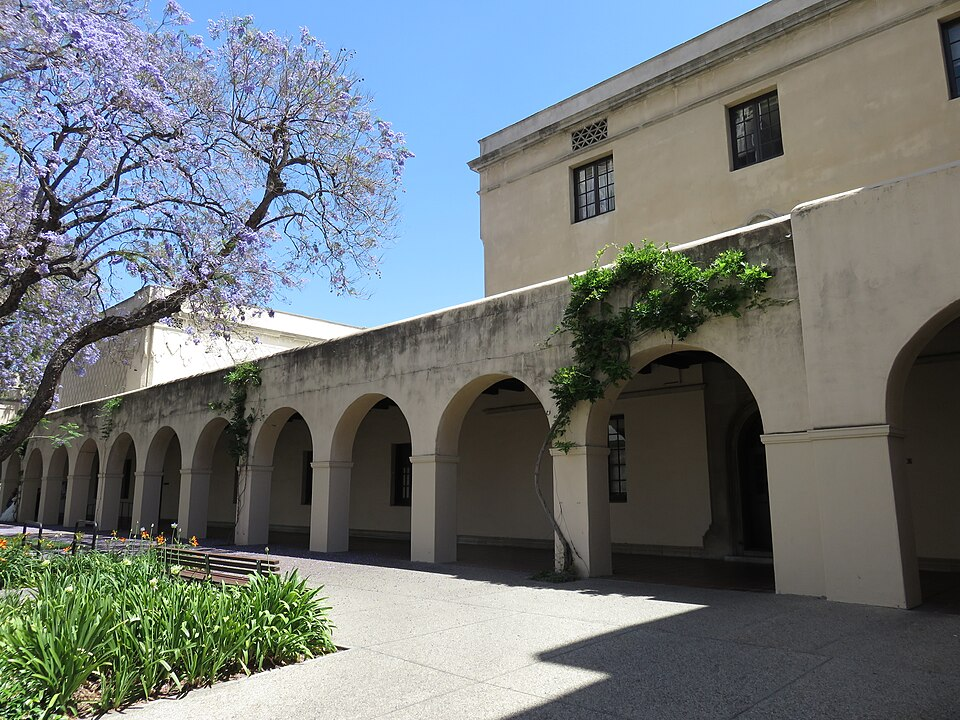

In September 1961 about 180 new [Caltech](kloom:e/california-institute-of-technology) students filed into the lecture
hall of the **Norman Bridge Laboratory of Physics** for the first physics
lecture of their college lives, and found **[Richard
Feynman](kloom:e/richard-feynman)** at the bench. For two years, twice a week, he taught them all of
physics, from atoms to quantum mechanics. It was the only time he taught
undergraduates a regular course, and the [lectures](kloom:e/the-feynman-lectures-on-physics) became the most widely
read thing he made.

## Why Caltech asked him

Caltech's introductory course was old-fashioned. It ran on a 1937 textbook
by [Millikan](kloom:e/robert-millikan) and two colleagues, had no lectures at all, and showed the
students almost nothing of twentieth-century physics in two years.
**[Matthew Sands](kloom:e/matthew-sands)**, who had known Feynman since [Los Alamos](kloom:e/los-alamos-national-laboratory), found that good
students were losing heart by then, and pushed the department to reform
the course. The Ford Foundation paid for it, and a committee under
**[Robert Leighton](kloom:e/robert-b-leighton)** was to design it. Sands and Leighton could not agree on
a syllabus: Leighton thought Sands's modern physics too much for freshmen.
So Sands asked Feynman to give the lectures himself. Feynman asked whether
a great physicist had ever taught freshmen, heard that Sands thought not,
and said he would do it.

He told the story differently in 1966, to the historian Charles Weiner:
Sands talked him into it, and he threw away the committee's syllabus and
did it his own way. He set himself rules. Never teach anything that is
only approximately right without saying so. Say plainly which ideas follow
from what came before and which are new. Give the best students something
to chew on without losing the rest. Make each lecture stand alone, with a
beginning, a climax and an end. His wife told him he had worked sixteen
hours a day.

## How the books were made

Feynman wrote nothing down beyond a page or two of notes. A microphone
hung round his neck fed a tape recorder in the next room, a photographer
shot the blackboards, and a typist transcribed the tapes. Graduate students
were meant to edit the transcripts and were too slow, so Leighton and then
Sands did most of it, by Leighton's count ten to twenty hours of a
physicist's work for each lecture. In 1963 Addison-Wesley offered to have
bound books ready for that September's class, with a wide margin for the
figures; when its editor turned "you" into "one", Sands had her change it
back. Feynman at first objected to his colleagues' names on the cover. The
compromise was the title.

| Volume | Subject                              | Chapters | Published |
| ------ | ------------------------------------ | -------- | --------- |
| I      | Mainly mechanics, radiation and heat | 52       | 1963      |
| II     | Mainly electromagnetism and matter   | 42       | 1964      |
| III    | Quantum mechanics                    | 21       | 1965      |

The plate draws the end of chapter 22 of the first volume, "Algebra". Sands
had asked whether freshmen could handle complex numbers; Feynman's answer
was a lecture that climbs from counting to the imaginary exponential,
e^iθ, the circle that the rest of the course leans on for
oscillations and waves. The spiral shows the idea of building it from many
small steps; the table's numbers are this frame's arithmetic, not the book's.

## How the students fared

Here the witnesses disagree. In June 1963, just after an exam whose average
Sands put at about 65 per cent, Feynman dictated a preface into Sands's
Dictaphone that said, in one line, "I don't think I did very well by the
students." A review in Caltech's _Engineering and Science_ in 1964 said that
test results and letters to the student paper showed some freshmen were
baffled. In a preface of 1989, **[David Goodstein](kloom:e/david-goodstein)** and **Gerry Neugebauer**
wrote that attendance by registered students fell sharply while graduate
students and faculty filled the seats. Sands, who sat at the back of nearly
every lecture, answered in 2005 that perhaps a fifth stayed away, as in any
large course, and quoted a former student who remembered the class
applauding at the end of the hour. Goodstein's own
verdict was that the books never worked as a first textbook, even at
Caltech, and became instead a source for people who already knew physics.

They sold, in English alone, more than 1.5 million sets by 2015. On 13
September 2013 Caltech put the whole text online free, as
feynmanlectures.caltech.edu. In March 1964, after the course was over,
Feynman came back to the freshmen once more for a guest lecture on the
planets, which went missing for almost thirty years. Its story belongs to
the next frame, with the lectures he gave at Cornell that November.
