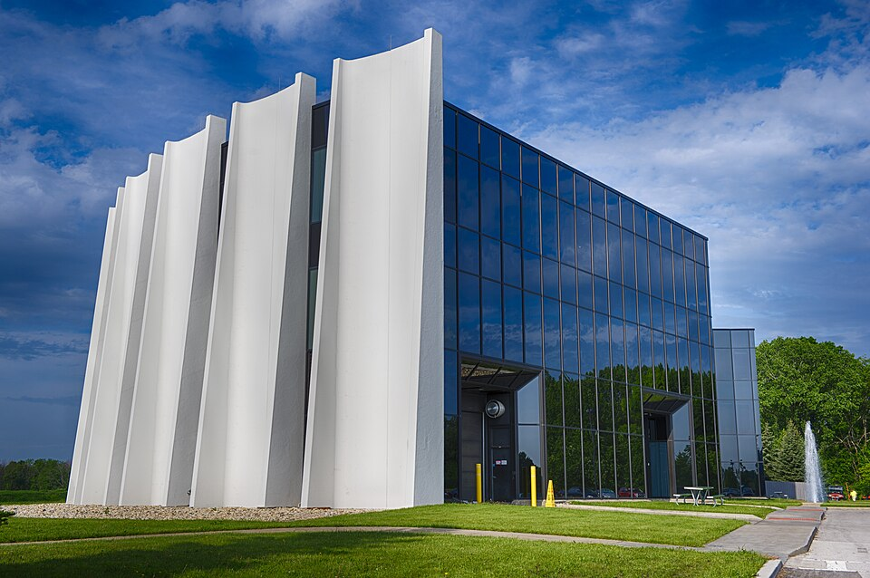
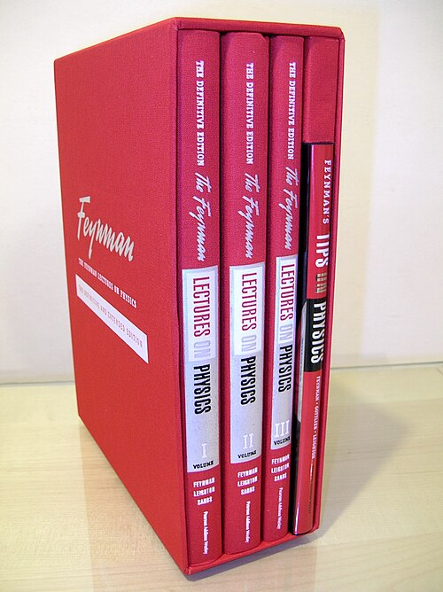

The stories in the frame before this one made Feynman famous. What keeps him in use is a handful of tools, and they are used every working day by people who never think of him. This frame says where they stand as of 28 September 2026, thirty-eight years after his death.

## Tools in daily use

**Feynman diagrams** are how physicists organise a calculation in quantum field theory. Each line is a particle's history and each junction an interaction; the rules turn a drawing into a term of the answer, and the answer is the sum over all the drawings. When he died, the _New York Times_ called his approach "now in universal use", and it still is: the predictions for collisions at the Large Hadron Collider and for the magnetism of the electron are built from them, thousands at a time: a 2012 calculation of the electron's magnetism summed 12,672 diagrams for its fifth-order term alone. The plate's right half draws the simplest correction of all, a photon thrown and caught again by an electron as it absorbs another; it gives the first term of the electron's extra magnetism, α/2π. Newer methods can reach some answers without summing diagrams: the _amplituhedron_ of Nima Arkani-Hamed and Jaroslav Trnka (2013) computes certain amplitudes, in a simplified relative of the real theory, from the volume of a geometric object; where both can be computed, the answers agree with the diagrams.

The **path integral**, from his thesis and his 1948 paper, is now the standard way of stating what a quantum field theory is. Three physicists writing for his centenary called it the "defining formulation" of the Standard Model, of gauge theories on a lattice, and of much of statistical mechanics. **Lattice QCD** takes it literally: it replaces spacetime with a grid of points and has supercomputers sample the sum over histories numerically, to compute the masses of the proton and its relatives from the theory of quarks. The plate's left half is a cartoon of that: one particle's paths on a small lattice, where the real calculation samples whole fields.

## What he started, and where it stands

| He started                                              | When    | Where it stands, September 2026                                                    |
| ------------------------------------------------------- | ------- | ---------------------------------------------------------------------------------- |
| The path integral                                       | 1942–48 | The standard statement of quantum field theory; summed numerically in lattice QCD  |
| Feynman diagrams                                        | 1948–49 | In every perturbative calculation in particle physics                              |
| The V−A theory of the weak force, with Murray Gell-Mann | 1958    | Part of the Standard Model's electroweak theory                                    |
| "There's Plenty of Room at the Bottom"                  | 1959    | Claimed by nanotechnology's advocates as its founding talk; prizes since 1993      |
| _The Feynman Lectures on Physics_                       | 1961–64 | In print, and free to read online since 2013                                       |
| The parton model                                        | 1969    | Grown into the parton distributions used in every prediction for proton collisions |
| Simulating nature with quantum computers                | 1981–82 | A field of its own; see the trail _Computing_                                      |

The lectures are the most read of all. Written up with Robert Leighton and Matthew Sands from his two years of introductory lectures at Caltech, 1961–63, they were never widely adopted as a textbook, and they sell anyway. In 2013 Caltech, with the team behind The Feynman Lectures Website, made them free to read online.

## Prizes in his name

Two prizes carry his name. Caltech has given the **Richard P. Feynman Prize for Excellence in Teaching** every year since 1993, to a member of its faculty in any subject: $3,500, matched by the same rise in salary. The most recent listed, for 2024–25, went to the mathematician Joel Tropp. The Foresight Institute, a nanotechnology advocacy group, has given **Feynman Prizes in Nanotechnology** since 1993, now one for theory and one for experiment; the 2025 prizes went to Nicola Marzari and to Ben Feringa. Its **Feynman Grand Prize** of $250,000, announced in 1995 for the first working nanoscale robot arm and nanoscale 8-bit adder, has never been claimed.

## A story of origins

Quantum computing tells its origin story with Feynman in it. In 1981, at a conference at MIT's Endicott House, he argued that nature is not classical, so a computer built to simulate it should be quantum mechanical too; the paper appeared in 1982. He was not the first to think of quantum computers: Paul Benioff had described a quantum-mechanical model of a Turing machine in 1980. But Feynman's question, what would it take to simulate physics, is the one the field still gives as its reason for being.

From here the reader can go deeper. The trail _Sum over histories_ follows the path integral from the thesis; _The diagrams_ follows the drawings from the Lamb shift to their spread; _The Hill_ follows Los Alamos; _Computing_ follows the machines to quantum computing now; and _The commission_ follows the Challenger inquiry to the shuttle's return to flight. Or go back to the start, to a boy in Far Rockaway whose father taught him to translate.
