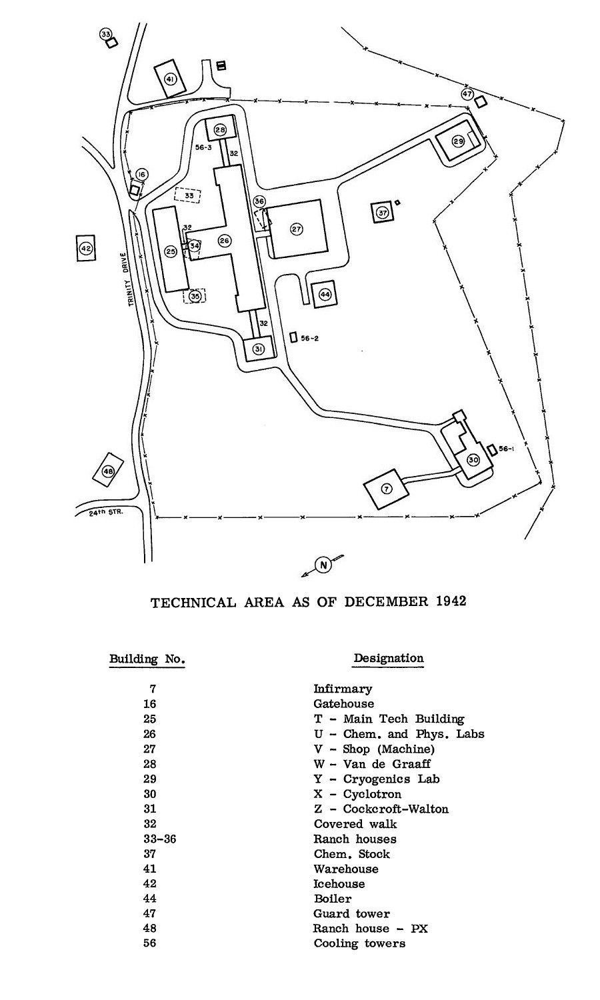
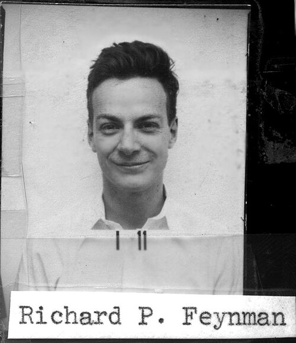

In the spring of 1943 Robert Wilson's isotope-separation group at Princeton
was wound up, and its young men were sent west to a laboratory that did not
yet exist. Feynman, his doctorate not yet a year old, went with them. On 28 March
he and **Arline**, ill with tuberculosis, left on the train for New Mexico,
in a private compartment he paid extra for. **J. Robert Oppenheimer** had
telephoned him long distance from Chicago to say that he had found her a
bed in a Presbyterian sanatorium in Albuquerque; Feynman, who had never had
a long-distance call from so far, never forgot it.

He liked to tell how the secret went with them. Everyone had been told not
to buy tickets to Albuquerque at Princeton's small station, so, he said, he
reasoned that he was the one person who could. The clerk's answer, in his
1975 telling, was "Oh, so all this stuff is for you!": the group had been
shipping crates of apparatus to Albuquerque for weeks.

## The Hill

The laboratory, **Project Y**, was put on the **Pajarito Plateau**, a mesa
of volcanic tuff at 7,300 feet cut into fingers by canyons, where the Army
had taken over the Los Alamos Ranch School. The plate draws a section
through it. The Princeton group arrived before the place was ready and
lived at first in rented ranch houses, driving up each morning. Feynman
remembered the road up the cliff as the most impressive thing he had seen,
an Easterner's first sight of the West. At the gate he found his assistant
**Paul Olum** with a clipboard, checking in trucks of lumber, and inside
the one finished building an experimental physicist he knew from his
papers, **John Williams**, in his shirtsleeves over blueprints, directing the
builders. The experimenters had nothing to do until their laboratories
existed, so they helped build them.

The theorists could start at once, so they were moved up onto the mesa: to
bunks in the old school's buildings, then to beds lined along a balcony,
with a chart telling each man which bathroom to change in. There was one
blackboard, on wheels, and in April **Robert Serber** used it to give the
newcomers five lectures on what was known about the bomb; typed up, they
became the laboratory's first report, the _Los Alamos Primer_.

## The battleship and the mosquito boat

The Theoretical Division, T Division, was led by **Hans Bethe**. In
Feynman's account their partnership began by accident. In his second or
third week every senior theorist but Bethe happened to be away, and Bethe,
who liked to test an idea by arguing it out loud, wandered into Feynman's
office. Feynman, as he always did once the subject was physics, forgot whom
he was talking to and told the division's leader he was crazy, again and
again, and was nearly always the one who was wrong. That, he decided
afterwards, was exactly what Bethe wanted. Colleagues likened the pair to a
battleship ploughing steadily through a problem and a mosquito boat
darting round it. They raced each other at arithmetic too: Bethe squared 48
in his head before Feynman could reach for the Marchant calculator.

By November 1943 Oppenheimer was writing that Feynman was "by all odds the
most brilliant young physicist here". When T Division was organised into
groups in March 1944, he was given one of them.

| Group | Subject                               | Leader           |
| ----- | ------------------------------------- | ---------------- |
| T-1   | Hydrodynamics of implosion, the Super | Edward Teller    |
| T-2   | Diffusion theory, IBM calculations    | Robert Serber    |
| T-3   | Experiments, efficiency, radiation    | Victor Weisskopf |
| T-4   | Diffusion problems                    | Richard Feynman  |
| T-5   | Computations                          | Donald Flanders  |

The table is the division as the laboratory's official history, written in
1946 and 1947, records it from March 1944. Feynman's group was four or five
friends, among them **Ted Welton**, **Julius Ashkin** and **Frederick
Reines**, and in 1966 he said he hardly felt he was leading it. He was
twenty-five.

## Everywhere at once

He also took on a job as the division's liaison, going round the
experimental laboratories to learn what they needed calculated and to
explain what the theorists had found. By his own account, only Oppenheimer
knew more of what went on in every division. The work suited him: unlike
the deep problems of physics, he said, the bomb's problems were new, and
there were many of them, so that the days were full of small successes.

The details are the trail that branches here, **The Hill**: the efficiency
formula he worked out with Bethe, the rooms of human and punched-card
computers, the safes and the censor, and the plant at Oak Ridge. On the
main spine, Arline's illness was coming to its end.
