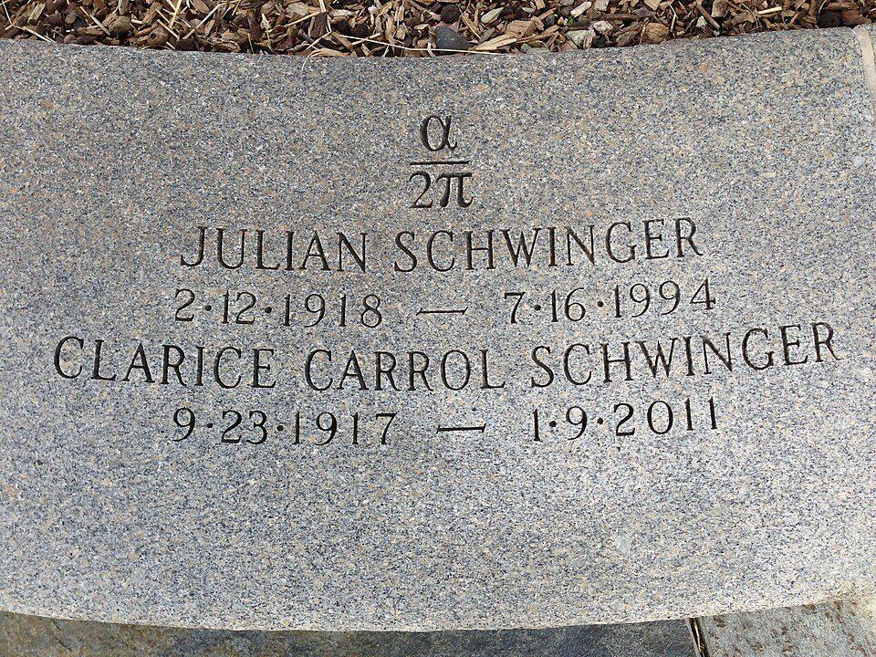

An electron is a small magnet. [Dirac's equation](kloom:e/dirac-equation) of 1928 fixed how strong a magnet for its spin: its _g-factor_, the ratio that sets the strength, should be exactly 2. At the [Shelter Island conference](kloom:e/shelter-island-conference) of the frame Lamb shift, **[Isidor Rabi](kloom:e/isidor-rabi)** of Columbia reported measurements of the electron's magnetism, and by 1948 **Polykarp Kusch** and **Henry Foley**, working in the same molecular-beam tradition at Columbia, had shown that g is slightly larger than 2. Since then the gap between 2 and the truth has been measured and calculated more precisely than any other quantity in physics, and it is where [Feynman's diagrams](kloom:e/feynman-diagram) have been counted in their thousands. This frame gives the state of both as of September 2026.

## Alpha over two pi

The first calculation was **[Julian Schwinger](kloom:e/julian-schwinger)**'s, published in February 1948 with his new, renormalized theory and without diagrams. The electron emits a virtual photon, is kicked by the magnetic field, and reabsorbs the photon, and the kick comes out stronger by a fraction α/2π, about 0.00116. The plate draws that process as a diagram, the one diagram of the first order. The result is cut into his headstone at Mount Auburn Cemetery in Cambridge, Massachusetts.

At the next order the diagrams earned their keep. Two of [Freeman Dyson](kloom:e/freeman-dyson)'s colleagues at the Institute for Advanced Study, **[Robert Karplus](kloom:e/robert-karplus)** and **[Norman Kroll](kloom:e/norman-myles-kroll)**, worked through the seven diagrams with two virtual photons, following his rules and with his help. Their answer, reported in 1950, was a g-factor of twice 1.001147. Each order since has meant many more diagrams, each diagram a harder integral.

| Loops | Power of α | Diagrams | Its contribution to g/2, in trillionths |
| ----: | ---------- | -------: | --------------------------------------: |
|     1 | α          |        1 |                           1,161,409,732 |
|     2 | α²         |        7 |                              −1,772,302 |
|     3 | α³         |       72 |                                  14,804 |
|     4 | α⁴         |      891 |                                     −56 |
|     5 | α⁵         |   12,672 |                                     0.4 |

The counts are from **Tatsumi Aoyama**, **Toichiro Kinoshita** and **Makiko Nio** (2019); the contributions, rounded and with α from the rubidium measurement, from **Hartmut Wittig**'s review of 2025. The first three orders are known exactly as formulas, the fourth to more than a thousand digits. The fifth has only ever been done numerically, by Kinoshita's group over decades, which published the first complete result in 2012, and by **Sergey Volkov**. Their results disagreed by five standard deviations in the 6,354 diagrams with no closed electron loop. In 2025 Aoyama, Nio and colleagues compared the two diagram by diagram, traced the gap to 98 integrals that needed far more Monte Carlo sampling, recalculated them, and brought their answer into agreement with Volkov's.

## The measurement

In February 2023 **Xing Fan**, **Thomas Myers**, **Benedict Sukra** and **[Gerald Gabrielse](kloom:e/gerald-gabrielse)**, of Northwestern and Harvard, published the best measurement: g/2 = 1.001 159 652 180 59, uncertain by 0.13 in the last two digits, or 0.13 parts per trillion. They held a single electron in a trap in a strong magnetic field, cold enough for its circular motion to settle into its lowest quantum states, and counted the frequencies at which its spin and its orbit could be made to jump. It is the most precisely measured property of any elementary particle. The five-loop term in the table is three times the measurement's uncertainty, so the experiment tests the diagrams of the fifth order.

## The fine-structure constant

To compare, the theory needs α itself, and α has to be measured some other way. The two best measurements, from cesium atoms at Berkeley in 2018 and rubidium atoms in Paris in 2020, disagree with each other by about five and a half standard deviations. With either one, theory and experiment agree to within about 0.7 parts per trillion; which of the two is right decides whether the agreement is better still or shows a gap. A review by Gabrielse and **Graziano Venanzoni**, revised in February 2026, still calls the α discrepancy unresolved, and this frame found no newer measurement that settles it. A new apparatus at Northwestern aims to measure the electron ten times more precisely, and to measure the positron, last done in 1987, as well.

What Karplus and Kroll did in 1950 was taught, not found in print: the next frame, Dispersion, follows how the diagrams traveled.
