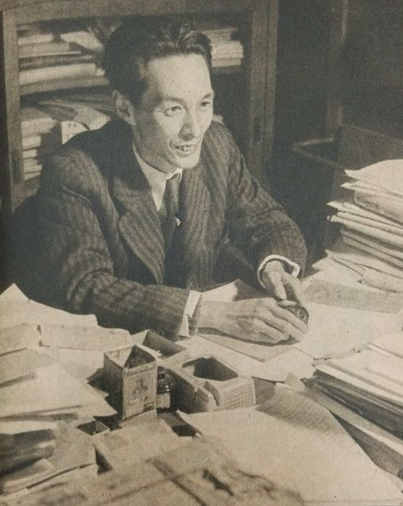

On 21 October 1965 the Royal Swedish Academy of Sciences awarded the [Nobel
Prize in Physics](kloom:e/nobel-prize-in-physics) to **[Sin-Itiro Tomonaga](kloom:e/shin-ichir-tomonaga)**, **[Julian Schwinger](kloom:e/julian-schwinger)** and
[Richard Feynman](kloom:e/richard-feynman), "for their fundamental work in [quantum electrodynamics](kloom:e/quantum-electrodynamics),
with deep-ploughing consequences for the physics of elementary particles".
Each had a third of the $55,000. The work was seventeen years old.

## The morning

The American Broadcasting Company rang Feynman's house in Altadena at 3:45
in the morning, Caltech's _Engineering and Science_ recorded, and the
reporter asked whether he wasn't pleased to hear it. Feynman said he could
have found out later that morning. In his own account to the historian
Charles Weiner the next summer, the call came at four, he was angry at being
woken, and when he told his wife she laughed and would not believe him,
because he was always playing tricks on her.

By half past ten he was facing radio, television and the newspapers in the
Athenaeum, Caltech's faculty club, with [Gweneth](kloom:e/gweneth-feynman) and their three-year-old
son Carl. Asked whether his work could be explained in lay terms, he said:
"There certainly must be. But I don't know what it is." A photographer from
_Time_ gave him a better answer while taking his picture: if it could be
said in a minute, it wouldn't be worth a Nobel Prize. Feynman used the joke
afterwards. The students hung a banner on Throop Hall, and that afternoon he
telephoned Tomonaga in Tokyo, where it was nearly midnight.

| Laureate  | Born           | At the time of the prize      | How he did it, as Caltech saw it in 1965 |
| --------- | -------------- | ----------------------------- | ---------------------------------------- |
| Tomonaga  | 1906, Japan    | Tokyo University of Education | from basic physical principles           |
| Schwinger | 1918, New York | Harvard University            | massive mathematical formulation         |
| Feynman   | 1918, New York | Caltech                       | quantum mechanics rebuilt his own way    |

## What he felt

To Weiner, in June 1966, he said it was still too close to judge calmly,
and that his feelings about it were partly distasteful. The good part was
the letters, hundreds of them, from friends, relatives and strangers, and in
every one he saw that someone was happy. Most of the rest was a chore, and
he dreaded the ceremony: he disliked formal dress, and had heard that one
must never turn one's back on the King. In the stories he told later, collected in
_"Surely You're Joking, Mr. Feynman!"_, he had thought of refusing the
prize, and was told that refusing would make more fuss than accepting.

In Stockholm on 10 December he received it from King Gustaf VI Adolf.
Tomonaga, kept away by an accident, could not come. At the banquet that night
Feynman said the joy in all those messages had taught him something about
honours and trumpets and kings: "such things provide entrance to the
heart." In the months that followed, the physicist David Goodstein, who
joined Caltech then, recalled a brief spell of dejection, in which Feynman
doubted that he could still do original work at the frontier.

## The lecture

His Nobel lecture on 11 December, "The Development of the Space-Time View
of Quantum Electrodynamics", is unlike most. Journal papers, he began, are
written to cover the tracks and hide the blind alleys; since the prize was
personal, he would tell what he had actually done. He told it from his
undergraduate idea at MIT that an electron should not act on itself, through
**[John Wheeler](kloom:e/john-archibald-wheeler)**'s waves running backward in time, a beer at the Nassau
Tavern where he first heard of Dirac's paper, and a calculation with
**Hans Bethe** that went wrong on a blackboard for reasons neither of them
ever found.

He also described what failed, on which he said he had spent almost as
much effort as on what worked. The plate draws one: in one
dimension of space, he found that paths zigzagging at the speed of light,
each carrying an amplitude that gains a factor for every reversal, give
Dirac's equation for the electron. He hoped for the same in three
dimensions and never found it. Most of the ideas that got him there, he
said, were not used in the end: the half-backward waves, the action
without fields, the electron that never acts on itself. He called
renormalisation "a way to sweep the difficulties of the divergences of
electrodynamics under the rug". And he closed by comparing the theory he had
fallen for as a young man to an old woman: no longer attractive, but a good
mother, with children the Academy had just honoured.

The dejection ended, in Goodstein's telling, at the University of Chicago's faculty club in
February 1967, where Feynman sat up reading [James Watson](kloom:e/james-watson)'s manuscript of
[_The Double Helix_](kloom:e/the-double-helix) and wrote one word on a notepad: "Disregard!" You have to
worry about your own work, he said, and ignore what everyone else is doing.
At first light he telephoned Gweneth to say he would be able to work again.
The work he went back to was the inside of the proton.
