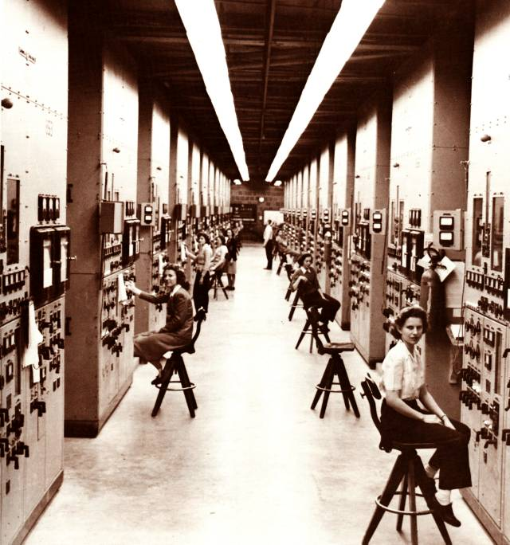

The uranium for the bomb was enriched at the **Clinton Engineer Works** in
Tennessee, the secret town of Oak Ridge. At its **Y-12** plant, managed
for the Army by Tennessee Eastman, the calutrons separated uranium-235
electromagnetically, and chemical departments recovered and purified the
product between stages. Y-12 sent its first few hundred grams, enriched to
13 to 15 per cent, to Los Alamos in March 1944. The Army kept the two
sites apart: Oak Ridge was not to know what the uranium was for, nor Los
Alamos how the plant worked.

## Won't it explode?

The assays did not agree. Oak Ridge's figures for its enrichment would not
match Los Alamos's measurements, and in the end **Emilio Segrè** was
allowed to go and see how the plant did its tests. Walking through, he saw
workers wheeling large bottles of green water, uranium nitrate solution,
and asked whether they meant to handle the enriched product like that. He
asked, in Feynman's retelling, whether it would not explode.

Oak Ridge had been told how much uranium a bomb needed, and since so much
would never be in one place, it had been assured there was no danger. That
figure was for dry metal and fast neutrons. In water a neutron bounces off
hydrogen nuclei, which weigh about as much as it does, and is quickly
slowed; and slow neutrons are far more likely to split a uranium-235
nucleus. In solution a much smaller quantity can start a chain reaction,
not a bomb but a burst of neutrons and radiation through the room. The
plate draws a neutron slowing in a drum of solution.

Los Alamos stopped much of its theoretical work for a couple of weeks,
Feynman said, to work out safe limits. **Robert Christy**'s group took the
solutions and Feynman's group the dry salts in boxes, the harder case;
because they needed only safe bounds, not exact critical amounts, they
could be generous. Christy was to take the answers east, caught pneumonia,
and Feynman went instead, on his first aeroplane flight.

## Telling them how it worked

Oppenheimer gave him the names of the men at Oak Ridge who knew enough
physics to understand, among them **Julian Webb**, and a line to use if
they were kept out of the meeting: that Los Alamos could not "accept the
responsibility for the safety of the Oak Ridge plant". Feynman walked the
plant first, saying nothing, and found it worse than Segrè had reported:
Segrè had seen boxes stacked in one room and missed more boxes against the
other side of the same wall. A wall does not stop neutrons; the plate
draws both rooms.

Before the meeting an officer passed on that the colonel in charge, whom
Feynman in 1966 called Colonel Nichols (presumably **Kenneth Nichols**, the
district engineer), wanted him to say only what was safe, not why. Feynman replied that rules nobody understood would not
be kept. The colonel looked out of the window for a few minutes and agreed.
So Feynman lectured the plant's managers and engineers on neutrons, on
slow and fast, on water and on cadmium, and gave them the fixes: cadmium
or boron salts in the solutions, and platforms that kept boxes a set
distance apart. He came back every month or so to check their own
calculators' work.

On one return visit the engineers showed him the design of a new plant for
enriched material, which was meant to stay safe if any single valve stuck.
Not knowing a symbol that recurred on the blueprints, he guessed that it
was a valve, pointed at one and asked what would happen if it
stuck, and after some anxious tracing through the drawings was told that
he was absolutely right. He swore the
story was true, and called it luck.

| Hazard                           | What was done                              |
| -------------------------------- | ------------------------------------------ |
| Uranium in water solution        | cadmium or boron salts in the solution     |
| Boxes of salts stacked together  | wooden platforms that keep them apart      |
| Too much in one store room       | a bigger store room                        |
| A stuck valve letting it pile up | designs in which no single valve can do it |

## The record and the date

The laboratory's official history, written in 1946 and 1947, credits the
safety calculations for Y-12 and the K-25 plant to **Edward Teller**'s
group, which Teller led until June 1944, and names Teller as the Manhattan
District's consultant on the danger; it does not mention Feynman. The date
of the first visit is uncertain too. An Oak Ridge historian's column gives
April 1944, and Feynman's own order of events puts it before he took over
the punched-card machines in early 1945. The rule the engineers
designed to, that no single failure should be enough, is still how
criticality safety works: its double-contingency principle asks that two
independent, unlikely changes be needed before an accident. At Y-12 on
16 June 1958, a solution of enriched uranium was diverted by mistake into
a steel drum and went critical for fifteen to twenty minutes; eight
workers were taken to hospital.

From Tennessee the trail returns to its start, on the mesa at **Los
Alamos**.
