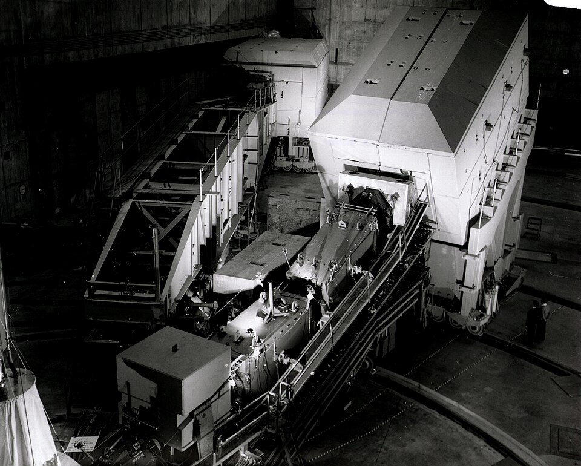

In the late 1960s the question of what a proton is made of had no agreed
answer. **Murray Gell-Mann**, whose office at Caltech was a few doors from
Feynman's, had proposed **quarks** in 1964, and George Zweig had proposed
the same scheme independently. Quarks sorted the zoo of particles into
tidy families, but no one had ever knocked one loose, and most physicists
treated them as bookkeeping. Then an experiment in California began to
see hard little things inside the proton, and Feynman gave them a name of
his own.

## Two miles of accelerator

The **Stanford Linear Accelerator Center** (SLAC) had just finished a
two-mile machine that drove electrons to 20 GeV. A collaboration from
**MIT and SLAC**, led by **Jerome Friedman**, **Henry Kendall** and
**Richard Taylor**, aimed the beam at liquid hydrogen and counted the
electrons that bounced off at large angles, in huge magnetic spectrometers
that rolled on rails around the target. They had meant to study the
proton's excited states. What they found, first reported at the Vienna
conference in August 1968, was far too many electrons scattered hard, as
if they were striking something small and solid rather than a soft cloud
of charge.

**James Bjorken**, a SLAC theorist, had predicted something odder still,
using the abstract machinery of current algebra: at high energy the
results should depend not on the energy lost and the momentum transferred
separately, but only on their ratio. The data showed this _scaling_.
Almost nobody, the experimenters included, could see why.

## A night in a motel

Feynman had spent the summer of 1968 in Santa Barbara, walking the beach
and trying to understand collisions between protons at very high energy.
His working picture treated each proton as a swarm of point-like pieces,
whatever they were, and he called them **partons**. In August he visited
SLAC, which was a few blocks from his sister Joan's house. In his account
to the historian Charles Weiner in 1973, the experimenters showed him the
data and asked him to explain Bjorken's scaling, since Bjorken was away.
That night in his motel he saw that his partons gave it at once.

The idea is the plate. Seen from a frame in which the proton rushes past
almost at the speed of light, it is flattened, and its internal motions
are slowed to a crawl. The electron's virtual photon strikes one parton
in an instant too short for the others to react, so the electron scatters
off it as if it were free. The measured quantity, _F₂_, then depends only
on the fraction _x_ of the proton's momentum that the struck parton carried:
Bjorken's variable, with a plain physical meaning. Kendall, in his Nobel
lecture, wrote that theoretical interest at SLAC grew substantially after
the visit, and Feynman gave the first public talk on partons at Stanford
that October.

## Partons, quarks and put-ons

His paper of 1969, "Very High-Energy Collisions of Hadrons" in _Physical
Review Letters_, is about proton collisions, not electron scattering, and
never says what partons are. Bjorken and **Emmanuel Paschos** worked out
the electron case that year and proposed that the partons were quarks.
Feynman, by his own account in 1973, was slow to agree: quarks never came
out of a proton, so they had to be held strongly, and he doubted his free
partons could be them. Finn Ravndal, then his student, remembers that a
seminar at Caltech on 9 February 1971, the day of the San Fernando
earthquake, was the first time Feynman identified partons with quarks in
public. His lectures of that autumn became the book _Photon-Hadron
Interactions_ (1972).

| What the experiments found                         | What it meant for partons              |
| -------------------------------------------------- | -------------------------------------- |
| Hard scattering, and scaling in _x_                | point-like constituents, struck singly |
| Callan and Gross's test of spin (1968–69)          | spin one-half, like quarks             |
| Charged partons carry only about half the momentum | the rest is neutral: gluons            |
| Neutrino scattering at CERN (1972 on)              | fractional charges: the quarks' own    |

By the mid-1970s the partons were understood as quarks and **gluons**, the
carriers of the strong force in **quantum chromodynamics**. Friedman,
Kendall and Taylor shared the 1990 Nobel Prize for the experiments.

The naming grated. Gell-Mann called Feynman's partons "put-ons", as
Stephen Wolfram, who knew them both at Caltech around 1980, remembered, and
George Johnson's portrait of the rivalry in _The Atlantic_ traces the feud
that grew from it. Physicists split the difference with "quark–parton
model", and the parton picture is still the working language of every
proton collider: the momentum distributions of partons in the proton are
measured, fitted and published to this day.

A few years later Feynman stood before Caltech's graduates and talked not
about quarks but about how scientists fool themselves.
