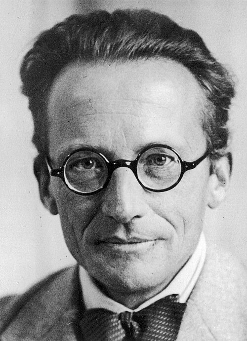

A day or so after the blackboard, [Feynman](kloom:e/richard-feynman) remembered in his Nobel lecture,
he was lying in bed wondering how to carry a wave function not one short
step forward but a long way. One factor of [Dirac](kloom:e/paul-dirac)'s exponential carried it
one step; another carried it the next. A product of exponentials is the
exponential of a sum, and a sum of the Lagrangian over many small steps of
time is the action. The amplitude to go from one place and time to another
was a sum over every way of getting there, each way weighted by e^(_iS_/_ħ_),
where _S_ is the action of that way. He had quantum mechanics written
directly in terms of the action.

## Two postulates

He used the method in his thesis in 1942, and published it as "Space-Time Approach to Non-Relativistic Quantum Mechanics" in
[_Reviews of Modern Physics_](kloom:e/reviews-of-modern-physics) in April 1948, from **[Cornell](kloom:e/cornell-university)**. The paper's
first sentence recalls that quantum mechanics began with two quite
different formulations, Schrödinger's and [Heisenberg](kloom:e/werner-heisenberg)'s; this, it says, is
essentially a third.

It rests on two postulates. The first says that when an experiment could
have happened in several ways and nothing records which, the probability is
the square of a sum of complex numbers, one for each way, and extends that
to every path a particle might take through a region of space and time.
The second says what each path contributes: "The paths contribute equally
in magnitude, but the phase of their contribution is the classical action
(in units of ħ); i.e., the time integral of the Lagrangian taken along the
path."

To make "every path" mean something, he sliced time into steps of length
ε, let a path be its positions at each step, integrated over all of them,
and took ε to zero at the end. The sum over all paths arriving at a point
from the past is the wave function. Expanding for one short step, as in the
library at Princeton, shows that it obeys [Schrödinger's equation](kloom:e/schrodinger-equation), so the new
formulation predicts exactly what the old ones do. The paper then relates
it to matrices and operators, and ends with what Feynman wanted it for: in
a sum over paths, one part of a system can be integrated away. The field
oscillators of electrodynamics could be removed, leaving charges acting on
one another across time, as in the [absorber theory](kloom:e/wheelerfeynman-absorber-theory).

| Formulation        | First published | What it describes                                        |
| ------------------ | --------------- | -------------------------------------------------------- |
| Matrix mechanics   | 1925            | observable quantities as arrays that do not commute      |
| Wave mechanics     | 1926            | a wave function changing from instant to instant         |
| Sum over histories | 1948            | an amplitude for each whole path, e^(_iS_/_ħ_), added up |

The plate shows the second postulate at work. Nine paths from A to B, one
of them the classical path, each contribute an arrow of the same length,
turned by its own action, and the arrows are added head to tail. The
actions here are made up for the drawing, and scaled so that the arrows turn
slowly; the thin line from the first tail to the last head is the sum.

## Sent back

Feynman told the story of its publication to Charles Weiner in June 1966.
He wrote it up while staying for some weeks with a friend in Pittsburgh,
recasting it again and again until it rested on axioms, and sent it to the
_Physical Review_. It came back: too long, and the first part, the
editors said, was already well known. **[Hans Bethe](kloom:e/hans-bethe)** showed him the trick of
answering that: say plainly which parts are old and which are new, and
shorten a little in the direction asked, rather than cutting the whole
thing. The _Physical Review_ suggested _Reviews of Modern Physics_, and
there it appeared.

It is usually told more sharply, as a rejection: a 2000 review of path
integrals by **Richard MacKenzie**, for one, calls it an all-time classic
"which was rejected by Physical Review!" Feynman himself, asked by Weiner
the next day whether he had ever had a paper rejected, said he had not.
The difference is partly one of words. The paper did not appear in the
journal he first sent it to; it appeared, on that journal's suggestion, in
its sister journal of reviews.

What the paper did not give was a picture a reader could hold. Feynman
supplied that later, most simply for the experiment with two slits, and
followed it to its end, where there are no slits at all: every path.
