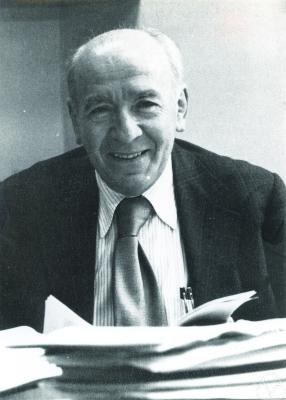

Feynman published the sum over histories as a new way of saying what was
already known. Seventy-eight years later it is how much of physics is
actually calculated, and it is still, in the cases that matter most, not a
well-defined piece of mathematics. This frame describes the state of things
as of 28 September 2026.

## Imaginary time

The first to take it up was a mathematician. **Mark Kac**, Feynman's
colleague at Cornell, had read Feynman's unpublished Princeton thesis, and
in a paper presented to the American Mathematical Society in October 1947
and printed in 1949 he said that his results were strongly influenced by
Feynman's derivation of the Schrödinger equation. Kac's version replaced
Feynman's spinning arrows with real, positive weights. Where Feynman had
e^(_iS_/_ħ_), Kac had a decaying exponential, and the paths became the
random paths of Brownian motion, over which Norbert Wiener had already
defined a genuine probability measure. The result, the **Feynman–Kac
formula**, is a theorem: it solves the diffusion equation, the Schrödinger
equation's cousin with time made imaginary, as an average over random paths.

The same trick connects quantum mechanics to heat. In imaginary time the
path integral of a quantum system becomes its partition function, the sum
that statistical mechanics uses to get every thermal property. In 1965
Feynman and **Albert Hibbs** published the method as
a textbook, _Quantum Mechanics and Path Integrals_. In the 1970s the path
integral became the common language of quantum field theory and of the
statistical physics of phase transitions, and much of the unification of
the two ran through it.

## On the lattice

In 1974 **Kenneth Wilson** wrote the theory of quarks and gluons on a grid
of points in space and time, with the gluon field living on the links
between neighbouring points, as the plate draws, and a closed loop of links
measuring the field inside it. On a lattice, in imaginary time, the path
integral is an ordinary integral over a very large but finite number of
variables, with positive weights, and it can be estimated by sampling. In
1980 **Michael Creutz** did it by Monte Carlo for a simpler version of the
theory. Today **lattice QCD** runs on the largest supercomputers: it has
computed the proton's mass to better than two per cent and the temperature,
about 150 MeV, at which ordinary matter melts into a plasma of quarks and
gluons.

Its most visible recent result is about the muon. For years the muon's
measured magnetic moment disagreed with the Standard Model's prediction,
and the disagreement was taken as a possible sign of new physics. The
hardest part of the prediction is the effect of quarks and gluons. In 2025
the physicists who make the official prediction replaced the estimate taken
from other experiments with an average of lattice calculations, precise to
about 0.9 per cent, and the disagreement disappeared.

| Comparison                                | Measured − predicted (×10⁻¹¹) | Tension                 |
| ----------------------------------------- | ----------------------------- | ----------------------- |
| 2021 average vs the 2020 prediction       | 251 ± 59                      | 4.2 standard deviations |
| final 2025 average vs the 2025 prediction | 38 ± 63                       | none                    |

In chemistry and materials, **path-integral Monte Carlo** does the same for
atoms: each quantum particle becomes a ring of beads joined by springs, a
path in imaginary time. An early application was liquid helium, and David
Ceperley's 1995 review in _Reviews of Modern Physics_, the journal of
Feynman's 1948 paper, surveys it there.

## Still not a theorem

Feynman knew the foundations were loose. A footnote in the 1948 paper
says that some sort of complex measure is being associated with the space
of paths, that it is not positive, and that he felt as Cavalieri must have
felt computing the volume of a pyramid before calculus. In 1960 **Robert
Cameron** proved that no such measure exists in the ordinary sense. The
path integrals of quantum mechanics have since been given rigorous meaning
for large classes of potentials by other routes, by limits of time slices
and by analytic continuation from Kac's real version. For interacting
quantum fields in four dimensions of space and time, the case the Standard
Model needs, there is no rigorous construction. Proving that quantum
Yang–Mills theory, the part of the Standard Model that describes the
gluons, exists and gives its particles mass is one of the Clay Mathematics
Institute's Millennium Prize problems, and as of this date it is unsolved.

The arrows that made the path integral beautiful also limit it in
practice. Where they cannot be turned into positive weights, as in dense
nuclear matter or a system followed forward in real time, sampling fails:
the sign problem. Physicists use the method every day regardless, as
Feynman did, on the strength of what it gets right. All of it goes back to
a question a graduate student asked at Princeton, how to make a quantum
theory out of an action, and to his answer, the thesis.
