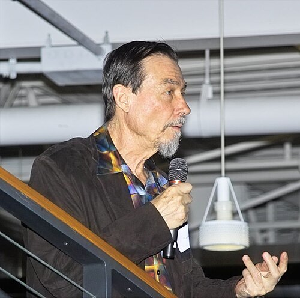

In the early 1980s three Caltech professors from three different trades
put their names on one course. **[Carver Mead](kloom:e/carver-mead)** designed chips. **[John
Hopfield](kloom:e/john-hopfield)**, a physicist who had moved to Caltech's chemistry and biology
divisions in 1980, was asking how networks of neurons compute.
**[Feynman](kloom:e/richard-feynman)** wanted to know what the laws of physics allow a computer to
do. The course was called "The Physics of Computation", the same title
as the MIT conference where, in May 1981, he gave the talk this trail
branches from.

## Three trades at one blackboard

Each brought something the others lacked. Mead had just helped change how
chips were made: with **[Lynn Conway](kloom:e/lynn-conway)** of [Xerox PARC](kloom:e/parc-company) he wrote _Introduction
to VLSI Systems_, the textbook that let students design their own
integrated circuits and have them fabricated on shared wafers. He was
starting to look at the transistor differently, too. Run below its
threshold, a transistor is not a clean on-off switch: its current rises
exponentially with the voltage on its gate, much as current through the
channels in a nerve cell's membrane does. The plate draws a transistor in
section and that curve. Mead would build a field on the resemblance,
circuits that compute the way nervous systems do, which he named
[_neuromorphic_](kloom:e/neuromorphic-computing). With **Richard Lyon**, who took the photograph of Mead in this frame, he
built an analog silicon cochlea in 1988.

Hopfield had spent his career in solid-state physics and biophysics. In
April 1982 he published "Neural networks and physical systems with
emergent collective computational abilities", in the _Proceedings of the
National Academy of Sciences_. It showed that a network of simple on-off
units, all wired to one another, has an energy that falls as the units
update, so that stored patterns sit at the bottoms of valleys and a
damaged pattern rolls down to the nearest whole one: a memory addressed by
its content. A Caltech professor, quoted in the institute's magazine in
2025, called it the fifth most cited paper ever written there.

Feynman brought the questions of his 1981 talk. How small can a computing
element be? What does a step of computation cost in energy? What can a
machine built from quantum parts do that an ordinary one cannot?

## A course that would not stay one course

How the course ran depends on who tells it. A Caltech news story of 2017
says the three co-taught it as a yearlong course in 1981–82 and that it
was given for three years; Caltech's magazine, in 2025, says it ran
intermittently from 1981 to 1983; Wikipedia's article on Hopfield gives
1981 to 1983 as well. The account of the [Computation and Neural Systems](kloom:e/computation-and-neural-systems)
programme has Mead and Hopfield teaching the first year alone, and
Feynman joining the next. A 2018 account by three physicists, one of them
a Caltech graduate student at the time, dates it to 1982 and remembers it
as chaotic: a vague syllabus, lecturers who did not know what would come
next, and Feynman sometimes presenting what had occurred to him the night
before as he fell asleep. Students came religiously, they say, for the
spectacle of three points of view criticising each other in public.

All the accounts agree on what happened next. The material outgrew one
course and split into three.

| Strand   | What it became                                       | Where it went                                |
| -------- | ---------------------------------------------------- | -------------------------------------------- |
| Feynman  | Potentialities and Limitations of Computing Machines | the _Feynman Lectures on Computation_ (1996) |
| Hopfield | neural networks                                      | the 2024 Nobel Prize in Physics, with Hinton |
| Mead     | neuromorphic analog circuits                         | a silicon cochlea (1988) and retina          |

## What it seeded

The course is remembered less for its lectures than for what grew from
it. In 1986 Caltech's provost, **Rochus Vogt**, approved an
interdivisional PhD programme, **Computation and Neural Systems**, with
Hopfield as its first chair and Mead among its founding faculty. It
brought physicists, engineers, mathematicians and biologists into one
programme on brains and computers, and was the first of its kind.

For Feynman the course was a start, not a destination. [Hopfield's network](kloom:e/hopfield-network)
turned up again in his summer job with a start-up near Boston, where he
worked out how to run one on a new kind of machine, and in the course he
went on to teach alone, where Hopfield came back as a guest speaker. The
start-up was [Thinking Machines](kloom:e/thinking-machines-corporation), and its machine is the next frame's.
