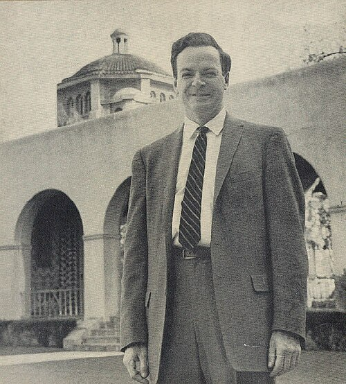

On 29 December 1959, at the annual meeting of the American Physical Society,
held that year at Caltech, Feynman gave a talk called **"There's Plenty of
Room at the Bottom"**. Caltech's magazine _Engineering and Science_ printed
a transcript in February 1960 under the subtitle "An invitation to enter a
new field of physics". The field was the manipulation of matter on a very
small scale, and he asked why nobody was doing it. Since the 1990s the talk
has been called the founding text of **nanotechnology**. Whether it founded
anything is another question.

## Pinheads and atoms

He began with a sum. The head of a
pin is a sixteenth of an inch across. Magnify it 25,000 times and its area
equals that of every page of the _Encyclopaedia Britannica_. So to write the
encyclopaedia on a pinhead, shrink its print 25,000 times. The smallest dot
in its halftone pictures, about 1/120 of an inch, would still be some 80
ångströms wide, 32 atoms across. The letters could be written with a beam
of ions and read with an electron microscope. The plate sets his numbers on
one logarithmic scale, each major tick ten times smaller than the last.

Then he went further. Written as a code in three dimensions, with a cube
of 5 × 5 × 5 atoms for each bit, all the information in the world's books,
some 10¹⁵ bits by his estimate, would fit in a speck of dust one
two-hundredth of an inch wide. Biology already stored information like
that, he pointed out, in DNA. The rest of the talk ranged over:

- **better electron microscopes**, a hundred times sharper, so that biologists
  could simply look at the order of the bases in DNA;
- **computers** with wires ten or a hundred atoms across, and so many more
  elements that they might, like a brain, recognise a face;
- a friend's idea, **Albert Hibbs**'s, of a surgeon you could swallow;
- sets of **mechanical hands**, each building a set a quarter its size, down
  to a billion tiny factories;
- and, at the end, **arranging atoms one by one**, making any chemical
  substance by putting the atoms where the chemist says.

## Two prizes

He closed with two offers of $1,000: one to the first person to put the
page of a book onto an area 25,000 times smaller in linear scale, readable
by electron microscope, and one for a working electric motor, controllable
from outside, no bigger than a 1/64-inch cube.

He did not expect to wait long, and for the motor he did not. In November
1960 **William McLellan**, a Caltech graduate working as an engineer in
Pasadena, carried a grocery carton into Feynman's laboratory. Inside was a
microscope, and under it a motor of thirteen parts weighing 250 micrograms,
built in two and a half months of lunch hours with a watchmaker's lathe and
a toothpick. Feynman had never formally set up the prize; he sent McLellan
the cheque anyway. McLellan had met the challenge with conventional tools,
which surprised Feynman, and the motor opened no new field. It was shown at Caltech and ran
until 1991.

The page took twenty-five years. In 1985 **Tom Newman**, a Stanford
graduate student working with Fabian Pease, used a beam of electrons to
write the first page of Dickens's _A Tale of Two Cities_ at 1/25,000 scale,
a page about six micrometres wide (the width is this frame's arithmetic for
a six-inch page). The hard part, he found, was locating the text again on
the chip. Feynman paid in November 1985.

## How much did it matter?

The anthropologist **Chris Toumey** asked that question in 2005 and
answered it with a citation count. In the Science Citation Index he found
three citations of the talk in the 1960s and four in the 1970s. **Eric
Drexler** found it through a 1979 article in _Physics Today_ while writing
his 1981 paper on molecular engineering, cited it there, and made it famous in his 1986
book _Engines of Creation_. Citations reached double figures in a year
only in 1992.

| Period                        | Citations found |
| ----------------------------- | --------------- |
| 1960s                         | 3               |
| 1970s                         | 4               |
| 13 years after Drexler's 1981 | 63              |

Toumey also asked the inventors. Gerd Binnig and Heinrich Rohrer, whose
scanning tunnelling microscope of the early 1980s first let people see and
move single atoms, had not heard of the talk until after their work was
recognised; Calvin Quate, of the atomic force microscope, had not read it.
Don Eigler, who spelled "IBM" in xenon atoms in 1990, had read it years
before but said it had not shaped his work. Toumey's conclusion was that the
field grew from its instruments and was then given Feynman as a founder,
largely through Drexler. Drexler, for his part, calls the talk the vision
that launched nanotechnology. When President Clinton announced the
National Nanotechnology Initiative at Caltech in January 2000, he quoted
Feynman's question about arranging the atoms one by one.

By the time McLellan's motor arrived, Feynman had married again, and bought
a house: the story of **Gweneth**.
