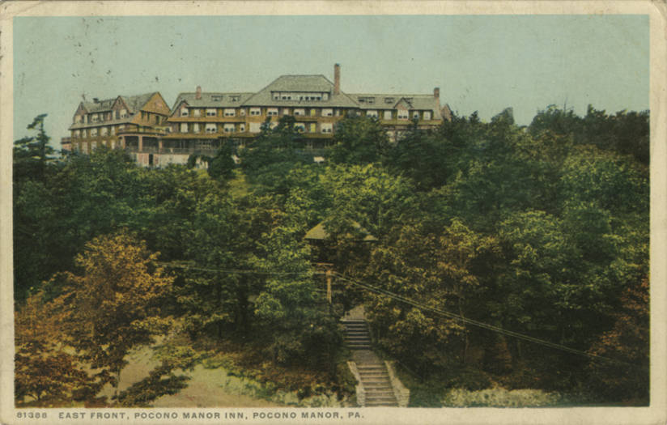

Between 1947 and 1949 the **National Academy of Sciences** brought the
leading theoretical physicists in America together three times, for a few
days each, at country inns, with **J. Robert Oppenheimer** leading the
talk. They were small meetings by design, two or three dozen people,
and Feynman said afterwards that no conference he went to later ever felt
as important. The second, in the Pocono Mountains of Pennsylvania in the
spring of 1948, was where he first showed the world his way of doing
quantum electrodynamics, and where almost nobody understood it.

| Conference     | When                  | Where                                   | Physicists |
| -------------- | --------------------- | --------------------------------------- | ---------- |
| Shelter Island | 2–4 June 1947         | Ram's Head Inn, Shelter Island, N.Y.    | 24         |
| Pocono         | 30 March–1 April 1948 | Pocono Manor Inn, Pennsylvania          | 28         |
| Oldstone       | 11–14 April 1949      | Oldstone-on-the-Hudson, Peekskill, N.Y. | 24         |

## Shelter Island

At the first meeting, in June 1947, the experimenters stole the show.
**Willis Lamb** had just measured a small shift between two levels of
hydrogen that Dirac's theory said should be equal, and **Isidor Rabi**'s
group had evidence that the electron's magnetism was slightly larger than
Dirac's value. Both pointed at the infinities that had stalled the theory
for fifteen years. Feynman explained his path integrals informally when the
discussion ran dry. Within months, following **Hans Bethe**'s lead on the
Lamb shift, he had turned his private methods into a way of calculating;
the trail "The diagrams" tells that part.

## Pocono Manor

Twenty-eight came to the Pocono Manor Inn, among them, for the first time,
**Niels Bohr** and his son **Aage**, **Paul Dirac** and **Eugene Wigner**.
**Julian Schwinger** of Harvard, the rising star, spoke first, and at
enormous length, most of a day, deriving his results from the standard
formalism with a rigour that exhausted his audience but that they could
check line by line. Feynman followed with what he called an alternative
formulation.

By his own account in 1966 he had slept badly and chose the wrong order.
Advised by Bethe to keep to mathematics, since Schwinger drew fire every
time he said anything physical, he began with a single formula from which
all his rules followed. He could not derive it from anything they knew;
he knew it was right because it gave the right answers. They wanted to know
where it came from. He tried examples, lost them in detail, retreated to
physical ideas, and sank deeper.

The objections came from the greatest names in the room, and each, he said
later, came from a theorem its author had proved could not be got round.

| Who           | What he asked                                     | What Feynman was doing                                             |
| ------------- | ------------------------------------------------- | ------------------------------------------------------------------ |
| Edward Teller | What about the exclusion principle?               | Ignoring it in intermediate states, which comes out right          |
| Paul Dirac    | Is it unitary?                                    | Letting electrons run backwards in time, so no step-by-step matrix |
| Niels Bohr    | Trajectories are not allowed in quantum mechanics | Adding an amplitude for every path, not choosing one               |

Bohr's objection upset him least, because it showed only that Bohr had not
followed. He decided to stop explaining and publish. Bohr later came to
apologise: his son had told him Feynman's scheme was sound. The plate
shows three of the pictures he was using: an electron that emits and
reabsorbs its own light, a path that turns back in time to make a pair,
and the closed loop he admitted he could not yet handle. Schwinger said he
could; by Feynman's later account, neither of them yet had it right.

## Two men who agreed

Away from the sessions, Feynman and Schwinger compared answers term by
term and found they agreed, though neither followed the other's method.
Weeks later they sorted out the missing terms of the closed loop between
them by telephone. On his return to Princeton, Oppenheimer found word
from **Sin-Itiro Tomonaga** in Tokyo of a third route to the same
results.

A year later, at **Oldstone** on the Hudson, the talk was of Feynman's
approach, and a young Englishman, **Freeman Dyson**, showed that the three
methods were the same theory. By then Feynman had done as he decided at
Pocono. His two papers of 1949 are the next frame, "He turned the algebra
into PICTURES."

The dates of Pocono are those on the notes of the meeting that **John
Wheeler** kept; some
accounts run it to 2 April. Feynman's memory of which conference was which
was vague, as he said himself, and this frame takes the order and numbers
from Jagdish Mehra's biography as others report it.
