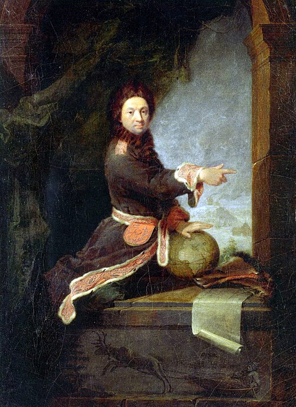

The idea [Feynman](kloom:e/richard-feynman) carried into his Princeton thesis was already very old. For
about two thousand years, people had noticed that nature seems to settle a
question about a whole route at once: of all the ways from here to there, it
takes the one that makes some quantity least. What that quantity is, and
why nature should care, took from antiquity to 1834 to work out.

## Light takes the quick way

**[Hero of Alexandria](kloom:e/hero-of-alexandria)**, in his _Catoptrics_ in the first century AD, showed
that the law of reflection, with the angle in equal to the angle out, follows
if light bouncing off a flat mirror takes the shortest route between two
points. Refraction broke the rule: a ray bending into water does not take
the shortest route. In 1657 **Marin Cureau de la Chambre** sent **[Pierre de
Fermat](kloom:e/pierre-de-fermat)** a treatise complaining of exactly that. Fermat's answer, in a letter
of 1 January 1662, was that light takes not the shortest path but the
_quickest_, provided it travels more slowly in the denser medium. That one
assumption gave the ordinary law of refraction.

The plate works an example. The numbers are invented for this frame: a
lamp at A, one metre above still water, and a point B one metre below the
surface and two metres along. Light is taken to move 1.33 times slower in
water than in air.

| Where the ray crosses the surface | Time from A to B |
| --------------------------------- | ---------------- |
| 0.50 m along                      | 11.727 ns        |
| 1.00 m (the straight line)        | 10.991 ns        |
| 1.27 m (the true ray)             | 10.885 ns        |
| 1.60 m                            | 11.072 ns        |
| 2.00 m                            | 11.895 ns        |

The straight line is the shortest route, but it spends too long in the slow
water. The true ray bends at the surface, and the sines of its angles to the
upright, 51.7° in air and 36.2° in water, stand in the ratio 1.33: [Snell's
law](kloom:e/snells-law), found here as the answer to a question about time. Fermat's
contemporaries were not persuaded. **Claude Clerselier**, defending
Descartes, objected that the principle treated nature as if it knew where it
was going and chose.

## From light to motion

In 1744 and 1746 **[Pierre-Louis Moreau de Maupertuis](kloom:e/pierre-louis-maupertuis)**, back from measuring
the shape of the Earth in Lapland, carried Fermat's idea from light to
moving bodies. Nature, he argued, is thrifty in all its actions, and he
named the quantity it saves the _action_, though he defined it differently
from problem to problem. His reasons were theological as much as physical,
and his claim of priority became one of the bitter quarrels of the century,
with Samuel König and Voltaire on the other side.

**[Leonhard Euler](kloom:e/leonhard-euler)**, who had corresponded with him, made it precise the same
year, 1744: for a body moving with fixed energy, the path is the one that
makes the sum of its momentum along the way stationary. In 1755 the young
**[Joseph-Louis Lagrange](kloom:e/joseph-louis-lagrange)** found a general way to vary a whole curve at once,
writing the change with a new symbol, δ, and Euler named the method the
_calculus of variations_.

## Hamilton, and stationary

In 1834 and 1835 **[William Rowan Hamilton](kloom:e/william-rowan-hamilton)**, in Dublin, gave the principle
the form Bader showed Feynman a century later. Take the kinetic energy minus
the potential energy, the quantity now called the **[Lagrangian](kloom:e/lagrangian-mechanics)**, and add it
up over every instant between a fixed start and a fixed finish: the true
motion is the path for which that sum, the action, does not change to first
order when the path is varied a little. **Carl Jacobi** read Hamilton's
papers in 1836 and extended them the following year.

"Least" turned out to be the wrong word. The action on the true path is
_stationary_: a minimum, or a saddle point, never a maximum. For short
motions it is a minimum. Fermat's least time has the same weakness. What
all the versions share is that every nearby path, to first order, gives the
same value.

| Who        | When      | What is made stationary                 |
| ---------- | --------- | --------------------------------------- |
| Hero       | 1st c. AD | the length of a reflected ray           |
| Fermat     | 1662      | the time taken by light                 |
| Maupertuis | 1744–46   | "action", defined case by case          |
| Euler      | 1744      | momentum summed along the path          |
| Hamilton   | 1834–35   | kinetic minus potential energy, in time |

None of them could say why nature should behave this way. The principle
worked, and it was beautiful, and for three centuries the reason for it
stayed a matter for metaphysics. The first real clue came from quantum
mechanics, in a nine-page paper by Paul Dirac that is the subject of
Dirac's hint.
