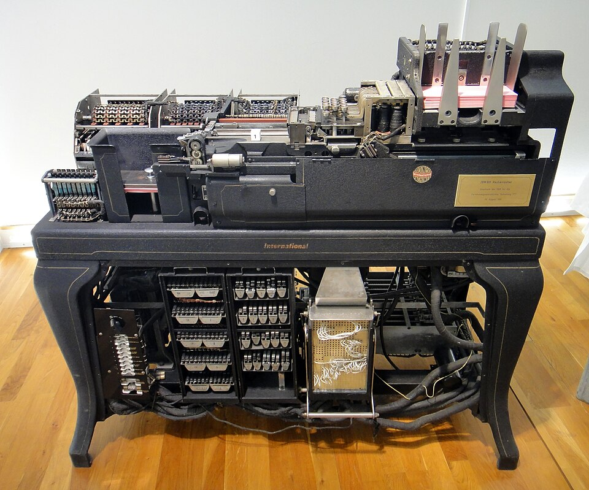

Before there were electronic computers, a _computer_ was a person, and
[Los Alamos](kloom:e/los-alamos-national-laboratory)'s first computers were mostly women. In the spring of 1943 the
Theoretical Division's hand-computing room began with about a dozen
volunteers, many of them scientists' wives: **Mici Teller**, Betty Inglis,
Jean Bacher, Kay Manley and Beatrice Langer among them. **Mary Frankel**
supervised them and wrote
out each problem on a form, one arithmetic step to a line, so that several
computers could work on it at once. Women of the Women's Army Corps joined
over the first summer and came to make up about half the group, which grew
to twenty-five, the largest in the division. The mathematician **Donald
Flanders** became its leader, group **T-5**, and standardized it on
ten-digit Marchant calculators.

The Marchants broke under the load, and sending them to Santa Fe or
Albuquerque for repair held the work up. [Feynman](kloom:e/richard-feynman) and **[Nicholas Metropolis](kloom:e/nicholas-metropolis)** took the covers off,
against the rules, and ran a repair service from their office.

## An assembly line of people

The big problem was the implosion bomb: how a sphere of metal squeezed by
explosives moves, time step by time step. It was far too much for hand
computing, and at the turn of 1944 the laboratory ordered **[IBM](kloom:e/ibm) [punched-card
accounting machines](kloom:e/unit-record-equipment)**, business machines that added, multiplied, sorted
and printed numbers punched on cards. **[Stanley Frankel](kloom:e/stan-frankel)** and **Eldred
Nelson** planned how to set the equations on them. In March 1944, before
the machines came, Frankel, Nelson and Feynman tested the plan with the
human computers (Feynman remembered doing it with Metropolis): each woman did one operation, cubing a number or taking a
difference, and passed her card to the next, like a machine in the cycle.
In Feynman's telling this assembly line ran as fast as the machines were
expected to, and found the plan's bugs before the machines arrived.

| Machine                            | What it did                                              |
| ---------------------------------- | -------------------------------------------------------- |
| 601 multiplier (three, later four) | multiply two numbers read from a card, punch the product |
| 405 tabulator                      | add, subtract and print                                  |
| 513 reproducing punch              | copy cards, punch new ones                               |
| 075 sorter, 077 collator           | put cards in order, merge decks                          |

The machines arrived on 4 April 1944. IBM's man had not: the company was
not told where they were going, so it could not send its own installers,
and the Army had to find a drafted IBM technician, **John Johnston**. For
the few days before he came, Feynman, Frankel and Nelson unpacked the
crates and put the machines together from the wiring blueprints. The
plate draws the machine room as a ring: one pass of a deck of cards round
the machines was one step of the calculation.

## Colors and errors

The work went slowly. The operators were soldiers of the **Special
Engineer Detachment**, clever young men who were forbidden to know what
the numbers meant. Frankel, in Feynman's diagnosis, had caught the
"computer disease" and was playing with what the machines could do; in
January 1945 he moved to another group. Feynman took over the running of
the machines under the group leader, Nelson, with Metropolis as deputy. The
mathematician **[Naomi Livesay](kloom:e/naomi-livesay)** programmed the machines and supervised
their operators throughout.

Feynman's first change, with Oppenheimer's permission, was to tell the
operators what they were calculating and why. They began inventing
improvements themselves. The best was to run two or three problems at
once, each on its own color of card, out of phase round the same machines.
Another dealt with mistakes. A wrong number on one card spreads to its
neighbors each cycle, as the plate draws, so rather than stop, they
copied a small deck of cards round the error and ran it round fast,
catching the error up and patching the big deck.

| Period              | Problems      | Source        |
| ------------------- | ------------- | ------------- |
| Before he took over | 3 in 9 months | Feynman, 1975 |
| April–December 1944 | 8             | Lewis, 2021   |
| After he took over  | 9 in 3 months | Feynman, 1975 |
| April–July 1945     | 12            | Archer, 2021  |

The records, as the laboratory's historians read them, support the
speed-up but not the slow start: eight problems were done in 1944, not
three. And the story is usually told as Feynman's, though the machines
were Frankel and Nelson's project and Livesay ran them. The hand computers,
the historian Nicholas Lewis notes, were never told what they were for.

The room also trained **[John Kemeny](kloom:e/john-g-kemeny)**, one of the soldier-operators and
later a creator of [BASIC](kloom:e/basic), and **[Richard Hamming](kloom:e/richard-hamming)**, who went on to invent the
Hamming code at Bell Labs. Feynman also worked out at Los Alamos a quick way to compute
logarithms, by factors of the form 1 + 2⁻ᵏ, which he used again forty years
later on the Connection Machine. The trail goes on to the mail, and his
games with the **censor**.
